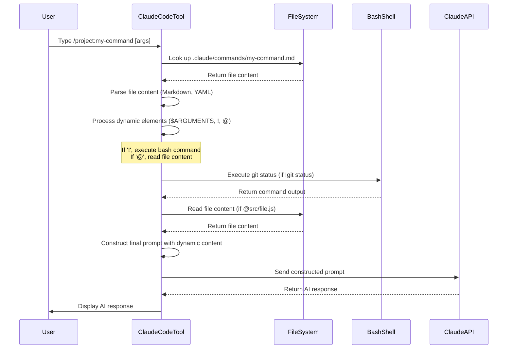

# Chapter 1: Claude Code Commands

Welcome to the first chapter of the `PRPs-agentic-eng` tutorial! In this chapter, we'll dive into the very foundation of how you interact with the Claude Code tool and this project: **Claude Code Commands**.

Think of Claude Code as a powerful assistant living inside your terminal. You can type instructions or questions to it, and it helps you write code, fix bugs, and understand your project. But sometimes, you find yourself typing the same set of instructions or asking the same complex questions repeatedly. That's where commands come in!

## What are Claude Code Commands?

Imagine you have a favorite coffee order. Instead of listing "double shot espresso, hot water on the side, splash of cold milk" every time, you just say "The usual." Claude Code Commands are like "the usual" for your coding tasks.

They are special shortcuts you type into the Claude Code terminal, starting with a forward slash (`/`). These commands trigger specific actions or even entire multi-step workflows. They act as the primary way you tell Claude Code *what* to do within the context of your project.

Let's start with a simple, common task you might want Claude Code to help with: **getting a summary of the recent changes you've made in your code (your "git diff") and asking Claude for feedback.**

Without commands, you might type something like:
"Okay Claude, please look at the changes I've staged and unstaged in git. Can you run `git diff HEAD` and then give me feedback on the code quality and potential issues? Also, explain what each change does briefly."

That's quite a mouthful! And you might ask for this kind of review often. This is exactly the kind of thing Claude Code Commands are designed to simplify.

## Built-in Commands

Claude Code comes with many useful commands already built-in. You can see a list of them by typing `/help`. These built-in commands handle common tasks related to the Claude Code environment itself, like clearing the conversation or changing settings.

Here are a few examples you might see (from the `PRPs/ai_docs/cc_commands.md` documentation):

```
/help         # Get usage help
/clear        # Clear conversation history
/cost         # Show token usage statistics
/model        # Select or change the AI model
```

You type them directly into the Claude Code terminal and press Enter.

## Custom Commands: Your Own Shortcuts

While built-in commands are great, the real power comes from **custom commands**. These are commands *you* define to automate tasks specific to *your* workflow or *your* project.

How do you define them? With simple Markdown files!

Yes, you read that right. A text file using Markdown format is all it takes to create a custom command. These files live in special directories that Claude Code checks.

There are two main places to put your custom command files:

1.  **Project Commands:** These are specific to the project you're currently working on. They are stored inside the project's directory, typically in `.claude/commands/`. This is great for sharing commands with your team.
    *   **Location:** `.claude/commands/`
    *   **How to type:** `/project:<command-name>`
2.  **Personal Commands:** These are available to you across *all* your projects. They are stored in a specific directory in your user home folder.
    *   **Location:** `~/.claude/commands/`
    *   **How to type:** `/user:<command-name>`

For the `PRPs-agentic-eng` project, you'll see many project-specific commands defined in the `.claude/commands/` directory. These are the commands that make the project's workflows possible.

Let's look at a simple example of creating a project command. Suppose you frequently ask Claude Code to summarize a specific concept document. You could create a file:

```bash
# Inside your project's root directory:
mkdir -p .claude/commands # Creates the directory if it doesn't exist
echo "Summarize the key points from the document at @docs/important_concept.md" > .claude/commands/summarize-concept.md
```

Now, inside Claude Code for this project, you can just type:

```
/project:summarize-concept
```

And Claude Code will read the content of `summarize-concept.md`, see the instruction "Summarize the key points from the document at...", and execute it. The `@docs/important_concept.md` part is special; it tells Claude Code to include the *contents* of that file in the prompt it sends (we'll touch on this more later).

The command name (`summarize-concept`) comes directly from the filename (`summarize-concept.md`).

## Anatomy of a Command File

A custom command file is a Markdown file (`.md`) with instructions for Claude Code. It can be quite simple, like the `summarize-concept.md` example above, or more complex.

Here are the key parts you might find in a command file:

1.  **Optional YAML Frontmatter:** At the very top, enclosed in `---` lines, you can add metadata using YAML format.
    ```markdown
    ---
    description: Briefly describes what the command does
    allowed-tools: [ToolA, ToolB] # Lists tools Claude can use
    ---

    # The rest is the prompt for Claude
    ```
    The `description` is helpful for you and others understanding the command. `allowed-tools` specifies which capabilities Claude is allowed to use when executing *this specific command*.

2.  **The Main Content (Prompt):** This is the core of the file – the instructions you want Claude Code to follow. It's just standard Markdown text.

3.  **Dynamic Placeholders:** Custom commands become truly powerful with dynamic elements:
    *   **`$ARGUMENTS`:** Allows you to pass information to the command when you type it. For example, if you have a command to look up a user by ID, the command file might contain `$ARGUMENTS`. When you type `/project:lookup-user 123`, the `$ARGUMENTS` inside the command file becomes `123`.
        *   Example file (`.claude/commands/lookup-user.md`):
            ```markdown
            Find the user with ID $ARGUMENTS in the database and provide their details.
            ```
        *   Usage:
            ```
            /project:lookup-user 456
            ```
            This sends the prompt "Find the user with ID 456 in the database and provide their details." to Claude.
    *   **`!` (Bash Command Execution):** Allows you to run a bash command *before* Claude gets the prompt, and the output of that command is included in the prompt context. This is crucial for including up-to-date information like git status or file contents.
        *   Example:
            ```markdown
            ## Context

            Current git status: !`git status`
            ```
            When Claude Code runs this command file, it will first execute `git status` in your terminal, capture the output, and include it in the prompt where `!git status` was.
    *   **`@` (File References):** Similar to `!`, but includes the *content* of a file or directory. This is essential for giving Claude Code context about your codebase.
        *   Example:
            ```markdown
            Review the code quality in @src/utils/helpers.js and suggest improvements.
            ```
            Claude Code will read `src/utils/helpers.js` and include its content in the prompt, followed by the instruction "Review the code quality...". You can also reference directories like `@src/utils/` to include contents of multiple files (often recursively).

These dynamic elements (`$ARGUMENTS`, `!`, `@`) are how command files provide up-to-date and context-rich instructions to Claude without you having to manually copy/paste information each time.

## Solving Our Use Case with a Custom Command

Let's return to our initial use case: reviewing staged/unstaged git changes. The `PRPs-agentic-eng` project actually includes a command for this! While not shown in the snippet, the `CLAUDE.md` file mentions `/review-staged-unstaged`. Based on the patterns, this command likely lives in `.claude/commands/code-quality/review-staged-unstaged.md` (using a namespace like `code-quality`).

Imagine the content of this file is something like this (simplified):

```markdown
---
description: Review staged and unstaged git changes using PRP methodology.
allowed-tools: [Bash(git status:*), Bash(git diff:*)] # Allow necessary git commands
---

## Context

Here are the current changes in the repository:

!`git diff HEAD`

## Your Task

Review the above git changes. Explain what the changes do, identify any potential issues (bugs, code style, performance), and suggest improvements based on standard best practices and any context provided in CLAUDE.md.
```

To use this command in Claude Code:

```
/project:code-quality:review-staged-unstaged
```

What happens when you type this?

1.  You type `/project:code-quality:review-staged-unstaged`.
2.  Claude Code looks for the file `.claude/commands/code-quality/review-staged-unstaged.md`.
3.  It reads the file content.
4.  It sees the `!` command `git diff HEAD`. It executes `git diff HEAD` in your terminal and captures the output (the actual code changes).
5.  It constructs the final prompt by combining the file's text with the output of `git diff HEAD`.
6.  It sends this full, context-rich prompt to Claude.
7.  Claude receives the prompt (including the actual diff) and responds with its review and suggestions.

This single command automates getting the diff and providing specific instructions for review, saving you a lot of typing!

## Under the Hood: How Commands Work (Simplified)

Let's visualize the basic flow when you type a custom command.



As you can see, typing a simple slash command kicks off a process where Claude Code reads your defined workflow (the Markdown file), gathers any necessary context (via `!` and `@`), and then sends a carefully crafted prompt to the Claude AI model.

## Commands in the PRPs-agentic-eng Project

The `PRPs-agentic-eng` project relies heavily on custom Claude Code Commands, particularly those under the `PRPs/` namespace (like `/project:PRPs:prp-base-create` and `/project:PRPs:prp-base-execute`).

You can see many of these commands listed in the project's `CLAUDE.md` file under the "Key Claude Commands" section. These commands are designed to encapsulate complex workflows related to creating and executing [PRP (Product Requirement Prompt)
](03_prp__product_requirement_prompt__.md)s, managing codebase context, and more.

For example, `/project:PRPs:prp-base-execute` (defined in `.claude/commands/PRPs/prp-base-execute.md`) is a command designed to take a [PRP (Product Requirement Prompt)
](03_prp__product_requirement_prompt__.md) file you've created and instruct Claude Code on how to read, understand, plan, implement, and validate the task described in that PRP.

```markdown
# Execute BASE PRP

Implement a feature using the PRP file.

## PRP File: $ARGUMENTS

## Execution Process
... (Detailed steps for Claude) ...
```

This command uses `$ARGUMENTS` to accept the name of the PRP file you want to execute. Typing `/project:PRPs:prp-base-execute my-new-feature.md` tells Claude Code to load the instructions from `.claude/commands/PRPs/prp-base-execute.md`, substituting `$ARGUMENTS` with `my-new-feature.md`, and then begin the complex process defined in that command file using the context of `my-new-feature.md`.

These project-specific commands bundle up the logic and context needed to drive the agentic workflows that are central to this project. They are your interface to the power of the PRP framework.

## Conclusion

In this chapter, we learned that Claude Code Commands are powerful, slash-prefixed shortcuts you type in the terminal. While there are built-in commands, the ability to create **custom commands** using simple Markdown files in directories like `.claude/commands/` is key. These custom commands can include dynamic content using `$ARGUMENTS`, `!`, and `@` to make them flexible and context-aware. The `PRPs-agentic-eng` project uses these commands extensively to define and trigger its core workflows.

You now understand that typing a command like `/project:PRPs:prp-base-execute` is not just a simple instruction, but a call to execute a detailed, predefined set of instructions and steps for Claude Code, all stored neatly in a Markdown file.

In the next chapter, we'll explore **[PRP Execution (Running a PRP)
](02_prp_execution__running_a_prp__.md)**, which is one of the primary workflows triggered by these commands.

[PRP Execution (Running a PRP)](02_prp_execution__running_a_prp__.md)

---

<sub><sup>Generated by [AI Codebase Knowledge Builder](https://github.com/The-Pocket/Tutorial-Codebase-Knowledge).</sup></sub> <sub><sup>**References**: [[1]](https://github.com/Wirasm/PRPs-agentic-eng/blob/57205a3f8360e7ba23bac76df6bca9d200ec3b6e/.claude/commands/PRPs/prp-base-create.md), [[2]](https://github.com/Wirasm/PRPs-agentic-eng/blob/57205a3f8360e7ba23bac76df6bca9d200ec3b6e/.claude/commands/PRPs/prp-base-execute.md), [[3]](https://github.com/Wirasm/PRPs-agentic-eng/blob/57205a3f8360e7ba23bac76df6bca9d200ec3b6e/.claude/commands/development/prime-core.md), [[4]](https://github.com/Wirasm/PRPs-agentic-eng/blob/57205a3f8360e7ba23bac76df6bca9d200ec3b6e/CLAUDE.md), [[5]](https://github.com/Wirasm/PRPs-agentic-eng/blob/57205a3f8360e7ba23bac76df6bca9d200ec3b6e/PRPs/ai_docs/cc_commands.md)</sup></sub>
````