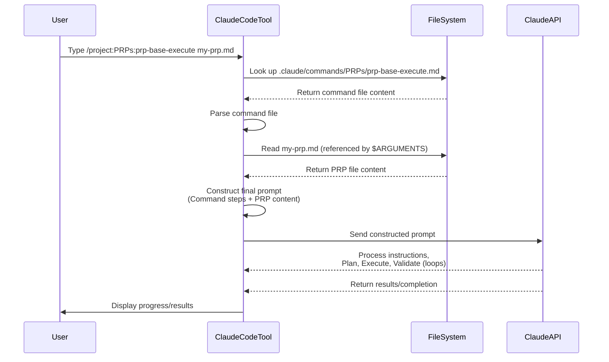

# Chapter 2: PRP Execution (Running a PRP)

Welcome back! In [Chapter 1: Claude Code Commands](01_claude_code_commands_.md), we learned how special `/` commands in Claude Code help you automate tasks and interact with the tool more effectively. You saw that a command like `/project:PRPs:prp-base-execute` is more than just a shortcut; it's a way to trigger a complex, predefined workflow using instructions stored in a Markdown file.

Now, let's dive into one of the most important workflows in this project: **PRP Execution**.

## What is PRP Execution?

Imagine you have a detailed plan for building a small new feature or fixing a bug. This plan isn't just a few bullet points; it's a complete work order. It includes:

*   What the feature is supposed to do.
*   Why it's important.
*   All the background information needed (links to documentation, examples from the existing codebase, things to watch out for).
*   Step-by-step instructions for *how* to build it (like pseudocode or a task list).
*   Crucially, a set of checks the work must pass to be considered complete and correct (like running tests, checking code style).

PRP Execution is the process of giving this detailed work order – which we call a **PRP (Product Requirement Prompt)** – to an AI agent like Claude Code and letting it **interpret the instructions, figure out a plan, write the code, and then use the checks provided to fix its own mistakes** until the work is done.

Think of it like this:

*   You (the engineer/product owner) create the detailed work order (the PRP).
*   Claude Code (the AI agent) is the skilled worker who reads the work order and executes it.

The goal is to make the AI agent capable of taking a comprehensive set of instructions and completing the task **autonomously**, requiring minimal back-and-forth once execution starts.

## Why is PRP Execution Important?

Traditional AI coding assistants often require you to break down tasks into very small steps and guide the AI turn by turn. This is like giving instructions to a junior developer one line at a time: "Okay, now create this file. Now write this function signature. Now add this loop..."

PRP Execution aims for a higher level of autonomy. By providing *all* the necessary context and validation steps upfront in the PRP document, you allow the AI to:

1.  Understand the bigger picture.
2.  Plan the entire task.
3.  Implement multiple parts.
4.  Self-correct based on validation feedback.

This shifts your role from a micro-manager to a "product owner" or "architect" who defines the requirements and success criteria. The AI handles the detailed implementation steps.

## Our Use Case: Getting Claude Code to Build a Feature

Let's go back to our example from Chapter 1. Suppose you've written a PRP document describing a small feature you want to add. How do you tell Claude Code: "Hey, take this document and build this feature following all the steps and rules inside it"?

This is exactly what PRP Execution, triggered by a specific Claude Code command, is for.

## Triggering PRP Execution with a Command

As hinted in Chapter 1, the primary way to start a PRP execution in this project is by using a custom Claude Code command designed specifically for this purpose. The main command for executing a standard PRP is `/project:PRPs:prp-base-execute`.

Let's look at how you would use this command:

```bash
/project:PRPs:prp-base-execute your-feature-name.md
```

Here:

*   `/project:` tells Claude Code to look for the command in the project's `.claude/commands/` directory.
*   `PRPs:` is a namespace (a folder inside `.claude/commands/`).
*   `prp-base-execute` is the name of the command file (`.claude/commands/PRPs/prp-base-execute.md`).
*   `your-feature-name.md` is the **argument** you're passing to the command. This is the filename of the specific PRP document you want to execute.

Recall from Chapter 1 that the command file `.claude/commands/PRPs/prp-base-execute.md` uses the `$ARGUMENTS` placeholder. When you type `/project:PRPs:prp-base-execute your-feature-name.md`, Claude Code reads that command file and replaces `$ARGUMENTS` with `your-feature-name.md`.

The content of the `.claude/commands/PRPs/prp-base-execute.md` file looks something like this (simplified):

```markdown
# Execute BASE PRP

Implement a feature using the PRP file.

## PRP File: $ARGUMENTS

## Execution Process

1. **Load PRP**
   - Read the specified PRP file
   - Understand all context and requirements
   ...

2. **ULTRATHINK**
   - Ultrathink before you execute the plan. Create a comprehensive plan...
   ...

3. ## **Execute the plan**
   - Implement all the code
   ...

4. **Validate**
   - Run each validation command
   - Fix any failures
   ...

5. **Complete**
   - Ensure all checklist items done
   ...

6. **Reference the PRP**
   - You can always reference the PRP again if needed
   ...
```

This command file acts as the "runbook" for the AI. It tells Claude Code the *process* it should follow *every time* it executes a base PRP. The `$ARGUMENTS` part is crucial because it tells Claude *which specific PRP file* contains the task details for *this particular* execution.

## The Execution Process: What the AI Does

When you run `/project:PRPs:prp-base-execute your-feature-name.md`, Claude Code follows the steps outlined in the "Execution Process" section of the `prp-base-execute.md` command file. Let's break down these steps in plain English:

1.  **Load PRP:** Claude Code first reads the contents of `your-feature-name.md`. It ingests all the information: the goal, the requirements, the context (documentation, code examples), the implementation blueprint, and importantly, the validation steps. It spends time understanding the task fully.
2.  **ULTRATHINK:** This is the planning phase. Based on the PRP, Claude Code figures out *how* it will accomplish the task. It might break it down into smaller sub-tasks, decide which files to modify, and sequence the steps. It might use internal tools (like the `TodoWrite` tool mentioned in the prompt comments and relevant files) to create a structured plan it can follow.
3.  **Execute the plan:** Now the AI starts coding. It writes the necessary code files, modifies existing ones, etc., following the plan and the implementation blueprint provided in the PRP.
4.  **Validate:** This is a critical step (so critical it gets its own chapter!). Claude Code runs the executable commands listed in the "Validation Loop" section of the `your-feature-name.md` PRP file. These commands might be linters (to check code style), unit tests, or integration tests.
    *   If the validation steps pass, great! The AI is confident its work is correct.
    *   If validation *fails* (e.g., a test fails), the AI knows there's a problem. It analyzes the error output, figures out what went wrong, and goes back to step 3 to fix the code. It repeats the Execute-Validate loop until the validation steps pass.
5.  **Complete:** Once all validation steps pass, the AI wraps up. It might ensure all checklist items from the PRP are done and report its completion status.
6.  **Reference the PRP:** The AI is instructed that it can always go back and re-read the PRP document at any point if it needs to clarify something or re-align with the requirements.

This structured process, defined in the command file and driven by the specific task details and validation steps in the PRP file, is the heart of PRP Execution.

## Under the Hood (Simplified)

Let's visualize this process when you type the command:



This diagram shows that your single command kicks off a flow where Claude Code reads *two* important documents: the command file (which defines the *process*) and the PRP file (which defines the *task*). It combines these to create the full set of instructions it sends to the core AI model (Claude API), which then performs the actual work, including potential back-and-forth internally for planning and validation loops.

The `prp_runner.py` script mentioned in `CLAUDE.md` is a Python script that effectively *mimics* or *orchestrates* this process from outside the Claude Code terminal, particularly useful for headless or automated runs. However, the `/project:PRPs:prp-base-execute` command within the Claude Code terminal is your direct interface for interactive execution.

## What a PRP File Looks Like (Briefly)

While we'll cover [PRP (Product Requirement Prompt)](03_prp__product_requirement_prompt__.md)s in detail in the next chapter, it's helpful to see a glimpse of the document the AI is executing. A PRP is a Markdown file with specific sections. Here's a very simplified example structure:

```markdown
# PRP: Implement User Profile Endpoint

## Goal
Add a REST endpoint to fetch user profile data.

## What
- New endpoint `/users/{id}` (GET)
- Returns user ID, name, email.
- Error if user not found.

## All Needed Context
- Database schema: @docs/db_schema.md
- Existing API pattern: @src/api/base.py
- User data structure: @src/models/user.py

## Implementation Blueprint
1. Create new file `src/api/users.py`
2. Define GET endpoint for `/users/{id}`
3. Use `get_user_by_id(id)` from `src/db/utils.py`
4. Handle `None` result for user not found (return 404)
5. Return JSON response with user data.

## Validation Loop

```bash
# Level 1: Syntax & Style
ruff check --fix && mypy .

# Level 2: Unit Tests
uv run pytest tests/users/test_api.py
```

... (more sections and details) ...
```

When you run `/project:PRPs:prp-base-execute implement-user-profile.md`, Claude Code reads *this* content, understands it needs to create `src/api/users.py`, follow the blueprint, use the provided context, and ensure the `ruff`, `mypy`, and `pytest` commands pass in the end.

## The Importance of Validation Loops

Notice the "Validation Loop" section in the example PRP structure and the "Validate" step in the execution process. This is arguably the most critical part of achieving autonomous execution. By providing executable checks *within the PRP*, you give the AI a concrete way to determine if its work is correct. It doesn't have to guess; it can run the commands and see if they pass. If they fail, the error messages provide valuable feedback for the AI to debug and fix its own code.

We will explore [Validation Loops](04_validation_loops_.md) in detail in a later chapter.

## Conclusion

In this chapter, you learned that **PRP Execution** is the core process where an AI agent like Claude Code takes a detailed work order (a **PRP** document) and autonomously implements it by following a predefined process that includes planning, coding, and, critically, self-correction via validation steps.

You learned that this process is typically triggered by a specific Claude Code command like `/project:PRPs:prp-base-execute`, which takes the PRP filename as an argument. The command file provides the "how-to" guide for executing *any* PRP, while the PRP file provides the specific "what-to-do" for a single task, along with all necessary context and validation criteria.

You now understand that running a command like `/project:PRPs:prp-base-execute` is the action you take to unleash the AI agent on a well-defined development task described in a PRP.

In the next chapter, we'll dive deeper into the **[PRP (Product Requirement Prompt)](03_prp__product_requirement_prompt__.md)** document itself – its structure, purpose, and why it's designed the way it is.

[PRP (Product Requirement Prompt)](03_prp__product_requirement_prompt__.md)

---

<sub><sup>Generated by [AI Codebase Knowledge Builder](https://github.com/The-Pocket/Tutorial-Codebase-Knowledge).</sup></sub> <sub><sup>**References**: [[1]](https://github.com/Wirasm/PRPs-agentic-eng/blob/57205a3f8360e7ba23bac76df6bca9d200ec3b6e/.claude/commands/PRPs/prp-base-execute.md), [[2]](https://github.com/Wirasm/PRPs-agentic-eng/blob/57205a3f8360e7ba23bac76df6bca9d200ec3b6e/.claude/commands/typescript/TS-execute-base-prp.md), [[3]](https://github.com/Wirasm/PRPs-agentic-eng/blob/57205a3f8360e7ba23bac76df6bca9d200ec3b6e/CLAUDE.md), [[4]](https://github.com/Wirasm/PRPs-agentic-eng/blob/57205a3f8360e7ba23bac76df6bca9d200ec3b6e/PRPs/scripts/prp_runner.py)</sup></sub>
````