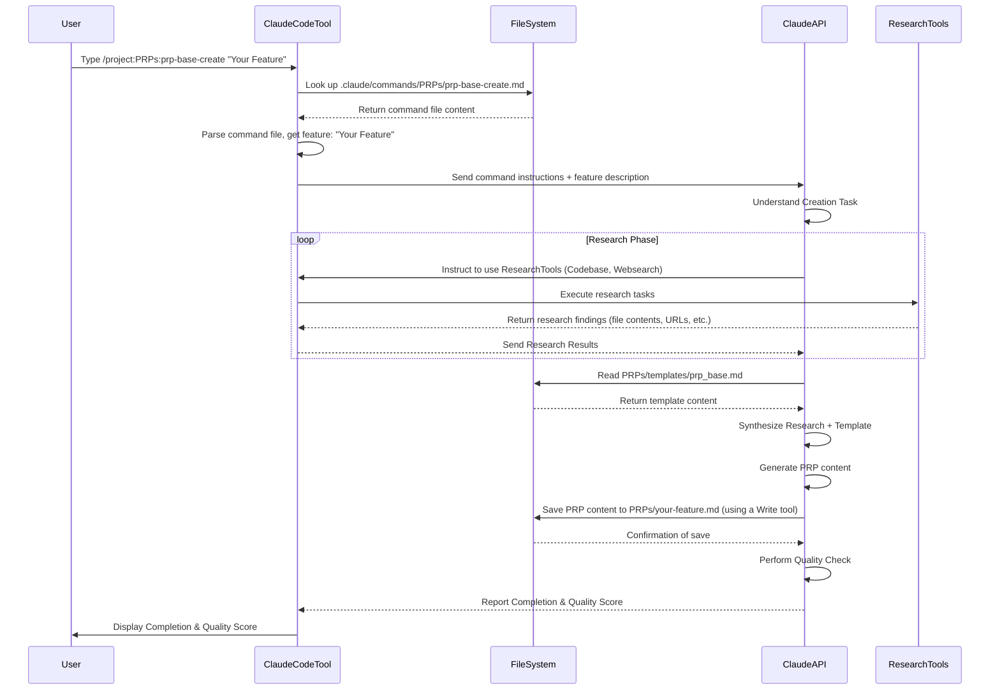

# Chapter 5: PRP Creation (Generating a PRP)

Welcome back! In our previous chapters, we've explored the heart of this project: running a detailed work order called a [PRP (Product Requirement Prompt)](03_prp__product_requirement_prompt__.md) using commands like `/project:PRPs:prp-base-execute` ([Chapter 2: PRP Execution (Running a PRP)](02_prp_execution__running_a_prp__.md)). We also saw how crucial [Validation Loops](04_validation_loops_.md) are for the AI to check and fix its own work.

But where do these detailed PRP documents come from in the first place? Writing a comprehensive PRP manually, with all the required context, implementation details, and validation steps, can be a lot of work! It requires deep research into the existing codebase, understanding project conventions, finding relevant documentation, and thinking through the implementation steps and necessary tests.

This is where **PRP Creation** comes in – the process of generating a PRP document. This project provides a way to automate this complex task using AI agents themselves.

## The Problem: Manual PRP Writing is Hard Work

Imagine you need to add a new feature, like integrating a third-party service. To write a PRP for this, you'd manually have to:

1.  Understand the requirements (Goal, Why, What).
2.  Hunt through the codebase to find similar integrations, relevant utility functions, or existing API patterns to follow.
3.  Search external documentation for the third-party service API, looking for specific endpoints, authentication methods, and potential pitfalls.
4.  Figure out how to structure the new code and break it down into logical tasks (Implementation Blueprint).
5.  Determine which tests need to be written or updated, and what commands will validate the work (Validation Loop).
6.  Collect all this information and structure it neatly into the PRP format.

This research and synthesis phase can take significant time and effort, even before any code is written!

## The Solution: AI-Assisted PRP Generation

This project leverages AI agents to *assist* or even *automate* the creation of PRPs. Instead of just writing the code *for* the feature, specialized 'creation agents' can perform the upfront research and generate the structured PRP document for you.

These creation agents are designed to:

*   Take a high-level feature description as input.
*   Perform research by analyzing your codebase and searching external resources.
*   Synthesize the research findings.
*   Structure the findings and implementation plan into a PRP document following a template.
*   Ensure the generated PRP includes rich context and executable validation steps.

The goal is to produce a high-quality, detailed PRP that is ready for an implementation agent (like the one used in [Chapter 2](02_prp_execution__running_a_prp__.md)) to execute with a high probability of success.

## Our Use Case: Asking the AI to Write a PRP for a New Feature

Let's go back to our ongoing example: suppose you want to build a "user authentication system". How do you tell the AI to *create* the PRP for this, rather than building it directly?

Just like triggering execution, creating a PRP is done using a dedicated Claude Code Command.

## Triggering PRP Creation with a Command

The primary command in this project for generating a base PRP is `/project:PRPs:prp-base-create`.

Here's how you would use it:

```bash
/project:PRPs:prp-base-create "Implement a user authentication system with email/password"
```

Here:

*   `/project:` tells Claude Code to look for the command in the project's `.claude/commands/` directory.
*   `PRPs:` is a namespace (a folder inside `.claude/commands/`).
*   `prp-base-create` is the name of the command file (`.claude/commands/PRPs/prp-base-create.md`).
*   `"Implement a user authentication system with email/password"` is the **argument** you're passing. This is the feature description that the creation agent will use as its starting point for research.

Recall from [Chapter 1](01_claude_code_commands_.md) that the command file uses the `$ARGUMENTS` placeholder. When you type the command above, Claude Code reads `.claude/commands/PRPs/prp-base-create.md` and substitutes `$ARGUMENTS` with your feature description.

## The PRP Creation Process: What the Command File Defines

The content of the `.claude/commands/PRPs/prp-base-create.md` file is the "runbook" for the *creation agent*. It tells the AI *how* to go about the process of generating a PRP. Let's look at the key sections:

```markdown
# Create BASE PRP

## Feature: $ARGUMENTS

... (description of the goal - generate a PRP) ...

## Research Process

> During the research process, create clear tasks and spawn as many agents and subagents as needed using the batch tools. The deeper research we do here the better the PRP will be. we optminize for chance of success and not for speed.

1. **Codebase Analysis in depth**
   - Create clear todos and spawn subagents to search the codebase for similar features/patterns ...
   - Identify all the necessary files to reference in the PRP
   - Note all existing conventions to follow
   - Check existing test patterns for validation approach
   - Use the batch tools to spawn subagents to search the codebase for similar features/patterns

2. **External Research at scale**
   - Create clear todos and spawn with instructions subagents to do deep research for similar features/patterns online and include urls to documentation and examples
   - Library documentation (include specific URLs)
   - For critical pieces of documentation add a .md file to PRPs/ai_docs and reference it in the PRP with clear reasoning and instructions
   - Implementation examples (GitHub/StackOverflow/blogs)
   - Best practices and common pitfalls found during research
   - Use the batch tools to spawn subagents to search for similar features/patterns online and include urls to documentation and examples

3. **User Clarification**
   - Ask for clarification if you need it

## PRP Generation

Using PRPs/templates/prp_base.md as template:

### Critical Context at minimum to Include and pass to the AI agent as part of the PRP

- **Documentation**: URLs with specific sections
- **Code Examples**: Real snippets from codebase
- **Gotchas**: Library quirks, version issues
- **Patterns**: Existing approaches to follow
- **Best Practices**: Common pitfalls found during research

### Implementation Blueprint

- Start with pseudocode showing approach
- Reference real files for patterns
- Include error handling strategy
- List tasks to be completed to fulfill the PRP in the order they should be completed...

### Validation Gates (Must be Executable by the AI agent)

```bash
# Syntax/Style
ruff check --fix && mypy .

# Unit Tests
uv run pytest tests/ -v
```
... (more commands) ...

## Output

Save as: `PRPs/{feature-name}.md`

## Quality Checklist

- [ ] All necessary context included
- [ ] Validation gates are executable by AI
- [ ] References existing patterns
- [ ] Clear implementation path
- [ ] Error handling documented

Score the PRP on a scale of 1-10 ...
```

Let's break down the key instructions in this command file:

1.  **Identify the Feature:** The command starts by clarifying the feature request using `$ARGUMENTS`.
2.  **Perform Research:** This is the core automated step. The command instructs the AI to perform **in-depth codebase analysis** and **external research at scale**.
    *   **Codebase Analysis:** The AI is told to use tools to examine the project's files (`@`), search for patterns (`!`, `Grep`), and identify existing conventions, test styles, and relevant files. It's like telling a human assistant, "Go look through our existing code and docs and find everything related to authentication."
    *   **External Research:** The AI is instructed to use web search tools (`Websearch`) to find relevant documentation URLs, code examples, best practices, and common pitfalls online. This is like asking for a web search on best practices for the requested feature.
    *   The mention of "spawning subagents" and "batch tools" hints at the internal complexity – the AI might break down the research into smaller, parallel tasks executed by different internal processes to speed things up and ensure thoroughness (similar to the `create-base-prp-parallel.md` command file, which explicitly describes this).
3.  **Synthesize and Generate PRP:** After gathering research findings, the command tells the AI to use the `PRPs/templates/prp_base.md` file as a template and fill it in with the information gathered during research.
    *   It specifies *what* critical context from the research MUST be included in the generated PRP (`Documentation`, `Code Examples`, `Gotchas`, `Patterns`, `Best Practices`). This ensures the *implementation agent* (who will later *run* this PRP) has all the necessary background.
    *   It tells the AI how to structure the `Implementation Blueprint` and what kind of information to include (pseudocode, task list, error handling).
    *   Crucially, it tells the AI *what executable validation commands* should be placed in the `## Validation Loop` section of the *generated PRP*. This is key – the creation agent doesn't run these tests *now*, but it ensures the *future* implementation agent knows *exactly* how to validate its work. The template lists common commands like `ruff check`, `mypy`, and `pytest`.
4.  **Output:** The command specifies the filename pattern and location where the generated PRP should be saved: `PRPs/{feature-name}.md`.
5.  **Quality Check:** Finally, the command asks the AI to internally check the generated PRP against a quality checklist and score it, ensuring it's well-formed and contains the necessary elements for successful execution.

By running this command, you are essentially telling the AI: "Go research this feature, gather all the relevant information from our codebase and the internet, organize it using our standard PRP template, include these specific validation steps, save it here, and tell me how confident you are in its quality."

## Under the Hood: The Creation Flow (Simplified)

When you type `/project:PRPs:prp-base-create "Your Feature"`:



This diagram shows that your single command triggers a multi-step process orchestrated by the AI. It first enters a research phase (which itself might involve complex internal loops or parallel execution using tools like `Glob`, `Grep`, `Read`, `Websearch`, etc.), then uses the findings to populate the PRP template, and finally saves the resulting document.

The file `PRPs/pydantic-ai-prp-creation-agent-parallel.md` included in the project is a highly detailed example of *how* such a creation agent might be implemented internally, using frameworks like PydanticAI and explicitly describing parallel research workflows. While the command file `/project:PRPs:prp-base-create` gives the *instructions* for the creation process, that detailed PRP file shows a potential *implementation plan* for the sophisticated agent that could execute those instructions.

## Beyond the Base: Parallel Creation

The project also includes a command called `/project:PRPs:create-base-prp-parallel`. As you might guess from the name and the content of `.claude/commands/rapid-development/experimental/create-base-prp-parallel.md`, this command is similar to the base creation command but explicitly emphasizes and defines the use of **parallel research agents**.

By launching multiple research tasks (like codebase analysis, external research, testing strategy research, and documentation research) concurrently, this approach aims to gather an even richer and more comprehensive set of context more quickly, leading to an even higher-quality PRP with a greater chance of one-pass implementation success. This is an example of how the system can be extended with more sophisticated agentic workflows defined within custom command files.

## Conclusion

In this chapter, you learned that creating a comprehensive PRP manually is a research-intensive task. This project automates that process using dedicated AI agents triggered by commands like `/project:PRPs:prp-base-create`.

You saw how the command file defines the entire creation workflow, including the research phase (analyzing codebase, searching externally), the generation phase (using a template and research findings), and the final output and quality check. The creation agent's job is to produce a high-quality, context-rich PRP document that is ready for an implementation agent to execute, complete with necessary validation steps already defined in the document.

You now understand that just as a command can trigger the *execution* of a PRP, another type of command can trigger the *creation* of one, leveraging AI agents to perform the necessary upfront research and synthesis.

In the next chapter, we'll take a closer look at the **[PRP Templates](06_prp_templates_.md)** themselves – the structured foundation upon which both manual and AI-assisted PRP creation relies.

[PRP Templates](06_prp_templates_.md)

---

<sub><sup>Generated by [AI Codebase Knowledge Builder](https://github.com/The-Pocket/Tutorial-Codebase-Knowledge).</sup></sub> <sub><sup>**References**: [[1]](https://github.com/Wirasm/PRPs-agentic-eng/blob/57205a3f8360e7ba23bac76df6bca9d200ec3b6e/.claude/commands/PRPs/prp-base-create.md), [[2]](https://github.com/Wirasm/PRPs-agentic-eng/blob/57205a3f8360e7ba23bac76df6bca9d200ec3b6e/.claude/commands/rapid-development/experimental/create-base-prp-parallel.md), [[3]](https://github.com/Wirasm/PRPs-agentic-eng/blob/57205a3f8360e7ba23bac76df6bca9d200ec3b6e/.claude/commands/typescript/TS-create-base-prp.md), [[4]](https://github.com/Wirasm/PRPs-agentic-eng/blob/57205a3f8360e7ba23bac76df6bca9d200ec3b6e/PRPs/pydantic-ai-prp-creation-agent-parallel.md)</sup></sub>
````