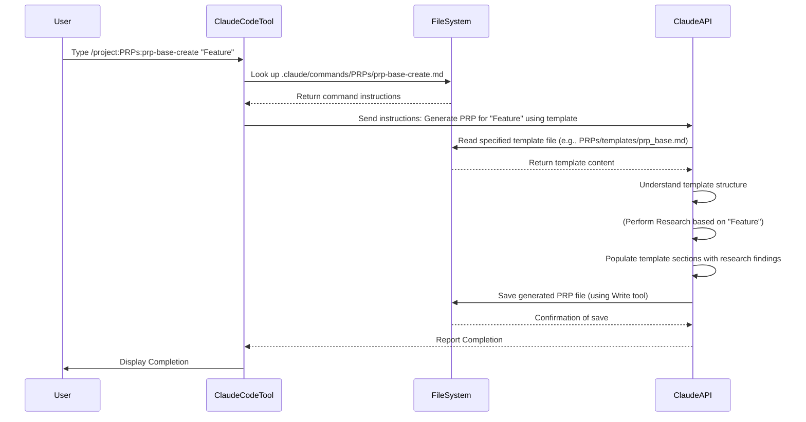

# Chapter 6: PRP Templates

Welcome back! In our previous chapter, [Chapter 5: PRP Creation (Generating a PRP)](05_prp_creation__generating_a_prp__.md), we saw that creating a detailed [PRP (Product Requirement Prompt)](03_prp__product_requirement_prompt__.md) can be a lot of work, but you can even use an AI agent to help generate one!

Whether you're writing a PRP yourself or asking the AI to create one for you using a command like `/project:PRPs:prp-base-create`, there's a need for a consistent starting point. You don't want to have to remember every single section and piece of information needed for a complete PRP each time.

This is where **PRP Templates** come in.

## What Problem Do PRP Templates Solve?

Imagine you're writing an official document, like a report or a proposal. If everyone just started typing from a blank page, each document would look completely different. Some might forget the executive summary, others might miss the conclusion, and the formatting would be all over the place. This makes them hard to read and compare.

PRPs are similar. They are detailed technical documents guiding an AI agent. If each PRP had a different structure, the AI agent (which is trained to expect certain sections like `## Validation Loop`) might get confused, miss crucial information, or fail to execute correctly.

**PRP Templates** solve this by providing a standardized blueprint.

## What Are PRP Templates?

**PRP Templates are pre-defined Markdown files that contain the standard structure and key sections required for a complete PRP document.**

Think of them like the templates you use for resumes, business letters, or project proposals. They include placeholder sections (like "## Goal", "## All Needed Context", "## Validation Loop") and often include comments or examples explaining what kind of information belongs in each section.

Using a template ensures that:

1.  **Consistency:** All your PRPs will have a similar structure, making them easier for humans (and AI) to read and understand.
2.  **Completeness:** Templates remind you (or the AI creation agent) to include all the necessary information, especially critical sections like the Validation Loop.
3.  **Efficiency:** You don't start from scratch. You start with a pre-formatted file ready for content.

## Where Do PRP Templates Live?

In this project, PRP templates are stored in a dedicated directory: `PRPs/templates/`.

If you look inside this folder, you'll see several files:

```bash
PRPs/templates/
├── prp_base.md         # A general template for most tasks (Python focus shown in previous chapters)
├── prp_base_typescript.md # A base template specifically for TypeScript projects
├── prp_planning.md     # A template for generating planning documents or PRDs
├── prp_spec.md         # Another template for creating technical specifications
└── prp_task.md         # A template focused on breaking down a larger task into smaller AI-executable steps
```

Each `.md` file in this directory is a different template designed for a potentially different type of task or project. The naming convention often indicates their purpose (e.g., `prp_base` for general tasks, `prp_typescript` for a specific language).

## How are PRP Templates Used?

PRP Templates are used in two main ways in this project:

1.  **Manual Creation:** You can copy one of the template files (e.g., `prp_base.md`) to a new location (like `PRPs/my-new-feature.md`) and then manually fill in the details for your specific task. This gives you a head start with the correct structure.
2.  **AI-Assisted Creation:** When you use a command like `/project:PRPs:prp-base-create` (as discussed in [Chapter 5](05_prp_creation__generating_a_prp__.md)), the AI creation agent is instructed to **use a specific template as its base** for generating the new PRP file. It reads the template's structure and fills in the sections with the research and details it gathers.

In both cases, the template provides the foundational structure that guides the creation process.

## Structure of a PRP Template (Simplified)

Let's look at a super simplified version of what a template file like `prp_base.md` might look like internally.

```markdown
# PRP Template Title

---

## Purpose

[Briefly explain what this template is for]

---

## Goal

[What is the main objective?]

## Why

[Why is this important?]

## What

[Specific requirements and success criteria]

## All Needed Context

### Documentation & References
```yaml
# List external docs, files, etc.
```

### Known Gotchas
```python
# Common pitfalls for this project/language
```

## Implementation Blueprint

### List of tasks
```yaml
# Step-by-step plan
```

### Per task pseudocode
```python
# Code examples or hints
```

## Validation Loop

### Level 1: Syntax & Style
```bash
# Commands like linters, type checkers
```

### Level 2: Unit Tests
```bash
# Commands to run unit tests
```

## Final validation Checklist

- [ ] Checklist item 1
- [ ] Checklist item 2

---

## Anti-Patterns to Avoid

- ❌ Avoid this...
```

This simplified structure shows the core sections you've seen mentioned in previous chapters. The actual template files (`prp_base.md`, `prp_base_typescript.md`) are much more detailed, with specific examples, comments, and instructions for both humans and AI agents. They define the expected content format within each section (e.g., YAML lists for context, bash blocks for validation commands, Markdown text for descriptions).

The key takeaway is that the template is the skeleton. It ensures that when you (or the AI) create a PRP, it *will* have sections for the `Goal`, `Context`, `Implementation Blueprint`, and crucially, the `Validation Loop` ([Chapter 4](04_validation_loops_.md)).

## Solving Our Use Case with a Template

Let's go back to creating the PRP for our "user authentication system" feature.

Whether you manually create it or use the AI command `/project:PRPs:prp-base-create "Implement user authentication..."`:

1.  **Choose a Template:** You'd likely choose `PRPs/templates/prp_base.md` if your project is in Python, or `PRPs/templates/prp_base_typescript.md` if it's a TypeScript project.
2.  **Start Filling:**
    *   If manual, you copy the chosen template file to `PRPs/implement-auth.md` and start editing, filling in the specific goal, why, what, context references, implementation steps, and validation commands for authentication.
    *   If using the AI command, the `prp-base-create.md` command file *instructs* the AI to load `PRPs/templates/prp_base.md` (or a similar base template based on project context) and then populate *its* sections based on the research the AI performs about "user authentication" and your codebase.

The template provides the structure. The content comes from your understanding or the AI's research.

## Under the Hood: Templates in AI Creation

When you trigger AI-assisted PRP creation using a command like `/project:PRPs:prp-base-create`, here's how the template is involved:



As you can see, the AI doesn't just invent a PRP structure. The command file explicitly tells it *which template* to use. The AI then reads that template file, understands its structure (the headings, the expected formats like YAML or bash blocks), and uses it as the framework to fill in the details based on the research it performs.

Templates ensure that the output of the AI creation process is always a well-structured, recognizable, and complete PRP ready for execution.

## Conclusion

In this chapter, you learned that **PRP Templates** are standardized Markdown files stored in `PRPs/templates/` that provide the blueprint for creating PRP documents. They ensure consistency and completeness, making PRPs easier to create (manually or via AI) and easier for the AI execution agent to understand.

You saw that different templates exist for different purposes or project types, and they are used by both humans copying the file and by AI creation agents instructed to use a specific template as their base.

Understanding PRP templates is key to understanding the structure and expected content of any PRP you'll encounter or create in this project. They are the foundation upon which consistent, high-quality agentic work orders are built.

In the next chapter, we'll dive into another crucial concept: **[Codebase Context (AI Documentation)](07_codebase_context__ai_documentation__.md)**, which is often referenced *within* these PRP templates as essential information for the AI.

[Codebase Context (AI Documentation)](07_codebase_context__ai_documentation__.md)

---

<sub><sup>Generated by [AI Codebase Knowledge Builder](https://github.com/The-Pocket/Tutorial-Codebase-Knowledge).</sup></sub> <sub><sup>**References**: [[1]](https://github.com/Wirasm/PRPs-agentic-eng/blob/57205a3f8360e7ba23bac76df6bca9d200ec3b6e/PRPs/templates/prp_base.md), [[2]](https://github.com/Wirasm/PRPs-agentic-eng/blob/57205a3f8360e7ba23bac76df6bca9d200ec3b6e/PRPs/templates/prp_base_typescript.md), [[3]](https://github.com/Wirasm/PRPs-agentic-eng/blob/57205a3f8360e7ba23bac76df6bca9d200ec3b6e/PRPs/templates/prp_planning.md), [[4]](https://github.com/Wirasm/PRPs-agentic-eng/blob/57205a3f8360e7ba23bac76df6bca9d200ec3b6e/PRPs/templates/prp_spec.md), [[5]](https://github.com/Wirasm/PRPs-agentic-eng/blob/57205a3f8360e7ba23bac76df6bca9d200ec3b6e/PRPs/templates/prp_task.md)</sup></sub>
````