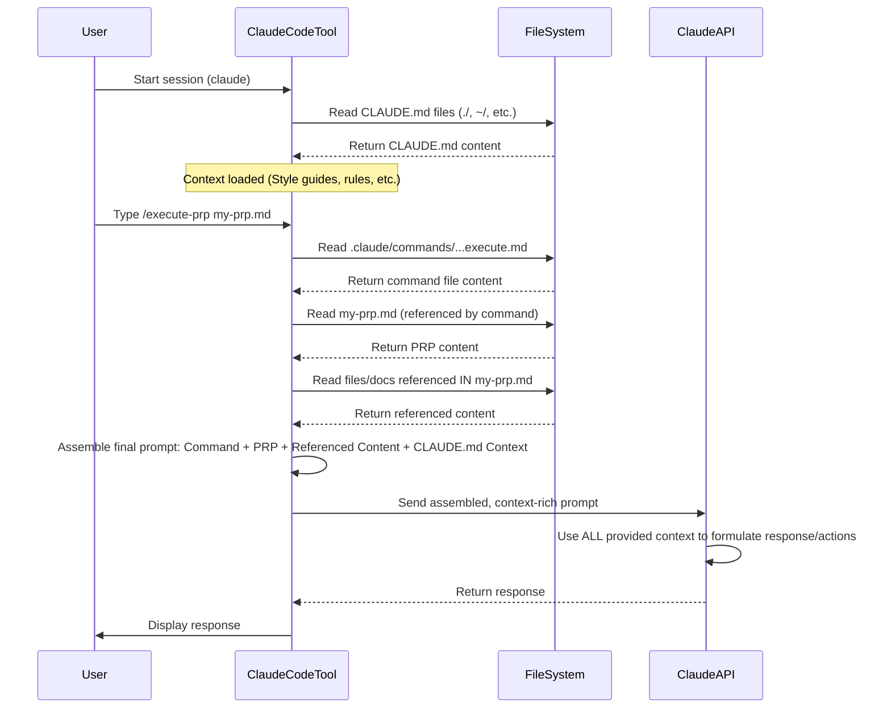

# Chapter 7: Codebase Context (AI Documentation)

Welcome back! In [Chapter 6: PRP Templates](06_prp_templates_.md), we learned how standardized templates provide the structure for our [PRP (Product Requirement Prompt)](03_prp__product_requirement_prompt__.md) documents, ensuring consistency whether you write them yourself or use an AI creation agent.

Now, let's tackle another fundamental concept: how does the AI agent know the specifics of *our* project? How does it know our preferred code style, which libraries we use, how our database is structured, or the specific commands we run for linting and testing? The AI models like Claude are powerful, but their general training data doesn't include the unique details of *your* codebase.

This is where **Codebase Context (AI Documentation)** comes in.

## The Problem: AI Needs Project-Specific Knowledge

Imagine you hire a brilliant new engineer. They are highly skilled generally, but they've never seen your project before. Before they can write code that fits seamlessly, they need to learn:

*   Your team's coding style guide.
*   The project's architecture and design patterns.
*   Which libraries are used and how they are typically configured.
*   Where the documentation lives.
*   How to run tests, linting, and other quality checks.

An AI agent is similar. Without this project-specific knowledge, its code output might look generic, ignore established patterns, use the wrong tools, or fail validation steps simply because it didn't know the rules.

Our use case: You want the AI to add a new feature using the [PRP Execution (Running a PRP)](02_prp_execution__running_a_prp__.md) process. How do you ensure the code it writes uses `ruff` for linting instead of `flake8`, follows your specific React 19 patterns, or knows the structure of your database models when writing API code?

## What is Codebase Context (AI Documentation)?

**Codebase Context** refers to all the project-specific information that we deliberately provide to the AI agent to guide its work. It's the "curated codebase intelligence" mentioned in the PRP definition. This context goes beyond the AI's general training and includes details unique to the project it's currently working on.

Think of it as giving the AI an onboarding guide, a style manual, a technical architecture overview, and a list of helpful resources *specific to your project*.

## Why is Codebase Context Important?

Providing tailored codebase context is crucial for several reasons:

*   **Seamless Integration:** Code generated by the AI is more likely to fit the existing style, patterns, and architecture, reducing the need for manual refactoring.
*   **Reduced Errors:** The AI avoids common project-specific pitfalls or anti-patterns if it knows about them.
*   **Correct Tool Usage:** The AI uses the designated tools (like specific linters, test runners, or search commands) defined for the project.
*   **Faster Iteration:** By understanding the project context upfront, the AI spends less time guessing or producing code that needs significant correction, leading to quicker task completion via [Validation Loops](04_validation_loops_.md).

## Sources of Codebase Context in This Project

This project framework uses several mechanisms to provide codebase context to the AI:

1.  **`CLAUDE.md` Files:**
    *   **What they are:** These are special Markdown files that Claude Code automatically loads when it starts in a directory (and recursively up the tree). They are designed to hold project-level or personal configuration and instructions for the AI.
    *   **Where they live:**
        *   `./CLAUDE.md`: For project-wide rules and context shared with the team.
        *   `~/.claude/CLAUDE.md`: For your personal preferences available across all projects.
        *   `.claude/CLAUDE.local.md`: (Deprecated in favor of `@` imports) Previously for local project preferences.
    *   **What they contain:** Style guides, architectural principles, required tools, common workflows, anti-patterns, and any other information you want the AI to know about this project.

    *Example Snippet from a `CLAUDE.md` (like `CLAUDE-REACT.md` provided):*

    ```markdown
    # CLAUDE.md

    ## Core Development Philosophy

    ### Component-First Architecture

    Build with reusable, composable components. Each component should have a single, clear responsibility...

    ## 🤖 AI Assistant Guidelines

    ### Context Awareness

    - When implementing features, always check existing patterns first
    - Prefer composition over inheritance in all designs
    - Use existing utilities before creating new ones

    ### Search Command Requirements

    **CRITICAL**: Always use `rg` (ripgrep) instead of traditional `grep` and `find` commands:

    ```bash
    # ✅ Use rg instead
    rg "pattern"
    ```
    ```
    *Explanation:* This tells the AI about the project's architectural preference (Component-First), guidelines for how the AI should approach tasks (check patterns, prefer composition), and explicitly states a required tool (`rg`) for searching, even providing the correct command syntax. If the AI were to propose a `grep` command, this context would tell it to use `rg` instead.

    *Example Snippet from this project's `CLAUDE.md`:*

    ```markdown
    # CLAUDE.md

    ## Project Nature

    This is a **PRP (Product Requirement Prompt) Framework** repository...

    ## Critical Success Patterns

    ### The PRP Methodology

    1. **Context is King**: Include ALL necessary documentation, examples, and caveats
    2. **Validation Loops**: Provide executable tests/lints the AI can run and fix

    ## Anti-Patterns to Avoid

    - L Don't create minimal context prompts - context is everything...
    - L Don't skip validation steps...
    ```
    *Explanation:* This provides the AI with a high-level understanding of *this* project itself – that it's about the PRP framework, not a typical application. It also reinforces the importance of context and validation loops, which are core to the PRP methodology.

2.  **`PRPs/ai_docs/` Directory:**
    *   **What it is:** A specific directory within the project designated for curating documentation *specifically* for the AI. This might include summaries of complex libraries, architectural decisions, or design documents tailored for AI consumption.
    *   **Where it lives:** `PRPs/ai_docs/`
    *   **What it contains:** Markdown files (`.md`) that hold detailed, organized information about project specifics that might be too long or complex to put directly in `CLAUDE.md`.

    *Example Snippet from `PRPs/ai_docs/cc_overview.md`:*

    ```markdown
    # Claude Code overview

    > Learn about Claude Code, the agentic coding tool that lives in your terminal...

    ## Basic usage

    To install Claude Code, use NPM:

    ```bash
    npm install -g @anthropic-ai/claude-code
    ```

    ## Why Claude Code?

    ### Accelerate development

    Use Claude Code to accelerate development with the following key capabilities:

    - Editing files and fixing bugs across your codebase
    ...
    ```
    *Explanation:* This file explains the Claude Code tool itself. While the AI *is* Claude, providing this explicit overview within the project's context directory helps ensure the AI understands the tool's capabilities and purpose within *this specific setup*. Other files in `ai_docs` might explain internal project modules, how to interact with specific APIs, etc.

3.  **Explicit References in PRPs and Commands:**
    *   **What they are:** Direct mentions of files, directories, URLs, or curated documentation within the content of [PRP (Product Requirement Prompt)](03_prp__product_requirement_prompt__.md) files or [Claude Code Commands](01_claude_code_commands_.md).
    *   **How they look:** Using special syntax like `@path/to/file` or YAML structures like `file: src/utils.py` or `docfile: PRPs/ai_docs/db_patterns.md`.
    *   **What they do:** Instruct Claude Code to load the *content* of these specific references and include it in the prompt sent to the AI model for that particular task.

    *Example Snippet from a PRP template's "All Needed Context":*

    ```yaml
    ## All Needed Context

    ### Documentation & References
    ```yaml
    # MUST READ - Include these in your context window
    - file: src/api/base.py
      why: Shows our standard API router setup

    - docfile: PRPs/ai_docs/db_guidelines.md
      why: Our specific ORM usage patterns and anti-patterns
    ```
    ```
    *Explanation:* This section in a PRP tells the AI that, for *this specific task*, it absolutely must review the content of `src/api/base.py` to see how API routes are typically set up in this project, and read `PRPs/ai_docs/db_guidelines.md` to understand the database interaction rules.

## How Codebase Context is Provided to the AI

Claude Code, the tool that runs in your terminal, acts as the orchestrator. It's responsible for gathering the relevant context and including it in the prompt it sends to the underlying Claude AI model.

1.  **Automatic Context Loading:** When Claude Code starts, it automatically finds and reads the `CLAUDE.md` files relevant to your current directory. This information is then available to the AI model for general guidance throughout your session.
2.  **Dynamic Context Inclusion:** When you run a command (like `/project:PRPs:prp-base-execute`) or the AI processes a PRP, the tool reads the command file and the PRP file. If these files contain `@` references or list files/docs in the "All Needed Context" sections, the Claude Code tool reads the content of those referenced files and includes it in the prompt alongside the command instructions or PRP details.

This means the AI isn't just getting a simple instruction; it's getting the instruction *plus* a large amount of relevant project-specific information (style guides, architectural notes, code examples, documentation snippets) that helps it understand the task within the project's unique environment.

## Solving Our Use Case with Codebase Context

Let's return to our use case: ensuring the AI uses the correct style, tools, and patterns when building a feature (like the user profile endpoint).

By properly setting up our codebase context:

1.  **Style/Tooling:** We add rules about code style (`ruff`, `mypy`) and required tools (`rg`) to the project's `CLAUDE.md`. When the AI starts, it loads this `CLAUDE.md` context. When it reaches the `Validation Loop` step in the PRP ([Chapter 4](04_validation_loops_.md)), it knows *which* commands to run (`ruff check`, `mypy`, `uv run pytest`) and how to interpret the output in the context of the project's style rules. If it uses `grep` in its internal thinking, the `CLAUDE.md` rule might prompt it to correct that to `rg`.
2.  **Architecture/Patterns:** We list `src/api/base.py` and `PRPs/ai_docs/db_guidelines.md` in the "All Needed Context" of the PRP for the user profile endpoint. The Claude Code tool reads these files and provides their content to the AI when it starts executing that PRP. The AI sees the existing API router setup pattern and the database interaction guidelines and uses them to structure the new code in `src/api/users.py`.
3.  **Specific Requirements:** The PRP itself, which is built upon a [PRP Template](06_prp_templates_.md) (Chapter 6), contains the `Goal`, `Why`, `What`, and `Implementation Blueprint`. This is the *task-specific* context that tells the AI *what* feature to build.

Combined, the general project context from `CLAUDE.md`, the curated documentation from `PRPs/ai_docs/`, and the task-specific context referenced in the PRP provide the AI with a comprehensive understanding of both the task and the environment, enabling it to generate code that fits.

## Under the Hood: Context in the Prompt

When Claude Code sends a prompt to the Claude API, it includes the user's input (or the command instructions), potentially the content of the command file, the content of the PRP file, *and* the content gathered from the `CLAUDE.md` files and any explicitly referenced files/docs (`@`, `file:`, `docfile:`).

Here's a simplified view of how the context gets included:



The crucial part is the "Assemble final prompt" step. Claude Code intelligently bundles all the relevant information it has gathered – the static project rules, the dynamic task details from the PRP, and the content of any specific files requested – into the single prompt it sends to the AI model. The AI then uses this rich context to generate code, make decisions, and perform actions that align with the project's standards.

## Conclusion

In this chapter, you learned that **Codebase Context (AI Documentation)** is the project-specific information provided to the AI agent to guide its work. This context comes from sources like the automatically loaded `CLAUDE.md` files, curated documentation in `PRPs/ai_docs/`, and explicit references within PRPs and Commands.

Providing this tailored context is essential for the AI to understand project-specific style guides, architectural patterns, required tools, and validation methods. By ensuring the AI has access to this information, we enable it to generate code that integrates seamlessly and adheres to project standards, increasing the chances of one-pass success during [PRP Execution (Running a PRP)](02_prp_execution__running_a_prp__.md).

You now understand that when you set up your project's `CLAUDE.md` or populate the `PRPs/ai_docs/` directory, you are actively training the AI on the nuances of *your* codebase, equipping it to be a more effective and integrated team member.

In the next chapter, we'll look at the underlying **[Claude Code Platform](08_claude_code_platform_.md)** itself – the tool that manages this context, runs commands, and interacts with the AI model.

[Claude Code Platform](08_claude_code_platform_.md)

---

<sub><sup>Generated by [AI Codebase Knowledge Builder](https://github.com/The-Pocket/Tutorial-Codebase-Knowledge).</sup></sub> <sub><sup>**References**: [[1]](https://github.com/Wirasm/PRPs-agentic-eng/blob/57205a3f8360e7ba23bac76df6bca9d200ec3b6e/CLAUDE.md), [[2]](https://github.com/Wirasm/PRPs-agentic-eng/blob/57205a3f8360e7ba23bac76df6bca9d200ec3b6e/PRPs/ai_docs/cc_memory.md), [[3]](https://github.com/Wirasm/PRPs-agentic-eng/blob/57205a3f8360e7ba23bac76df6bca9d200ec3b6e/PRPs/ai_docs/cc_overview.md), [[4]](https://github.com/Wirasm/PRPs-agentic-eng/blob/57205a3f8360e7ba23bac76df6bca9d200ec3b6e/claude_md_files/CLAUDE-REACT.md)</sup></sub>
````