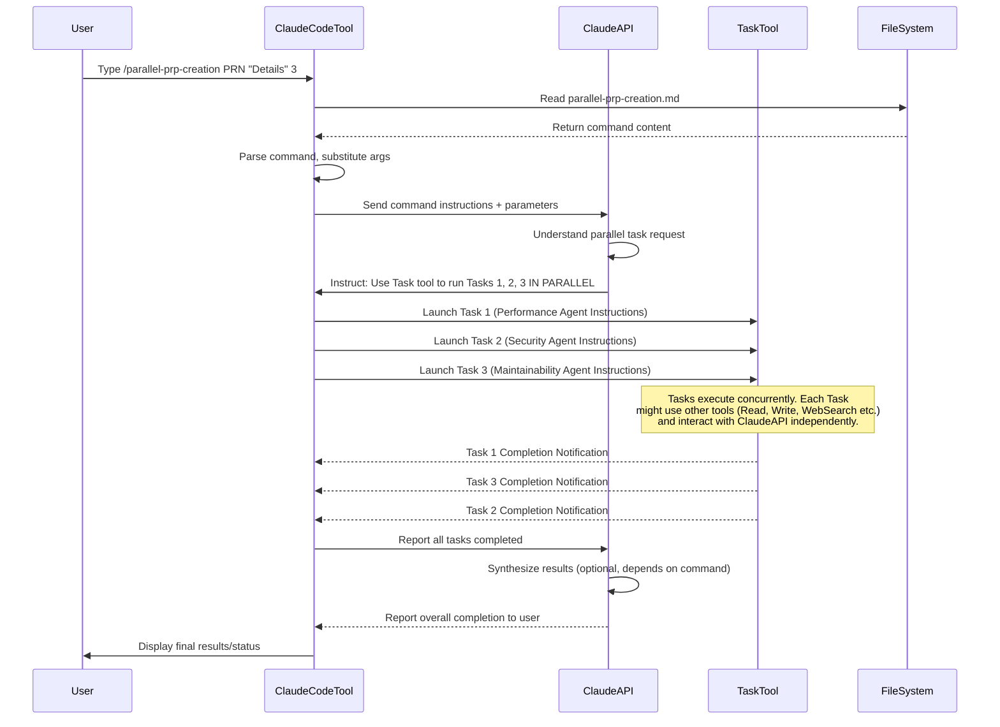

# Chapter 9: Parallel Agentic Execution

Welcome to the final chapter of the `PRPs-agentic-eng` tutorial! We've journeyed from basic [Claude Code Commands](01_claude_code_commands_.md) to executing detailed [PRP (Product Requirement Prompt)](03_prp__product_requirement_prompt__.md)s with [Validation Loops](04_validation_loops_.md), creating PRPs using [PRP Templates](06_prp_templates_.md) and [Codebase Context](07_codebase_context__ai_documentation_.md), all orchestrated by the [Claude Code Platform](08_claude_code_platform_.md).

Now, let's explore an advanced technique that leverages the power of that platform to handle complex tasks even faster: **Parallel Agentic Execution**.

## The Problem: One Agent Can Only Do One Thing at a Time

So far, we've mostly talked about a single AI agent (the Claude model you're interacting with via the Claude Code platform) working on a task defined in a PRP. It reads the PRP, makes a plan ([PRP Execution (Running a PRP)](02_prp_execution__running_a_prp__.md)), writes code, runs validation, and iterates.

While this is powerful, some tasks are large or require exploring multiple distinct approaches.

Imagine you need to figure out the best way to implement a new feature, considering different trade-offs like performance, security, and maintainability. You could ask a single agent to research and propose one approach, then another, and so on, but that would take a lot of back-and-forth and time. Or maybe you have a large feature that can be broken down into several independent sub-tasks (e.g., backend API, frontend UI, database schema changes). Asking one agent to do them strictly one after another might be slow.

The problem is that a single agent, even a very capable one, is generally following one train of thought and executing tasks sequentially.

## The Solution: Parallel Agentic Execution

**Parallel Agentic Execution** is an advanced strategy where you instruct *multiple* AI agents to work on *different parts* of a larger problem or explore *different solutions* simultaneously. Each agent works on its assigned piece independently, like a team of developers tackling different modules of a project at the same time.

Think of it like a restaurant kitchen:

*   A single chef (one agent) can cook a meal, but it takes time to do each step sequentially.
*   Multiple chefs (multiple agents) can work on different parts of the meal (one on appetizers, one on the main course, one on dessert) or even experiment with different ways to cook the same dish, dramatically speeding up the process and potentially yielding better results or more options.

In the context of this project, this means using the Claude Code Platform's capabilities to launch distinct AI tasks that run *at the same time*, each potentially handled by a separate instance or thread of the AI model focused on its specific instructions.

## Our Use Case: Exploring Multiple Implementation Strategies

Let's take the scenario of wanting to explore different implementation strategies for a feature (e.g., user authentication). Instead of asking one agent to research and propose a "performance-optimized" approach, then asking it again for a "security-first" approach, and again for a "maintainability-focused" approach, we can launch multiple agents *in parallel*, each tasked with researching and outlining one specific strategy.

This allows us to get back proposals for all these strategies much faster and compare them to choose the best fit for our project.

## How to Trigger Parallel Execution with a Command

Just like other complex workflows in this project, parallel agentic execution is typically triggered using a dedicated Claude Code command. This command file acts as the orchestrator, instructing the Claude Code platform to launch multiple parallel tasks for the AI.

This project includes an experimental command designed for this exact use case: `/project:rapid-development:experimental:parallel-prp-creation`.

You would use it like this in your Claude Code terminal:

```bash
/project:rapid-development:experimental:parallel-prp-creation "User Authentication System" "Implement email/password authentication with JWT tokens" 3
```

Here:

*   `/project:` indicates a project-specific command.
*   `rapid-development:experimental:` is a namespace structure pointing to a specific folder path (`.claude/commands/rapid-development/experimental/`).
*   `parallel-prp-creation` is the name of the command file (`.claude/commands/rapid-development/experimental/parallel-prp-creation.md`).
*   `"User Authentication System"` is the first argument (`$ARGUMENTS[0]` in the command file) - the base name for the generated PRPs.
*   `"Implement email/password authentication with JWT tokens"` is the second argument (`$ARGUMENTS[1]`) - the core details/description of the feature.
*   `3` is the third argument (`$ARGUMENTS[2]`) - the number of parallel PRPs (strategies) to generate.

When you run this command, the Claude Code platform reads the instructions in `.claude/commands/rapid-development/experimental/parallel-prp-creation.md`.

## Under the Hood: The Parallel Command File

Let's look at excerpts from the command file `.claude/commands/rapid-development/experimental/parallel-prp-creation.md` to understand how it orchestrates parallel execution.

The file defines the command and its arguments:

```markdown
---
name: parallel-prp-creation
description: Create multiple PRP variations in parallel for comparative analysis and implementation strategy validation
arguments:
  - name: prp_name
    description: The base name for the PRP (e.g., "user-authentication")
  - name: implementation_details
    description: Core feature requirements and context
  - name: number_of_parallel_prps
    description: Number of parallel PRP variations to create (recommended 2-5)
---

# Parallel PRP Creation - Multiple Implementation Strategies

Generate **ARGS** parallel PRP variations...

## Execution Parameters

PRP_NAME: $ARGUMENTS[0]
IMPLEMENTATION_DETAILS: $ARGUMENTS[1]
NUMBER_OF_PARALLEL_PRPs: $ARGUMENTS[2]

## Parallel Agent Coordination

**CRITICAL**: Execute all agents simultaneously using multiple Task tool calls in a single response. Do not wait for one agent to complete before starting the next.
```

This part sets up the command and captures the arguments you provide. The crucial instruction is under "Parallel Agent Coordination": it explicitly tells the AI (who is interpreting this command file via the Claude Code platform) to use the `Task` tool and launch multiple tasks *simultaneously*.

Further down, the command file defines blocks for each potential parallel agent. It specifies their focus (Performance, Security, etc.) and, importantly, provides specific instructions for each agent using `Task:` and `Prompt:`.

Here's a simplified example of one of these blocks:

```markdown
### Agent 1: Performance-Optimized Implementation

```
Task: Performance-Optimized PRP Creation
Prompt: Create a comprehensive PRP for "${PRP_NAME}" with focus on PERFORMANCE AND SCALABILITY.

Feature Details: ${IMPLEMENTATION_DETAILS}

Your approach should emphasize:
- High-performance architecture patterns
... (more detailed instructions) ...

Output Files:
1. Save PRP as: PRPs/${PRP_NAME}-1.md
... (more output instructions) ...

Do NOT run any servers, builds, or executables. Focus on research and PRP creation only.
```
```

This block isn't *code* itself, but rather instructions *for the AI*. It defines a `Task` (a unit of work to be executed) with a specific `Prompt` (the detailed instructions for the agent assigned to this task). The `$ARGUMENTS` (like `${PRP_NAME}` and `${IMPLEMENTATION_DETAILS}`) are substituted from the command line input.

The command file lists several such `Task`/`Prompt` blocks (Performance, Security, Maintainability, etc.). When the AI processes this command file, guided by the "Parallel Agent Coordination" instruction and using the Claude Code platform's capabilities, it doesn't execute these tasks one by one. Instead, it tells the **Platform** to launch the first `NUMBER_OF_PARALLEL_PRPs` tasks *concurrently*.

## Under the Hood: The Platform Orchestrates Parallel Tasks

The Claude Code Platform is the key enabler of parallel execution. It provides the necessary mechanism for the AI (via the Claude API) to request the execution of multiple, independent `Task`s.

Here's a simplified sequence diagram illustrating the process:



In this diagram:

*   The User initiates the parallel command via the Claude Code Tool.
*   The Tool reads the command file and sends the core instruction (launch N tasks in parallel) to the ClaudeAPI.
*   The ClaudeAPI (the AI) understands this instruction and uses the `Task` tool provided by the Claude Code Platform.
*   The Claude Code Tool's `TaskTool` capability receives the request and launches multiple independent tasks (Agent 1, Agent 2, Agent 3, etc.). Each of these tasks is essentially a new instance of the AI processing a specific prompt (`Task:`/`Prompt:` block) concurrently.
*   These parallel tasks can then execute their own sub-steps (like reading files, searching the web, generating content) independently, potentially making further calls back to the ClaudeAPI or other Tools via the Claude Code Platform.
*   The Claude Code Platform monitors these parallel tasks and notifies the primary AI instance when they are complete.

This parallel execution allows the system to work on multiple fronts at once, significantly reducing the overall time required for tasks that can be broken down or that benefit from exploring multiple options simultaneously.

Other command files in the `experimental` directory, like `.claude/commands/rapid-development/experimental/hackathon-prp-parallel.md`, illustrate even more aggressive parallelization, defining dozens of tasks for different parts of a hackathon project (specs, plans, backend, frontend, QA) to be executed concurrently to achieve maximum speed.

## Benefits of Parallel Agentic Execution

*   **Speed:** Completing multiple independent tasks or research paths concurrently is much faster than doing them sequentially.
*   **Exploration:** Enables rapid exploration of multiple design options or implementation strategies.
*   **Modularity:** Facilitates breaking down large, complex problems into smaller, manageable, and independently executable tasks.
*   **Efficiency:** Different agents can specialize or focus on specific types of work (e.g., one agent for database tasks, another for frontend).

This capability pushes the boundaries of what AI agents can achieve autonomously, moving towards complex project execution rather than just isolated tasks.

## Conclusion

In this chapter, you learned about **Parallel Agentic Execution**, a strategy where multiple AI agents work concurrently on different tasks or explore different solutions simultaneously. This is enabled by the [Claude Code Platform](08_claude_code_platform_.md)'s ability to orchestrate multiple independent `Task`s as instructed by the AI.

You saw how commands like `/project:rapid-development:experimental:parallel-prp-creation` trigger this process, defining multiple parallel tasks within a single command file. The AI interprets these instructions and leverages the Platform's tools to launch and manage the concurrent execution of these tasks.

Parallel execution is a powerful technique for speeding up complex workflows, exploring diverse options rapidly, and tackling larger, more modular problems with AI agents.

This concludes our introductory tutorial on the `PRPs-agentic-eng` project. We've covered the core concepts from interacting with the platform via commands to defining detailed work orders in PRPs, enabling self-correction with validation loops, automating creation, leveraging codebase context, understanding the platform's role, and finally, harnessing the power of parallel execution.

Armed with this knowledge, you're ready to start exploring the project, experimenting with its commands, and contributing to the evolution of agentic engineering!

---

<sub><sup>Generated by [AI Codebase Knowledge Builder](https://github.com/The-Pocket/Tutorial-Codebase-Knowledge).</sup></sub> <sub><sup>**References**: [[1]](https://github.com/Wirasm/PRPs-agentic-eng/blob/57205a3f8360e7ba23bac76df6bca9d200ec3b6e/.claude/commands/rapid-development/experimental/create-base-prp-parallel.md), [[2]](https://github.com/Wirasm/PRPs-agentic-eng/blob/57205a3f8360e7ba23bac76df6bca9d200ec3b6e/.claude/commands/rapid-development/experimental/hackathon-prp-parallel.md), [[3]](https://github.com/Wirasm/PRPs-agentic-eng/blob/57205a3f8360e7ba23bac76df6bca9d200ec3b6e/.claude/commands/rapid-development/experimental/parallel-prp-creation.md), [[4]](https://github.com/Wirasm/PRPs-agentic-eng/blob/57205a3f8360e7ba23bac76df6bca9d200ec3b6e/PRPs/pydantic-ai-prp-creation-agent-parallel.md)</sup></sub>
````