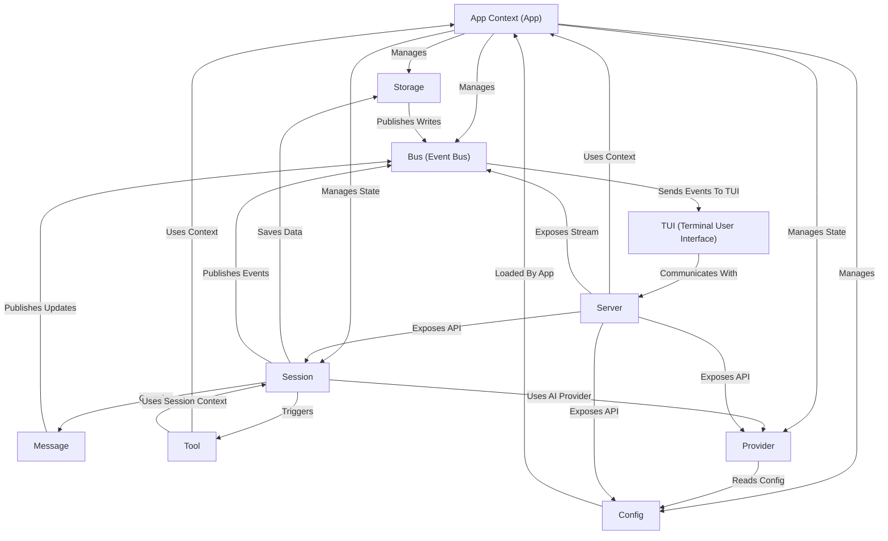

# Tutorial: opencode

opencode is your **AI assistant** for coding projects. It manages *interactive conversations* (Sessions and Messages) where you can ask the AI to help you. The AI uses **specialized skills** (Tools) to read and modify your files or run commands. It connects to *different AI services* (Providers) and remembers everything through **persistent storage**. A *local server* (Server) provides the core logic and communicates with the interactive *terminal interface* (TUI).

## Visual Overview

## Chapters

1. [TUI (Terminal User Interface)
](01_tui__terminal_user_interface__.md)
2. [Message
](02_message_.md)
3. [Session
](03_session_.md)
4. [Config
](04_config_.md)
5. [Provider
](05_provider_.md)
6. [Tool
](06_tool_.md)
7. [Storage
](07_storage_.md)
8. [Server
](08_server_.md)
9. [Bus (Event Bus)
](09_bus__event_bus__.md)
10. [App Context (App)
](10_app_context__app__.md)

---

Generated by [AI Codebase Knowledge Builder](https://github.com/The-Pocket/Tutorial-Codebase-Knowledge).
