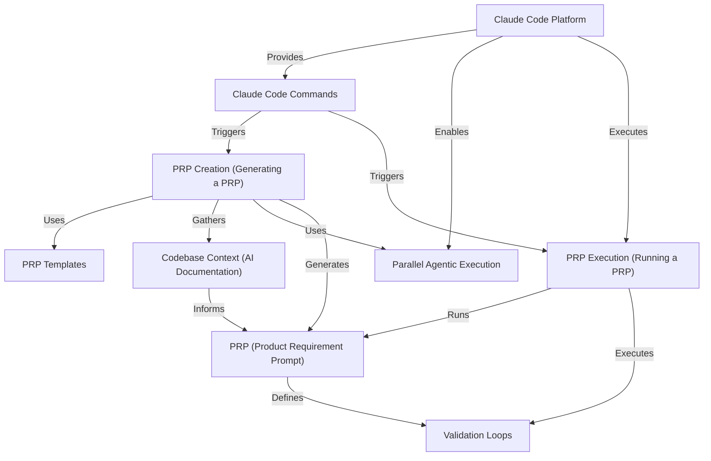

# Tutorial: PRPs-agentic-eng

The `PRPs-agentic-eng` project is a framework for building **production-ready software** using *AI coding agents*.
It centers around the **Product Requirement Prompt (PRP)**, a detailed work order combining product goals
with specific codebase context, implementation steps, and executable tests. This methodology aims
to guide AI agents to complete coding tasks correctly on the first attempt, minimizing manual iteration
and leveraging the capabilities of platforms like Claude Code.


## Visual Overview



## Chapters

1. [Claude Code Commands
](01_claude_code_commands_.md)
2. [PRP Execution (Running a PRP)
](02_prp_execution__running_a_prp__.md)
3. [PRP (Product Requirement Prompt)
](03_prp__product_requirement_prompt__.md)
4. [Validation Loops
](04_validation_loops_.md)
5. [PRP Creation (Generating a PRP)
](05_prp_creation__generating_a_prp__.md)
6. [PRP Templates
](06_prp_templates_.md)
7. [Codebase Context (AI Documentation)
](07_codebase_context__ai_documentation__.md)
8. [Claude Code Platform
](08_claude_code_platform_.md)
9. [Parallel Agentic Execution
](09_parallel_agentic_execution_.md)

---

<sub><sup>Generated by [AI Codebase Knowledge Builder](https://github.com/The-Pocket/Tutorial-Codebase-Knowledge).</sup></sub>
````