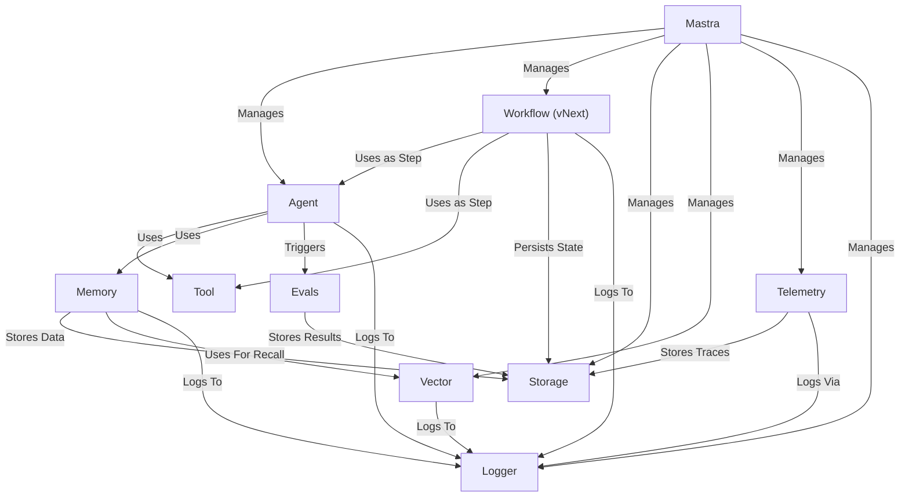

# Tutorial: mastra

Mastra is a **core framework** for building AI applications, acting as a *central hub*.
It allows you to register and *manage AI components* like **Agents** and **Workflows**.
Mastra coordinates these components and provides shared services for *persistence*, *observability*, and *evaluation*.

## Visual Overview

## Chapters

1. [Mastra
](01_mastra_.md)
2. [Logger
](02_logger_.md)
3. [Agent
](03_agent_.md)
4. [Workflow (vNext)
](04_workflow__vnext__.md)
5. [Tool
](05_tool_.md)
6. [Memory
](06_memory_.md)
7. [Storage
](07_storage_.md)
8. [Vector
](08_vector_.md)
9. [Telemetry
](09_telemetry_.md)
10. [Evals
](10_evals_.md)

---

Generated by [AI Codebase Knowledge Builder](https://github.com/The-Pocket/Tutorial-Codebase-Knowledge).