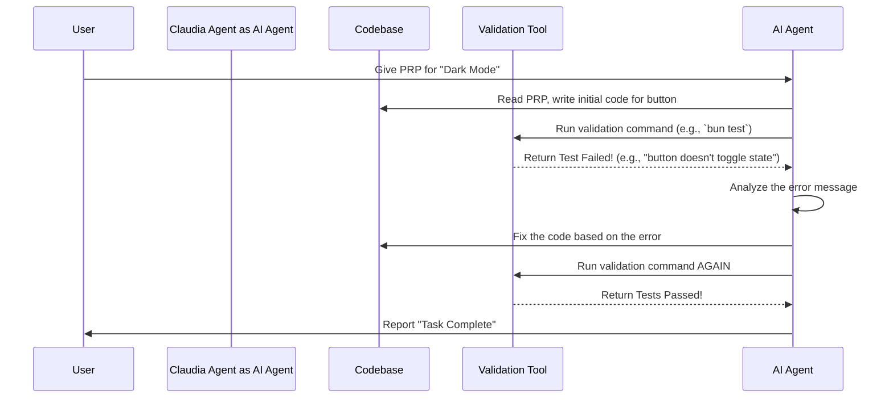

# Chapter 1: Product Requirement Prompt (PRP) & Validation Loops

Welcome to the `openGUIcode` project! We're excited to have you. In this first chapter, we're going to dive into the single most important concept in our project: the **Product Requirement Prompt (PRP)** and its powerful sidekick, the **Validation Loop**. This is the core methodology we use to guide our AI agents to build software successfully.

### The Problem: How Do You Give an AI a Task?

Imagine you want an AI to add a new feature to an app, like a "Dark Mode" button.

If you just tell the AI, "Hey, add a dark mode button," what happens? The AI has a ton of questions:
*   Where should the button go?
*   What should it look like?
*   How do I change the colors for the whole app?
*   Which code files should I change?
*   How do I know if I broke something else?

Giving vague instructions is a recipe for disaster. The AI might write messy code, put the button in the wrong place, or completely crash the app. We need a better way to give the AI its work orders.

### The Solution: A Super-Detailed Work Order (The PRP)

The **Product Requirement Prompt (PRP)** is our solution. Think of it as a super-detailed work order or a recipe, designed specifically for an AI. It doesn't just say *what* to build; it provides all the context and a blueprint for *how* to build it.

A PRP has a few key parts, just like a good recipe:

1.  **Goal (`Purpose`, `Why`):** This is the "What are we making?" part of the recipe. It explains the high-level objective. For our example, the goal is to "let users switch to a dark theme to reduce eye strain."
2.  **Context (`All Needed Context`):** These are the "Ingredients and Kitchen Notes." It lists all the documentation, existing code examples, and tricky parts the AI needs to know about. For example: "The app's colors are defined in `styles/theme.css`" or "Look at `components/LoginButton.js` for an example of how we build buttons."
3.  **Blueprint (`Implementation Blueprint`):** These are the "Step-by-Step Instructions." It gives the AI a clear plan, like "1. Create a new `DarkModeButton.js` file. 2. Add the button to the `Header.js` component. 3. Write the CSS for the dark theme in `styles/theme.css`."

Here's a glimpse of a tiny, simplified PRP for our dark mode feature. Real PRPs are much more detailed, but this gives you the idea.

```markdown
name: "Feature - Dark Mode Toggle"
description: "Allow users to toggle between light and dark themes."

#### Goal
Implement a button that allows users to switch the application's theme between a light mode and a dark mode.

#### All Needed Context
-   `docfile: docs/ui-style-guide.md` - Our guide for component styles.
-   `file: src/components/LoginButton.js` - Example of an existing button.
-   `file: src/styles/theme.css` - Where all color variables are stored.

#### Implementation Blueprint
1.  **CREATE** a new file `src/components/DarkModeButton.js`.
2.  **MODIFY** `src/components/Header.js` to include the new DarkModeButton.
3.  **MODIFY** `src/styles/theme.css` to add color variables for the dark theme.
```

With this PRP, the AI has a much clearer idea of what to do. But one crucial piece is still missing...

### The Secret Sauce: Validation Loops

How does the AI know if its work is actually correct? How does it check for mistakes?

This is where the **Validation Loop** comes in. It's the most powerful part of a PRP.

A Validation Loop is a set of **executable commands** (like running linters or tests) that the AI runs to check its own work. Think of it as the "taste test" in our recipe analogy.

The process looks like this:

1.  **Code:** The AI writes some code based on the PRP's blueprint.
2.  **Validate:** The AI runs the validation commands from the PRP. For example, `npm test`.
3.  **Check Feedback:** The AI looks at the results.
    *   **Success?** If all tests pass, great! The AI can move to the next task.
    *   **Failure?** If a test fails, the AI gets an error message.
4.  **Fix & Repeat:** The AI reads the error message, figures out what went wrong, fixes its code, and **goes back to step 2 to run the tests again.**

This "code -> test -> fix -> repeat" cycle is the **Validation Loop**. It allows the AI to fix its own mistakes until the task is complete and correct.

Here's how we'd add a Validation Loop to our PRP:

```markdown
#### Validation Loop

##### Level 1: Code Style & Syntax
# First, make sure the code is clean and has no syntax errors.
bunx eslint . --fix

##### Level 2: Unit Tests
# Next, run the tests for our new button to make sure it works.
bun test src/components/DarkModeButton.test.js
```

Now, when the AI works on this PRP, it won't just write code. It will run `eslint` to clean it up and then run the unit tests. If the tests fail, it will read the error, fix the button's code, and run the tests again until they pass.

### Under the Hood: What's Happening?

When you give a PRP to an AI agent in `openGUIcode`, a simple but powerful process kicks off. Let's visualize the loop.



As you can see, the Validation Loop allows the AI to be much more autonomous. You don't have to check every line of code for mistakes. You just define what "correct" looks like by providing the right tests, and the AI will work until it meets that definition.

This core methodology of combining a detailed **Product Requirement Prompt (PRP)** with a self-correcting **Validation Loop** is what makes `openGUIcode` so effective. It turns a simple AI assistant into a capable AI developer that can take a task from start to finish.

### Conclusion

In this chapter, you learned about the foundational concept of `openGUIcode`:

*   A **Product Requirement Prompt (PRP)** is a detailed work order for an AI, telling it what to build, why, and how.
*   A **Validation Loop** is a set of executable checks (like tests) inside the PRP that the AI uses to verify its own work.
*   This loop allows the AI to **code, test, analyze errors, and fix its mistakes** iteratively until the task is done correctly.

This PRP is the "mission" we give to our AI agents. Now that you understand what the mission looks like, you're ready to meet the agents who will carry it out.

In the next chapter, we'll introduce you to the workers of our system: the [Claudia Agents](02_claudia_agents_.md).

---

Generated by [AI Codebase Knowledge Builder](https://github.com/The-Pocket/Tutorial-Codebase-Knowledge)