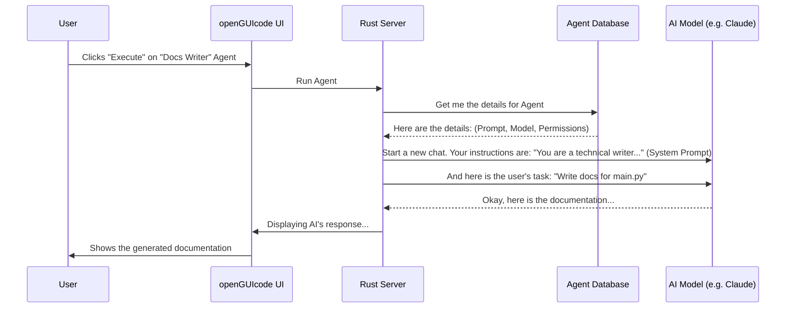

# Chapter 2: Claudia Agents

In the [previous chapter](01_product_requirement_prompt__prp____validation_loops_.md), we learned about the **Product Requirement Prompt (PRP)**, which is like a detailed mission plan for our AI. We now know how to give the AI a clear, testable task.

But who exactly is carrying out this mission? Is it always the same general-purpose AI? Not exactly. Let's meet the specialists who do the work: the **Claudia Agents**.

### The Problem: One AI, Many Hats

Imagine you have a single, very smart assistant. One minute you need them to be a creative copywriter. The next, you need them to be a meticulous security expert. Then, you need them to be a speedy code generator.

Every time you switch tasks, you have to give them a long list of instructions:
*   "Okay, now act like a security expert. Be very formal. Focus only on vulnerabilities. Follow the OWASP Top 10..."
*   "Now, switch gears. Act like a helpful junior developer. Be friendly. Write simple code with lots of comments..."

This is repetitive, slow, and easy to get wrong. There must be a better way!

### The Solution: A Toolbox of Specialists

**Claudia Agents** are the solution. Think of them as pre-configured "personalities" or specialized profiles for the AI. Instead of one assistant who tries to wear many hats, you have a toolbox full of custom-built specialists.

An **Agent** is a bundle that combines three key things:
1.  **A System Prompt:** The agent's core instructions or "personality." This tells the AI *how* to behave (e.g., "You are a helpful bot that writes commit messages.").
2.  **A Preferred AI Model:** The engine the agent uses. You might use a fast model like Sonnet for simple tasks, or a more powerful model like Opus for complex reasoning.
3.  **A Set of Permissions:** What the agent is allowed to do. Can it read files? Can it write new files? This is crucial for security.

Instead of telling a generic AI to "act like a security auditor" every time, you just select your pre-configured **"Security Scanner" Agent** and give it a task.

### Meet the Agents

In `openGUIcode`, you'll find a list of your available agents. Some might come pre-built, and you can create as many new ones as you want.

Here are a few examples you might find in your toolbox:

| Icon | Agent Name          | Job Description                                          |
| :--- | :------------------ | :------------------------------------------------------- |
| 🛡️   | **Security Scanner**| Audits code for common security vulnerabilities.         |
| 🤖   | **Git Commit Bot**  | Analyzes code changes and writes perfect commit messages.|
| 💻   | **Unit Test Writer**| Reads a function and generates test cases for it.        |

This list of specialists lives right inside the `openGUIcode` application.

```typescript
// --- File: src/components/CCAgents.tsx (Simplified) ---
// ...
const [agents, setAgents] = useState<Agent[]>([]);

useEffect(() => {
  // When the page loads, fetch the list of agents from the backend.
  const loadAgents = async () => {
    const agentsList = await api.listAgents(); // Asks the backend for all agents
    setAgents(agentsList);
  };
  loadAgents();
}, []);
// ...
```

When you open the "Claudia Agents" screen, the app makes a simple request to the backend to get the list of all the agents you've saved.

### Building Your Own Specialist

Let's say you frequently need to write documentation. Instead of re-typing instructions every time, you can build a "Docs Writer" agent.

When you click "Create Agent," you'll see a form.


Here's how you'd fill it out:

1.  **Agent Name:** `Documentation Writer`
2.  **Agent Icon:** 📄
3.  **Model:** `Sonnet` (It's fast and great for writing text).
4.  **System Prompt:** `You are an expert technical writer. Your goal is to create clear, concise, and beginner-friendly documentation for the given code. Explain the 'why' behind the code, not just the 'what'.`
5.  **Default Task:** `Write documentation for the selected file.`

When you hit "Save," this new specialist is added to your toolbox.

```typescript
// --- File: src/components/CreateAgent.tsx (Simplified) ---
// ...
const [name, setName] = useState("");
const [systemPrompt, setSystemPrompt] = useState("");
const [model, setModel] = useState("sonnet");

const handleSave = async () => {
  // When you click save, we call the backend API.
  await api.createAgent(
    name,         // e.g., "Documentation Writer"
    "file-text",  // The chosen icon
    systemPrompt, // The personality you wrote
    "Write documentation for this.", // The default task
    model         // "sonnet" or "opus"
  );
  onAgentCreated(); // Go back to the list
};
// ...
```

This code snippet shows that when you fill out the form and click "Save", the frontend simply bundles up that information and sends it to the backend to be stored permanently.

### Putting an Agent to Work

Now that you have your "Documentation Writer" agent, you can use it.

1.  Go to the "Claudia Agents" screen.
2.  Click **Execute** on your "Documentation Writer" agent.
3.  You're taken to the execution screen. The agent's default task is already filled in!
4.  You just need to tell it which project or file to work on.

This is the view where you give an agent its assignment.

```typescript
// --- File: src/components/AgentExecution.tsx (Simplified) ---
// ...
const [projectPath, setProjectPath] = useState("");
const [task, setTask] = useState(agent.default_task || ""); // Pre-fills the task

const handleExecute = async () => {
  // When you click Execute...
  setIsRunning(true);
  
  // ...we tell the backend to run this specific agent
  // on this specific folder with this specific task.
  await api.executeAgent(agent.id!, projectPath, task, model);
};
// ...
```

The `AgentExecution` component is the "mission control" for a single run. It takes the agent you selected, the project path you provided, and the task you wrote, and then tells the backend to start the work.

### Under the Hood: How Agents Work

So what happens when you click that "Execute" button?

Unlike the PRP files from Chapter 1, which are just text files in your project, **Agent configurations are stored in a small, private database** inside the `openGUIcode` application's support directory. This makes them fast to access and keeps them separate from your code.

Here's a step-by-step look at the execution flow:



1.  **You click Execute:** The frontend tells the backend which agent to use and on which project.
2.  **Backend Fetches Config:** The backend server looks up the agent's details (its system prompt, model, and permissions) from the private database.
3.  **Backend Prepares the AI:** The backend prepares to talk to the AI model. It sends the agent's **system prompt** first. This sets the "rules of the game" for the conversation.
4.  **Backend Sends the Task:** The backend then sends your specific task (e.g., "Write docs for this file").
5.  **AI Does the Work:** The AI, now configured with its special personality, generates a response.
6.  **Results Stream Back:** The backend streams the results back to the UI for you to see in real-time.

This process ensures that the AI is perfectly primed for the job *before* it even sees the task.

### Conclusion

In this chapter, you've learned about the power of **Claudia Agents**.

*   An Agent is a **pre-configured specialist** for your AI assistant, combining a system prompt, a model, and permissions.
*   They save you time and reduce errors by letting you create a **toolbox of reusable AI personalities**.
*   `openGUIcode` provides an easy-to-use interface to **create, manage, and execute** your agents.

Now we understand the *mission* (the [PRP](01_product_requirement_prompt__prp____validation_loops_.md)) and the *specialist* who performs it (the **Claudia Agent**). But how does the agent actually interact with your code and development tools?

In the next chapter, we'll dive into the core engine that makes this possible: the [OpenCode Integration & Server](03_opencode_integration___server_.md).

---

Generated by [AI Codebase Knowledge Builder](https://github.com/The-Pocket/Tutorial-Codebase-Knowledge)