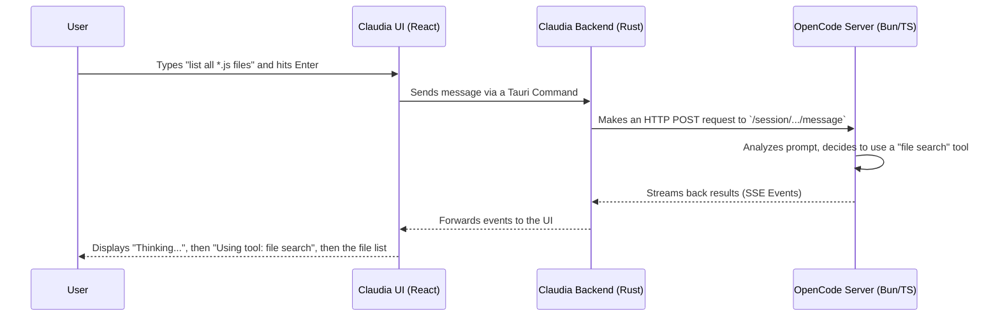

# Chapter 3: OpenCode Integration & Server

In the [previous chapter](02_claudia_agents_.md), we met the specialists who do the AI work: the **Claudia Agents**. We now have a way to create pre-configured AI personalities for specific jobs.

But a big question remains: how does our pretty user interface, Claudia, actually give work to these agents and get results back? In the project's early days, it directly called a specific command-line tool. This worked, but it was like having a car where the dashboard is welded directly to one specific brand of engine. It's rigid and hard to upgrade.

This chapter introduces a huge architectural improvement that solves this problem: the **OpenCode Server**.

### The Problem: A Hard-Wired System

Imagine you have an AI assistant that is great at writing code using one specific AI model (let's call it "Model A"). The entire application is built to talk *only* to Model A.

Now, what happens when a new, much better model comes out ("Model B")? Or what if you want to give your assistant a new tool, like the ability to search the web?

You'd have to tear apart the application's wiring and rebuild it. This is slow, risky, and inefficient. We need a more flexible design.

### The Solution: A Universal Engine Bay

The **OpenCode Integration & Server** is our solution. Instead of hard-wiring Claudia (our GUI) to a specific AI tool, we introduce a middleman: the **OpenCode Server**.

Think of it like this:
*   **Claudia (the GUI)** is your car's dashboard, steering wheel, and pedals. It's how you interact with the system.
*   **The OpenCode Server** is a universal engine. It runs quietly in the background, waiting for instructions.
*   **The API** is the set of standardized wires and connections between the dashboard and the engine.

With this setup, Claudia doesn't need to know *how* the engine works. It just needs to know how to "press the gas" (send a message) and "read the speedometer" (get the results). The OpenCode Server handles all the complex stuff: talking to different AI models, using tools, and managing the conversation.

This makes our whole system incredibly flexible. We can swap out the AI model or add new tools to the OpenCode "engine" without having to change the Claudia "dashboard" at all.

### How it Works: A Simple Chat Message

Let's walk through what happens when you type a message into Claudia and press Enter.



1.  **You send a message:** You type "list all *.js files" in the chat. The React UI sends this to Claudia's backend.
2.  **Claudia calls the Server:** The Rust backend doesn't try to figure out the request. It simply packages your message and sends it to the OpenCode Server over a standard HTTP request, just like your web browser visiting a website.
3.  **OpenCode Server thinks:** The OpenCode Server receives the message. It analyzes the text and realizes it needs to use a tool to find files. It runs the tool.
4.  **Results stream back:** The server doesn't wait until it's completely finished. It streams updates back to Claudia's backend in real-time. You might see "Thinking...", followed by "Using File Search Tool", and then finally the list of files as they are found.
5.  **Claudia displays the updates:** The UI receives these small, streamed updates and displays them to you, creating a smooth, interactive experience.

### Under the Hood: A Look at the Code

Let's peek at the code that makes this client-server magic happen.

#### 1. Starting the Server

When you first launch the `openGUIcode` application, the Rust backend automatically starts the OpenCode server. It's just running a command in the background.

```rust
// --- File: src-tauri/src/opencode_integration.rs ---

// This function starts the OpenCode server process.
pub async fn start_server(&self, app_handle: &AppHandle) -> Result<OpenCodeServerInfo> {
    // Find the 'bun' command on your system.
    let bun_path = which::which("bun").context("Could not find bun")?;

    // Find the server's main file inside our app.
    let opencode_path = ...; // Path to opencode/src/index.ts

    // Create and run the command: `bun run .../index.ts serve`
    let mut child = Command::new(&bun_path)
        .arg("run")
        .arg(&opencode_path)
        .arg("serve")
        // ... other setup ...
        .spawn()?; // Start the process!

    // ... code to find the port it's running on ...
    Ok(server_info)
}
```
This Rust code finds the `bun` runtime, points it to our OpenCode server's code, and runs it as a background process. Claudia then listens to its output to figure out which port it's running on (e.g., `http://127.0.0.1:3001`).

#### 2. Sending a Message

When you send a chat message, the frontend calls a [Tauri Command](05_tauri_commands__ipc_bridge__.md). This command in the Rust backend makes a simple API call to the server we just started.

```rust
// --- File: src-tauri/src/commands/opencode.rs ---

#[tauri::command]
pub async fn send_opencode_chat_message(
    session_id: String,
    message: String,
    // ... other details ...
    state: State<'_, OpenCodeState>,
) -> Result<OpenCodeMessage, String> {
    // Get the server URL, e.g. "http://127.0.0.1:3001"
    let base_url = ...;
    let url = format!("{}/session/{}/message", base_url, session_id);
    
    // Use an HTTP client to send a POST request with the message.
    let response = state.http_client.post(&url).json(&request).send().await;
    
    // ... handle the response ...
}
```
This is the core of the client-side logic. It's just sending your message, packed in a JSON format, to a specific URL on the local OpenCode server.

#### 3. The Server's API Endpoint

On the other side, the OpenCode server (written in TypeScript using a framework called Hono) is listening for these requests.

```typescript
// --- File: opencode/packages/opencode/src/server/server.ts ---

// Create the web server app
const app = new Hono();

// Define an endpoint for receiving messages
app.post(
  "/session/:id/message",
  /* ... validation logic ... */
  async (c) => {
    const sessionID = c.req.valid("param").id;
    const body = c.req.valid("json");
    
    // This is the main function that does the AI thinking.
    const msg = await Session.chat({ ...body, sessionID });
    
    return c.json(msg);
  },
);
```
This code sets up a "listener" at the `/session/:id/message` URL. When a request comes in from Claudia's Rust backend, this function is triggered. It calls the `Session.chat` function, which is the heart of the AI engine, to process the message and generate a response.

#### 4. Receiving Streaming Updates

The frontend doesn't have to constantly ask "Are you done yet?". The server sends updates automatically. Our React UI just needs to listen for them.

```typescript
// --- File: src/components/OpenCodeSession.tsx ---
// (Simplified using the useOpenCode hook)

// The useOpenCode hook handles all the complex listening logic.
const { messages, sendMessage } = useOpenCode();

useEffect(() => {
  // This effect runs whenever the messages array changes.
  // The UI automatically re-renders to show the new content.
  console.log("New message or update received!", messages);
}, [messages]);
```
Behind the scenes, the `useOpenCode` hook sets up a listener for events coming from the Rust backend. When the Rust backend gets an update from the OpenCode server's event stream, it forwards it to the frontend, the hook updates the `messages` state, and React automatically redraws the screen.

### Conclusion

In this chapter, you learned about the most important architectural piece of `openGUIcode`: the client-server model.

*   **Claudia is the "Client":** A user-friendly GUI for interacting with the AI.
*   **OpenCode is the "Server":** A powerful, separate engine that handles all AI logic.
*   They communicate via a **standard API** (HTTP and Server-Sent Events).
*   This **decoupling** makes the system incredibly **flexible and modular**, allowing us to easily upgrade or change AI models and tools without rewriting the whole application.

We now understand *how* Claudia and OpenCode talk to each other. But what gives the OpenCode server its real power? It's the ability to plug in different AI models and custom tools.

In the next chapter, we'll explore exactly that: the world of [OpenCode Providers & Tools](04_opencode_providers___tools_.md).

---

Generated by [AI Codebase Knowledge Builder](https://github.com/The-Pocket/Tutorial-Codebase-Knowledge)