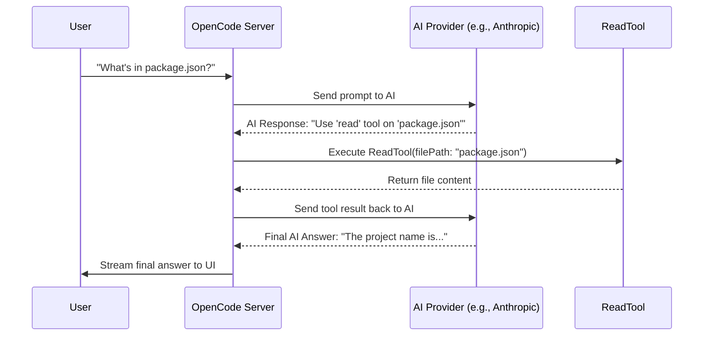

# Chapter 4: OpenCode Providers & Tools

In the [previous chapter](03_opencode_integration___server_.md), we learned how Claudia (the UI) communicates with the powerful **OpenCode Server** in the background. We have a client and a server, which is a great and flexible setup.

But what actually gives the OpenCode server its intelligence and power? An AI model by itself is just a brain in a box. It's very smart, but it can't see your files, it can't run commands, and it can only "speak" the language of its own API. To be a useful coding assistant, it needs more.

This chapter introduces the two core concepts that give the AI its superpowers: **Providers** and **Tools**.

### The Problem: A Brain in a Box

Imagine you hired the world's smartest architect. But there are a few problems:
1.  They are locked in a soundproof room. You can't talk to them.
2.  They have no hands or eyes. They can't see your building site or pick up a hammer.

This is what a large language model (LLM) is like on its own. It's incredibly smart, but it's isolated. It can't connect to different AI services (like Anthropic's Claude or OpenAI's GPT-4), and it can't interact with your computer. We need to give this brain a mouth to talk and hands to work.

### The Solution: Pluggable Mouths and Hands

The `opencode` engine solves this with two key extension points:

1.  **Providers (The Mouths):** These are like universal translators. A Provider is an "adapter" that teaches `opencode` how to talk to a specific AI service. With the `anthropic` provider, it can talk to Claude. With the `openai` provider, it can talk to GPT-4. You can plug in different mouths to talk to different brains.

2.  **Tools (The Hands and Eyes):** These are the capabilities you give the AI. A `ReadTool` gives it eyes to read files. A `BashTool` gives it hands to run terminal commands. These make the AI an active participant in your development, not just a passive chatbot.

Let's explore each of these.

---

### Part 1: Providers - Connecting to Different Brains

A **Provider** is a piece of code that handles all the specific details of communicating with an AI vendor like Anthropic, OpenAI, or Google.

When `opencode` wants to send a message to an AI, it doesn't have to worry about the unique API format or authentication method for each service. It just hands the message to the correct Provider, and the Provider takes care of the translation.

This is managed in the `opencode` engine, primarily in files like `provider.ts`. The system is smart enough to detect which providers you can use based on the API keys you've set up.

```typescript
// --- Simplified logic from: opencode/packages/opencode/src/provider/provider.ts ---

// A list of special instructions for certain providers
const CUSTOM_LOADERS: Record<string, CustomLoader> = {
  // Teaches `opencode` how to authenticate with Anthropic
  async anthropic(provider) {
    // ... checks for Anthropic login details ...
    return { autoload: true, options: { /* auth headers */ } };
  },
  // Teaches `opencode` how to authenticate with GitHub Copilot
  "github-copilot": async (provider) => {
    // ... checks for Copilot login details ...
    return { autoload: true, options: { /* auth headers */ } };
  },
  // ... and so on for other providers
};
```
This code shows that for special providers like `anthropic`, there's a custom loader that knows exactly how to handle its specific authentication. For others, `opencode` might just look for an environment variable like `OPENAI_API_KEY`. This modular design makes it easy to add support for new AI services in the future.

---

### Part 2: Tools - Giving the AI Hands and Eyes

This is where things get really exciting. **Tools** are what allow the AI to interact with your system. They are the bridge between the AI's "thoughts" and the real world of your code.

Let's say you ask the AI: *"What is the name of this project according to its package.json?"*

The AI knows it can't answer without looking at the `package.json` file. So, it uses a tool.

Here are a few of the most important tools `opencode` provides:

| Tool Name       | Analogy      | Description                                          |
| --------------- | ------------ | ---------------------------------------------------- |
| `ReadTool`      | Eyes         | Reads the content of a file.                         |
| `WriteTool`     | Pen          | Writes new content to a file, or creates a new one.  |
| `BashTool`      | Hands        | Executes any command in your terminal (like `npm i`).|
| `WebFetchTool`  | Web Browser  | Fetches the content of a URL.                        |

#### Example: The `ReadTool`

The definition for each tool is simple and clear. It tells the AI what the tool is called (`id`), what it does (`description`), and what information it needs (`parameters`).

```typescript
// --- Simplified from: opencode/packages/opencode/src/tool/read.ts ---

export const ReadTool = Tool.define({
  id: "read",
  description: "Reads the contents of a file at a given path.",
  parameters: z.object({
    filePath: z.string().describe("The path to the file to read"),
  }),
  async execute(params) {
    // ... logic to read the file from params.filePath ...
    // ... and return its content ...
  },
});
```
When the AI sees this, it understands: "If I need to read a file, I should use the `read` tool and I must provide a `filePath`."

#### Example: The `BashTool`

Similarly, the `BashTool` lets the AI run terminal commands. This is incredibly powerful.

```typescript
// --- Simplified from: opencode/packages/opencode/src/tool/bash.ts ---

export const BashTool = Tool.define({
  id: "bash",
  description: "Executes a command in the bash shell.",
  parameters: z.object({
    command: z.string().describe("The command to execute"),
  }),
  async execute(params) {
    // ... logic to run params.command in the terminal ...
    // ... and return the output (stdout/stderr) ...
  },
});
```
With this tool, you can ask the AI to do things like "Install the dependencies for this project," and it will know to run `npm install` or `bun install`.

### Under the Hood: How Providers and Tools Work Together

Let's trace what happens when you ask the AI to read a file.

1.  **You:** "What's in `package.json`?"
2.  **OpenCode Server:** Sends your question and the conversation history to the AI model using the configured **Provider** (e.g., the Anthropic provider).
3.  **AI Model (Claude):** "To answer this, I need to see the file. I will use the `ReadTool` with `filePath: 'package.json'`."
4.  **OpenCode Server:** Sees the AI wants to use a tool. It pauses the conversation and executes the `ReadTool`'s code.
5.  **`ReadTool`:** Reads `package.json` from your disk and returns the content.
6.  **OpenCode Server:** Takes the file content and sends it back to the AI model, saying "Here is the result from the `ReadTool`."
7.  **AI Model (Claude):** "Great. Now I have the content. The `name` is `open-gui-code`."
8.  **OpenCode Server:** Streams this final text answer back to you.

This entire interaction is a seamless loop.



This combination of a smart brain (**Provider**) with capable hands (**Tools**) is what makes `opencode` so effective. It can reason about a task, use tools to gather information or make changes, analyze the results, and continue until the job is done.

### Conclusion

In this chapter, you've learned about the core extensibility points of the `opencode` engine:

*   **Providers** are adapters that connect `opencode` to different AI models (like Claude, GPT-4, etc.), acting as universal translators.
*   **Tools** are the "hands and eyes" of the AI, giving it specific abilities like reading files (`ReadTool`) or running commands (`BashTool`).
*   This powerful combination turns the AI from a simple chatbot into an **active agent** that can interact with your development environment.

We now understand how the OpenCode server works its magic. But how does our main `openGUIcode` application, with its buttons and text boxes, actually talk to this server? How does the "click" of a button in the UI get translated into a command for the server?

In the next chapter, we'll explore the bridge that connects our user interface to the powerful Rust backend: [Tauri Commands (IPC Bridge)](05_tauri_commands__ipc_bridge__.md).

---

Generated by [AI Codebase Knowledge Builder](https://github.com/The-Pocket/Tutorial-Codebase-Knowledge)