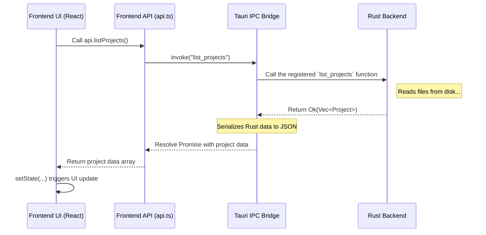

# Chapter 5: Tauri Commands (IPC Bridge)

In the [previous chapter](04_opencode_providers___tools_.md), we explored the powerful **Providers** and **Tools** that give our AI assistant its brain and hands. We know the `opencode` server can read files, run commands, and talk to different AI models.

But a critical question remains: How does our friendly user interface (the buttons, text boxes, and windows you see) actually tell the backend to do these things? How does clicking a button in Claudia translate into a real action on your computer, like reading a file?

This chapter introduces the fundamental communication channel that makes this possible: the **Tauri Command IPC Bridge**.

### The Problem: A Secure Wall Between Worlds

Imagine your application is like a high-security building.

*   **The Frontend (UI):** This is the public lobby. It's beautiful and interactive, but for security reasons, it's very restricted. People in the lobby (the JavaScript code) can't just wander into secure areas, open filing cabinets (your files), or use special equipment (run terminal commands). This "sandboxing" is a core security feature of web technologies.
*   **The Backend (Rust):** This is the secure operations center. It has full access to the building's resources. The experts here (the Rust code) can access the filing cabinets and use all the special equipment.

How does someone in the lobby ask an expert in the operations center to do a task for them? They can't just shout through the wall. They need a secure, approved communication system.

### The Solution: A Secure Phone Line

**Tauri Commands** are this secure communication system. Think of them as a special phone line or an intercom that connects the frontend lobby to the backend operations center.

It works like this:
1.  **A Limited Phonebook:** The backend publishes a list of pre-approved tasks it's willing to perform. These are the **Tauri Commands**. (e.g., "list_projects", "create_agent").
2.  **Making a Call:** When you click a button in the UI, the frontend uses a special function called `invoke` to "call" one of these approved tasks.
3.  **Doing the Work:** The backend receives the call, performs the task (like reading files from your disk), and sends the result back over the same secure line.

This keeps our application fast and safe. The UI stays responsive, while the powerful (and potentially dangerous) work is handled by the robust and secure Rust backend.

### How it Works: From Click to Code

Let's trace a simple, real-world example from `openGUIcode`: loading the list of your projects when you navigate to the "CC Projects" screen.

#### Step 1: The Frontend Asks for Data (TypeScript/React)

When the project list screen loads, it needs to get the list of projects from the backend. It does this by calling a helper function from our `api` library.

```typescript
// --- Simplified from: src/App.tsx ---
// ...
const [projects, setProjects] = useState([]);

useEffect(() => {
  // When the component first loads, load the projects.
  const loadProjects = async () => {
    // Call our friendly API function to get the data.
    const projectList = await api.listProjects();
    setProjects(projectList); // Update the UI with the result
  };
  loadProjects();
}, []);
// ...
```

This React code is simple: when the component appears, it calls `api.listProjects()` and then updates its state with the projects that come back.

#### Step 2: The API Wrapper (The "Phone Call")

That `api.listProjects()` function is a clean wrapper in `src/lib/api.ts`. Its real job is to make the "phone call" to the backend using Tauri's `invoke` function.

```typescript
// --- Simplified from: src/lib/api.ts ---
import { invoke } from "@tauri-apps/api/core";

export const api = {
  async listProjects() {
    // This is the magic!
    // We "invoke" the command named "list_projects"
    // in the Rust backend.
    return await invoke("list_projects");
  },
  // ... other api functions like createAgent, etc.
};
```

Using `invoke("command_name")` is how the frontend tells the backend, "Please run the command named `list_projects` for me."

#### Step 3: The Backend Does the Work (Rust)

On the other side of the bridge, in our Rust code, we have a function named `list_projects`. The special `#[tauri::command]` attribute above it tells Tauri that this function can be called from the frontend.

```rust
// --- Simplified from: src-tauri/src/commands/claude.rs ---
use serde::Serialize; // To convert Rust data to JSON

#[derive(Serialize)] // Let this struct be convertible to JSON
pub struct Project { /* ... fields like id, path ... */ }

// This attribute exposes the function to the frontend.
#[tauri::command]
pub async fn list_projects() -> Result<Vec<Project>, String> {
  // ... native Rust code to read your project folders ...
  // This is where the heavy lifting happens!

  let projects = find_all_projects_on_disk();
  Ok(projects) // Send the successful result back
}
```

This Rust function does the actual work of finding the project files on your computer. When it's done, it returns `Ok(projects)`. Tauri automatically converts this list of `Project` structs into JSON data that JavaScript can understand.

#### Step 4: The Command Registry (The "Phonebook")

Finally, how does Tauri know which functions are allowed to be called? We have to register them in a "phonebook". This happens in `src-tauri/src/main.rs`.

```rust
// --- Simplified from: src-tauri/src/main.rs ---
fn main() {
    tauri::Builder::default()
        // ... other setup ...
        .invoke_handler(tauri::generate_handler![
            // This list is the "phonebook" of allowed commands.
            commands::claude::list_projects,
            commands::agents::create_agent,
            commands::opencode::start_opencode_server
            // ... all other commands are listed here ...
        ])
        .run(...)
        // ...
}
```

The `tauri::generate_handler!` macro takes a list of all the functions you want to expose. If a command isn't in this list, the frontend cannot call it, which provides a great layer of security.

### Under the Hood: A Visual Flow

Let's visualize the entire journey of that single request.



1.  **The Ask:** The UI component calls the `api.listProjects` function.
2.  **The Call:** The API wrapper uses `invoke` to send a message across the IPC bridge.
3.  **The Work:** Tauri Core finds the registered Rust function and executes it. The Rust code reads your file system.
4.  **The Return:** The Rust function returns the data. Tauri's bridge converts it into a format the frontend can use and sends it back.
5.  **The Update:** The `invoke` Promise resolves, the data flows back to the React component, and the UI updates to show you the list of projects.

This entire system is the backbone of `openGUIcode`. Every time the UI needs to interact with the file system, manage a process, or access the database, it uses this secure and efficient bridge.

### Conclusion

In this chapter, you've learned about the critical link between the user interface and the backend engine:

*   **Tauri Commands** are the secure "phone line" (IPC bridge) between the frontend (TypeScript/React) and the backend (Rust).
*   The frontend uses `invoke("command_name")` to request an action.
*   The backend defines these actions in Rust functions marked with `#[tauri::command]`.
*   These commands must be registered in `main.rs` to be accessible.
*   This architecture keeps the application **secure, responsive, and powerful**.

We now understand how the different parts of `openGUIcode` talk to each other. We have our AI agents, our server, our tools, and the command bridge that connects everything. But how does the application remember the state of a long-running task? How can you pause and resume work?

In the next chapter, we'll explore the system that makes this possible: [Checkpointing & Timelines](06_checkpointing___timelines_.md).

---

Generated by [AI Codebase Knowledge Builder](https://github.com/The-Pocket/Tutorial-Codebase-Knowledge)