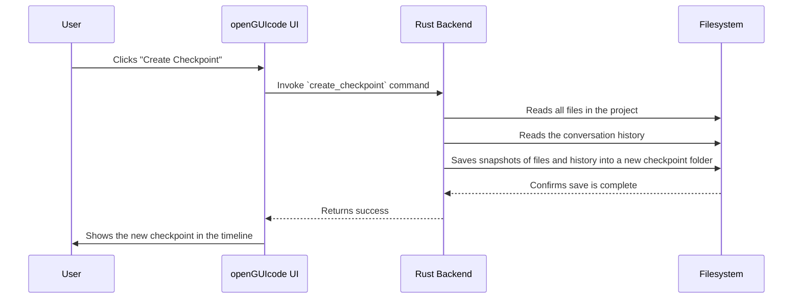

# Chapter 6: Checkpointing & Timelines

In the [previous chapter](05_tauri_commands__ipc_bridge__.md), we learned how our user interface communicates with the powerful Rust backend using the **Tauri Command IPC Bridge**. We now have a clear picture of how all the pieces of `openGUIcode` are connected.

In this final chapter, we'll explore one of the most powerful safety features in the entire system: **Checkpointing & Timelines**. This is the feature that gives you the confidence to let an AI agent experiment with your code, knowing you can always undo its work.

### The Problem: What If the AI Makes a Mistake?

Imagine you give an AI agent a big, important task. You ask it to refactor a key part of your application to make it more efficient. The agent starts working, modifying dozens of files.

Then, you check the result, and... it's a disaster. The code is more confusing than before, and the application doesn't even run anymore. What do you do now?

If you were using a normal text editor, you might have to manually undo changes file by file, which is slow and painful. If you were using `git`, you might be able to revert the changes, but you would lose the entire conversation history with the AI that led to this point. You need a better "undo" button—one designed specifically for AI-driven development.

### The Solution: A Time Machine for Your Project

**Checkpointing** is our solution. Think of it as having "Git for your AI sessions".

A **Checkpoint** is a complete snapshot of your work at a specific moment in time. It saves two crucial things together:
1.  **The entire conversation history** with the AI agent.
2.  **The exact state of all your project files**.

These checkpoints are organized into a **Timeline**, which is a visual, branching history of your project. It's like a save history in a video game. You can reach a milestone, create a checkpoint (a "save game"), and then try something risky. If it doesn't work out, you can just "load" your previous checkpoint, and your conversation and all your files will be reverted to that exact state.

This system provides an incredible safety net, letting you experiment fearlessly with different AI-driven changes.

### How to Use Checkpoints in the UI

You interact with this system through the **Timeline Navigator**, a panel in the `openGUIcode` interface. It looks something like this:

  <!-- Placeholder for a real image if available -->

Let's walk through the key actions you can take.

#### 1. Creating a Checkpoint

Whenever you reach a good stopping point—like after the AI successfully implements a small feature—you can manually create a checkpoint. You just click the "Checkpoint" button and give it an optional description.

The UI for this is handled by our `TimelineNavigator.tsx` component. When you click the button, it calls a simple function.

```typescript
// --- Simplified from: src/components/TimelineNavigator.tsx ---
const handleCreateCheckpoint = async () => {
  // We call the backend API to create the checkpoint.
  await api.createCheckpoint(
    sessionId,
    projectId,
    projectPath,
    "Auto-save before restore" // A description
  );
  
  // After it's created, we reload the timeline to show it.
  await loadTimeline();
};
```
This function tells the backend, "Save everything as it is right now!" The backend does the heavy lifting, and the new checkpoint appears in your timeline.

#### 2. Restoring a Checkpoint

Let's say the AI's latest changes broke your app. No problem. You just find the last good checkpoint in your timeline and click "Restore".

```typescript
// --- Simplified from: src/components/TimelineNavigator.tsx ---
const handleRestoreCheckpoint = async (checkpoint: Checkpoint) => {
  // Ask the user for confirmation first.
  if (!confirm("Are you sure you want to restore?")) return;
  
  // Tell the backend to restore everything to this checkpoint's state.
  await api.restoreCheckpoint(
    checkpoint.id, // The ID of the checkpoint to restore
    sessionId,
    projectId,
    projectPath
  );
  
  // Reload the UI to reflect the restored state.
  await loadTimeline();
};
```
When you do this, `openGUIcode` will overwrite your current files with the versions saved in that checkpoint and will also restore the chat history to that point. It's a complete time-travel experience.

#### 3. Forking from a Checkpoint

What if you like a previous state but want to try a *different* approach from that point forward? You can **Fork**. This creates a new branch in your timeline, leaving the original one untouched. It's perfect for exploring multiple solutions to the same problem.

### Under the Hood: How is Everything Saved?

So, what happens when you click that "Checkpoint" button? How does `openGUIcode` save everything?

The process is managed by our Rust backend, specifically within the `src-tauri/src/checkpoint/` module.



1.  **The Call:** The UI sends a [Tauri Command](05_tauri_commands__ipc_bridge__.md) to the backend.
2.  **The Scan:** The backend's `CheckpointManager` wakes up. It scans your entire project directory to see which files have changed.
3.  **The Snapshot:** It creates **File Snapshots**. For each modified file, it saves a copy of its content. It also saves the current conversation history.
4.  **The Save:** All this data is stored in a special directory inside your project folder, usually named `.timelines/`. This keeps the checkpoint data alongside your code but hidden from view.

Let's peek at the simple data structures that define what a checkpoint is.

```rust
// --- Simplified from: src-tauri/src/checkpoint/mod.rs ---

// This struct holds the "metadata" for a save point.
pub struct Checkpoint {
    pub id: String, // A unique ID, e.g., "a1b2-c3d4"
    pub timestamp: DateTime<Utc>, // When it was created
    pub description: Option<String>, // e.g., "Implemented login button"
}

// This struct represents a saved copy of a single file.
pub struct FileSnapshot {
    pub file_path: PathBuf, // e.g., "src/components/Button.js"
    pub content: String, // The full text of the file
    pub is_deleted: bool, // Was the file deleted at this point?
}
```
As you can see, a `Checkpoint` is just a record with a description and a timestamp. It's associated with a collection of `FileSnapshot`s, which hold the actual content of your project files at that moment.

When the `CheckpointManager` in Rust is asked to create a checkpoint, its main job is to create these structs and hand them off to the `CheckpointStorage` to be written to disk.

```rust
// --- Simplified from: src-tauri/src/checkpoint/manager.rs ---
pub async fn create_checkpoint(
    &self,
    description: Option<String>,
) -> Result<CheckpointResult> {
    // 1. Get the current conversation history.
    let messages = self.current_messages.read().await;

    // 2. Create snapshots of all modified files.
    let file_snapshots = self.create_file_snapshots().await?;
    
    // 3. Create the main checkpoint object.
    let checkpoint = Checkpoint { /* ... details ... */ };

    // 4. Tell the storage module to save everything.
    let result = self.storage.save_checkpoint(
        &checkpoint,
        file_snapshots,
        &messages.join("\n"),
    )?;

    Ok(result)
}
```
This Rust code shows the clear, step-by-step logic: get the messages, get the file snapshots, bundle them into a `Checkpoint`, and tell the storage system to save it all.

The `CheckpointStorage` is clever. To save disk space, it uses a technique where if a file's content hasn't changed between two checkpoints, it doesn't save a new copy. It just points back to the old one. This makes checkpointing fast and efficient.

### Conclusion

In this chapter, you've learned about the powerful **Checkpointing & Timelines** system in `openGUIcode`:

*   A **Checkpoint** is a snapshot of your conversation and project files, acting as a "save point".
*   The **Timeline** is a branching history of these checkpoints.
*   This system provides a crucial **safety net**, allowing you to **restore** your project to a previous state or **fork** new lines of development without fear.
*   The entire process is managed by a robust backend system that efficiently saves snapshots of your work.

You have now completed the tour of `openGUIcode`'s core concepts! From the initial [Product Requirement Prompt (PRP)](01_product_requirement_prompt__prp____validation_loops_.md) to the specialized [Claudia Agents](02_claudia_agents_.md), through the flexible [OpenCode Server](03_opencode_integration___server_.md) and its powerful [Tools](04_opencode_providers___tools_.md), across the secure [Tauri Command](05_tauri_commands__ipc_bridge__.md) bridge, and finally to the safety of **Checkpoints**, you have a solid foundation for understanding how this project works.

You're now ready to explore the codebase, contribute new features, and help build the future of AI-driven software development

---

Generated by [AI Codebase Knowledge Builder](https://github.com/The-Pocket/Tutorial-Codebase-Knowledge)