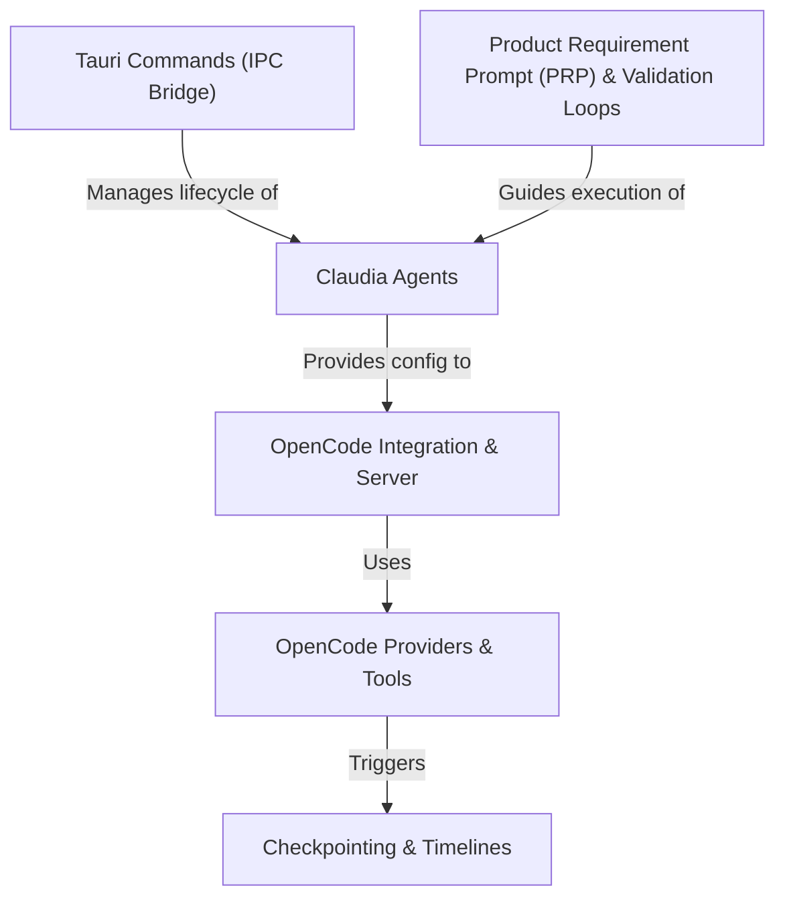

# Tutorial: openGUIcode

`openGUIcode` is a powerful **AI development environment**, presented through a user interface named *Claudia*. It allows you to work with pre-configured **Claudia Agents** to perform complex tasks like coding and security analysis. The core AI logic is driven by a local **OpenCode Server**, which can flexibly connect to different AI models through **Providers** and perform actions using **Tools** like reading files or running commands. The entire workflow is guided by detailed work orders called **Product Requirement Prompts (PRPs)** which include **Validation Loops**, enabling the AI to test and fix its own work. For safety, the system features **Checkpointing**, which acts like a version control system for your AI sessions, letting you save and restore your project's state at any time. All these features are accessed from the UI via **Tauri Commands**, which bridge the gap between the user interface and the powerful backend.

**Source Repository:** [None](None)

## Chapters

1. [Product Requirement Prompt (PRP) & Validation Loops
](01_product_requirement_prompt__prp____validation_loops_.md)
2. [Claudia Agents
](02_claudia_agents_.md)
3. [OpenCode Integration & Server
](03_opencode_integration___server_.md)
4. [OpenCode Providers & Tools
](04_opencode_providers___tools_.md)
5. [Tauri Commands (IPC Bridge)
](05_tauri_commands__ipc_bridge__.md)
6. [Checkpointing & Timelines
](06_checkpointing___timelines_.md)

---

Generated by [AI Codebase Knowledge Builder](https://github.com/The-Pocket/Tutorial-Codebase-Knowledge)