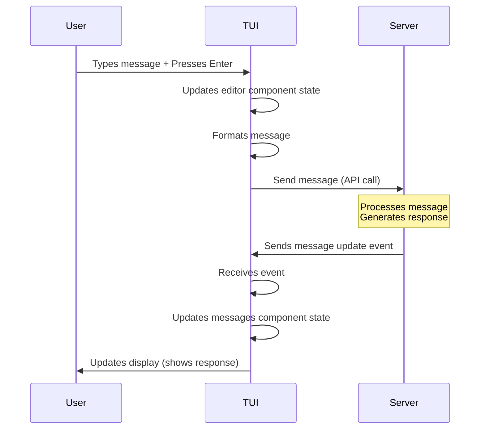

# Chapter 1: TUI (Terminal User Interface)

Welcome to the first chapter of the `opencode` tutorial! We're going to start by looking at the part of `opencode` you interact with directly: the Terminal User Interface, or TUI.

### What is the TUI?

Think of the `opencode` TUI as the application's "face" – it's what you see and use when you run `opencode` in your terminal. It's a program that runs locally on your computer and provides a friendly, interactive way to chat with the AI assistant, see your conversation history, and manage settings, all within your command line window.

Why use a TUI instead of a web browser or a desktop app? For developers working extensively in the terminal, a TUI offers a seamless experience without needing to switch windows. It can also be lightweight and fast.

In `opencode`, the TUI is built separately from the main "brain" of the application (which runs as a Server – we'll cover that later!). The TUI talks to this Server using an API (Application Programming Interface), which is basically a set of rules for how software components can talk to each other.

Here’s a quick look at its main jobs:

*   **Showing the Conversation:** Displaying the messages you send and the AI's responses.
*   **Handling Your Input:** Letting you type your messages and commands.
*   **Displaying Status:** Showing useful info like the current model being used, version, or session details.
*   **Managing Terminal Features:** Using keyboard shortcuts (keybinds) and arranging the different parts of the interface (layout).

It's like the TUI is the messenger and display, and the Server is the one doing the heavy lifting and thinking.

### Your First Interaction: Sending a Message

Let's think about the most basic thing you'll do with the TUI: sending a message to the AI.

1.  You open `opencode` in your terminal.
2.  The TUI starts up and connects to the `opencode` Server.
3.  You see the TUI interface, including a place to type.
4.  You type your question or request into the typing area (this is handled by the **Editor** part of the TUI).
5.  You press the Enter key.
6.  The TUI takes your typed message.
7.  It sends this message to the `opencode` Server using the API.
8.  The Server processes your message (using an AI model, which we'll discuss in later chapters).
9.  The Server sends the AI's response back to the TUI.
10. The TUI receives the response and displays it in the conversation history area (this is handled by the **Messages** part of the TUI).

This simple interaction involves several parts of the TUI working together and communicating with the Server.

### Inside the TUI (High Level)

The `opencode` TUI is built using the Go programming language and a popular TUI library called [Bubble Tea](https://github.com/charmbracelet/bubbletea). Bubble Tea helps manage the interactive parts of the terminal display.

The core of the TUI logic lives in the `packages/tui/internal/tui/tui.go` file. This file defines the main `appModel` struct, which is the central piece that holds all the other parts together and handles updates based on what you do (like pressing keys) or what the Server sends back.

Let's look at the entry point, `main.go`, to see how the TUI starts:

```go
// packages/tui/cmd/opencode/main.go
package main

import (
	"context"
	"encoding/json"
	"log/slog"
	"os"
	"path/filepath"
	"strings"

	tea "github.com/charmbracelet/bubbletea/v2" // Import Bubble Tea
	"github.com/sst/opencode/internal/app"
	"github.com/sst/opencode/internal/tui" // Import our main TUI model
	"github.com/sst/opencode/pkg/client"    // Import client to talk to Server
)

var Version = "dev"

func main() {
	// ... logging and config loading ...

	// Create a client to talk to the opencode Server
	httpClient, err := client.NewClientWithResponses(url)
	if err != nil {
		slog.Error("Failed to create client", "error", err)
		os.Exit(1)
	}

	ctx, cancel := context.WithCancel(context.Background())
	defer cancel()

	// Create the main application context (includes client, config etc)
	app_, err := app.New(ctx, version, appInfo, httpClient)
	if err != nil {
		panic(err)
	}

	// Create a new Bubble Tea program with our TUI model
	program := tea.NewProgram(
		tui.NewModel(app_), // This is our main TUI model
		tea.WithAltScreen(),
		tea.WithKeyboardEnhancements(),
		tea.WithMouseCellMotion(),
	)

	// ... setup event listener from Server ...

	// Run the TUI program
	result, err := program.Run()
	if err != nil {
		slog.Error("TUI error", "error", err)
	}

	slog.Info("TUI exited", "result", result)
}
```

This `main` function does the setup: it configures logging, connects to the `opencode` Server using a `client`, creates the core `app` structure (which holds config, the client, etc.), initializes the main `tui.NewModel` (our application's TUI state), and then runs the Bubble Tea program (`program.Run()`). This `program.Run()` is where the TUI comes to life and starts listening for events (like key presses or messages from the Server).

The `tui.NewModel` function creates the central model that manages the TUI's state and its various components:

```go
// packages/tui/internal/tui/tui.go
// ... imports ...

// appModel is the main Bubble Tea model for the entire TUI application.
type appModel struct {
	width, height        int
	app                  *app.App // Holds application context (client, config etc)
	modal                layout.Modal // For pop-up dialogs
	status               status.StatusComponent // Status bar at the bottom
	editor               chat.EditorComponent // The text input area
	messages             chat.MessagesComponent // The message history display
	editorContainer      layout.Container // Layout helper for the editor
	layout               layout.FlexLayout // Main layout manager
	completions          dialog.CompletionDialog // For command/path completions
	completionManager    *completions.CompletionManager // Manages completion providers
	showCompletionDialog bool
	leaderBinding        *key.Binding // For keybinding sequences
	isLeaderSequence     bool
	toastManager         *toast.ToastManager // For temporary notifications
}

func NewModel(app *app.App) tea.Model {
	// Initialize various TUI components
	completionManager := completions.NewCompletionManager(app)
	initialProvider := completionManager.DefaultProvider()

	messages := chat.NewMessagesComponent(app) // Component for messages
	editor := chat.NewEditorComponent(app)     // Component for input editor
	completions := dialog.NewCompletionDialogComponent(initialProvider) // Component for completions

	// Use layout helpers to manage component sizes/positions
	editorContainer := layout.NewContainer(
		editor,
		layout.WithMaxWidth(layout.Current.Container.Width),
		layout.WithAlignCenter(),
	)
	messagesContainer := layout.NewContainer(messages)

	// Setup the main flexible layout
	mainLayout := layout.NewFlexLayout(
		[]tea.ViewModel{messagesContainer, editorContainer},
		layout.WithDirection(layout.FlexDirectionVertical),
		layout.WithSizes(
			layout.FlexChildSizeGrow, // Messages area grows to fill space
			layout.FlexChildSizeFixed(5), // Editor area has a fixed height
		),
	)

	// Create and return the main appModel
	model := &appModel{
		status:               status.NewStatusCmp(app), // Status bar component
		app:                  app,
		editor:               editor,
		messages:             messages,
		completions:          completions,
		completionManager:    completionManager,
		// ... other fields ...
		editorContainer:      editorContainer,
		layout: mainLayout, // Assign the main layout
		toastManager:         toast.NewToastManager(), // Toast component
	}

	return model
}

// ... Init, Update, View methods (details omitted for brevity) ...
```

As you can see, the `appModel` is like a conductor orchestrating different parts:

*   `editor`: Manages the user's text input.
*   `messages`: Displays the conversation history.
*   `status`: Shows information at the bottom.
*   `layout`: Helps arrange these components neatly in the terminal window.
*   `completions`: Provides suggestions as you type commands or paths.
*   `modal`, `toastManager`: Handle temporary overlays like dialogs or notifications.

All these components are also Bubble Tea models themselves, managing their own small part of the UI and reacting to messages. The `appModel`'s `Update` method receives messages (like key presses or data from the Server) and decides which component should handle it, or updates its own state. The `View` method combines the output of all components to draw the complete terminal display.

### How It Works (Sequence Diagram)

Let's visualize the simple "send a message" flow using a sequence diagram.



This diagram shows how the TUI acts as the intermediary between the User and the Server. It handles the local interaction (typing, displaying) and the communication with the Server.

### The TUI Components in More Detail

The TUI is composed of several smaller, specialized components:

| Component             | Role                                              | Relevant File(s)                                      |
| :-------------------- | :------------------------------------------------ | :---------------------------------------------------- |
| **Editor**            | Handles user text input and history navigation.   | `packages/tui/internal/components/chat/editor.go`     |
| **Messages**          | Displays chat history and tool outputs.           | `packages/tui/internal/components/chat/messages.go`   |
| **Status**            | Shows version, session info, context/cost.      | `packages/tui/internal/components/status/status.go`   |
| **Commands**          | Manages and displays available commands.          | `packages/tui/internal/components/commands/commands.go` |
| **Completions Dialog**| Provides interactive command/path suggestions.    | `packages/tui/internal/components/dialog/complete.go` |
| **Modal**             | Displays temporary pop-up interfaces (dialogs). | `packages/tui/internal/components/modal/modal.go`     |
| **Toast Manager**     | Shows small, temporary notification messages.     | `packages/tui/internal/components/toast/toast.go`     |
| **Layout**            | Arranges components within the terminal window.   | `packages/tui/internal/layout/layout.go`              |
| **Styles**            | Manages colors and text formatting.               | `packages/tui/internal/styles/styles.go`              |

Each of these components is a Bubble Tea model responsible for its own piece of the UI.

For example, the `editorComponent` in `editor.go` uses Bubble Tea's built-in `textarea` model to manage text input:

```go
// packages/tui/internal/components/chat/editor.go
// ... imports ...

type editorComponent struct {
	app            *app.App
	width, height  int
	textarea       textarea.Model // Bubble Tea's textarea for input
	attachments    []app.Attachment
	history        []string
	historyIndex   int
	currentMessage string
	spinner        spinner.Model
}

func NewEditorComponent(app *app.App) EditorComponent {
	// ... spinner setup ...
	ta := createTextArea(nil) // Creates a configured textarea

	return &editorComponent{
		app:            app,
		textarea:       ta, // Initialize with the textarea model
		history:        []string{},
		historyIndex:   0,
		currentMessage: "",
		spinner:        s,
	}
}

// Update method handles messages for the editor
func (m *editorComponent) Update(msg tea.Msg) (tea.Model, tea.Cmd) {
	// ... handle specific editor messages (like Paste, Newline) ...

	// Pass messages to the underlying textarea model
	var cmd tea.Cmd
	m.textarea, cmd = m.textarea.Update(msg)
	// ... other updates ...
	return m, cmd
}

// View method renders the editor
func (m *editorComponent) View() string {
	// ... formatting logic ...
	return m.Content() // Renders the textarea along with prompt/info
}
```

Similarly, the `messagesComponent` in `messages.go` uses a `viewport` model to display the potentially long chat history, allowing scrolling:

```go
// packages/tui/internal/components/chat/messages.go
// ... imports ...

type messagesComponent struct {
	width, height   int
	app             *app.App
	viewport        viewport.Model // Bubble Tea's viewport for scrolling content
	spinner         spinner.Model
	attachments     viewport.Model
	commands        commands.CommandsComponent
	cache           *MessageCache
	rendering       bool
	showToolDetails bool
	tail            bool
}

func NewMessagesComponent(app *app.App) MessagesComponent {
	// ... spinner setup ...
	vp := viewport.New() // Create the viewport
	// ... other component setup ...

	return &messagesComponent{
		app:             app,
		viewport:        vp, // Initialize with the viewport
		// ... other fields ...
	}
}

// Update method passes messages to the viewport for scrolling
func (m *messagesComponent) Update(msg tea.Msg) (tea.Model, tea.Cmd) {
	// ... handle specific messages ...

	// Pass messages to the underlying viewport model
	viewport, cmd := m.viewport.Update(msg)
	m.viewport = viewport
	// ... other updates ...
	return m, cmd
}

// SetSize and renderView methods configure the viewport content
func (m *messagesComponent) SetSize(width, height int) tea.Cmd {
	// ... update component size ...
	m.viewport.SetWidth(width) // Set viewport width
	m.viewport.SetHeight(height - lipgloss.Height(m.header())) // Set viewport height
	m.renderView() // Re-render content into the viewport
	return nil
}
```

The `statusComponent` in `status.go` is simpler, mainly focusing on rendering information at the bottom of the screen:

```go
// packages/tui/internal/components/status/status.go
// ... imports ...

type statusComponent struct {
	app   *app.App
	width int
}

func NewStatusCmp(app *app.App) StatusComponent {
	// ... create and return statusComponent ...
}

// View method renders the status bar content
func (m statusComponent) View() string {
	t := theme.CurrentTheme()
	// ... logic to build status string ...
	status := m.logo() + cwd + spacer + sessionInfo // Combine parts
	// ... add padding ...
	return status
}
```

These code snippets show how the TUI is built by combining smaller, focused components, each responsible for a specific part of the interface or interaction, all managed by the main `appModel`.

### Conclusion

In this chapter, we learned that the `opencode` TUI is your primary interface for interacting with the AI assistant directly in your terminal. It's a separate Go program built with Bubble Tea that handles displaying the conversation, taking your input, showing status, and managing terminal features like keybinds and layout. It communicates with the `opencode` Server (the backend "brain") via an API to send your messages and receive responses.

We saw how the main `appModel` in `tui.go` brings together various components like the editor, messages display, and status bar to create the full interactive experience.

Now that we understand how the TUI displays information, the next logical step is to understand the structure of the information being displayed: the messages themselves.

Let's dive into the concept of a Message in `opencode`.

[Chapter 2: Message](02_message_.md)

---

<sub><sup>Generated by [AI Codebase Knowledge Builder](https://github.com/The-Pocket/Tutorial-Codebase-Knowledge).</sup></sub> <sub><sup>**References**: [[1]](https://github.com/sst/opencode/blob/100d6212be5b1475692116397aa9bef05da79cbf/packages/tui/cmd/opencode/main.go), [[2]](https://github.com/sst/opencode/blob/100d6212be5b1475692116397aa9bef05da79cbf/packages/tui/internal/app/app.go), [[3]](https://github.com/sst/opencode/blob/100d6212be5b1475692116397aa9bef05da79cbf/packages/tui/internal/components/chat/editor.go), [[4]](https://github.com/sst/opencode/blob/100d6212be5b1475692116397aa9bef05da79cbf/packages/tui/internal/components/chat/messages.go), [[5]](https://github.com/sst/opencode/blob/100d6212be5b1475692116397aa9bef05da79cbf/packages/tui/internal/components/commands/commands.go), [[6]](https://github.com/sst/opencode/blob/100d6212be5b1475692116397aa9bef05da79cbf/packages/tui/internal/components/dialog/complete.go), [[7]](https://github.com/sst/opencode/blob/100d6212be5b1475692116397aa9bef05da79cbf/packages/tui/internal/components/status/status.go), [[8]](https://github.com/sst/opencode/blob/100d6212be5b1475692116397aa9bef05da79cbf/packages/tui/internal/layout/layout.go), [[9]](https://github.com/sst/opencode/blob/100d6212be5b1475692116397aa9bef05da79cbf/packages/tui/internal/styles/styles.go), [[10]](https://github.com/sst/opencode/blob/100d6212be5b1475692116397aa9bef05da79cbf/packages/tui/internal/tui/tui.go)</sup></sub>
````