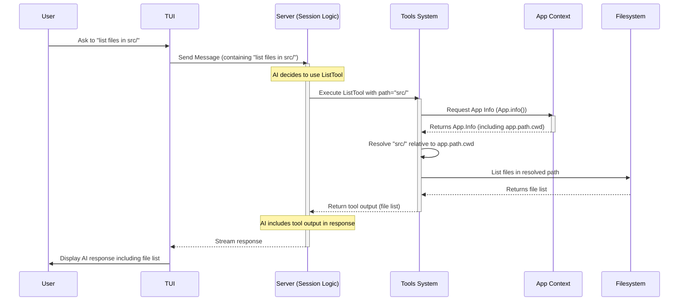

# Chapter 10: App Context (App)

Welcome back to the `opencode` tutorial! Over the past chapters, we've explored many different pieces of `opencode`: from the [Chapter 1: TUI](01_tui__terminal_user_interface__.md) you interact with, to the [Chapter 2: Message](02_message_.md)s that form conversations, the [Chapter 3: Session](03_session_.md)s that group them, the [Chapter 7: Storage](07_storage_.md) that saves everything, the [Chapter 8: Server](08_server_.md) that orchestrates it all, the [Chapter 9: Bus (Event Bus)](09_bus__event_bus__.md) for real-time communication, and how `opencode` uses [Chapter 4: Config](04_config_.md), [Chapter 5: Provider](05_provider_.md)s, and [Chapter 6: Tool](06_tool_.md)s.

All these different systems and components need to work together and often need access to fundamental information about the current environment. Where is the project located? What is the current directory? Where should configuration and data files be stored? How can I access the Event Bus or other shared services?

This is the role of the **App Context**, often referred to simply as the **App**.

### What is the App Context (App)?

Think of the **App Context** as the central operating system or the core environment for your `opencode` project when it's running. It's the glue that holds everything together and provides access to essential information and shared services.

When `opencode` starts up to run the TUI or a command, it first sets up this App Context. This context contains:

*   **Fundamental Paths:** Where the configuration files are, where data is stored, the root directory of your project (often the Git root), and the current working directory.
*   **User Information:** Who is running `opencode`?
*   **Application State:** It acts as a registry for the state of various other systems (like [Storage](07_storage_.md), [Config](04_config_.md), [Bus](09_bus__event_bus__.md), [Session](03_session_.md)s, [Provider](05_provider_.md)s). It ensures these systems are initialized correctly and makes their state accessible to others within the context.

Every significant operation within `opencode` happens *within* an App Context. This ensures that any component, no matter how deep in the call chain, can access the necessary environmental information and shared resources without them needing to be explicitly passed around everywhere.

### Your Use Case: Knowing Where You Are

Imagine you're using the `GlobTool` ([Chapter 6: Tool](06_tool_.md)) or the `ListTool` ([Chapter 6: Tool](06_tool_.md)) to find files. When you tell the AI to "list files in the 'src' directory" or "find all `.test.ts` files", how does the tool know *which* 'src' directory or where to start searching for `.test.ts` files?

It uses the App Context! Specifically, it accesses the `app.path.cwd` (current working directory) and `app.path.root` (project root directory) from the context to correctly interpret relative paths or determine the scope of the search within your project.



This flow shows how the `ListTool`, when executed by the Server's `Session` logic, needs access to the fundamental paths provided by the App Context to perform its task correctly within the user's project environment.

### Anatomy of the App Info

The core information provided by the App Context is captured in the `App.Info` structure.

```typescript
// Simplified structure based on packages/opencode/src/app/app.ts
export namespace App {
  export const Info = z.object({
    user: z.string(), // The current user's username
    git: z.boolean(), // Whether the current directory is inside a Git repository
    path: z.object({ // Important file paths
      config: z.string(), // Path to global config directory
      data: z.string(),   // Path to application data directory
      root: z.string(),   // Project root path (usually Git root or CWD)
      cwd: z.string(),    // Current working directory
      state: z.string(),  // Path to application state file
    }),
    time: z.object({
      initialized: z.number().optional(), // Timestamp when the app was first initialized
    }),
  });
  export type Info = z.infer<typeof Info>;

  // ... other parts of App namespace ...
}
```

This `Info` object holds the essential details about the running instance of `opencode`:

*   `user`: Handy for logging or personalization.
*   `git`: Useful for features that need to know if they are in a Git project.
*   `path`: This nested object contains the critical paths. `config` and `data` are standard locations on your system for `opencode`, while `root` and `cwd` are specific to where you ran `opencode`. `root` is often the Git repository root if detected, providing a stable reference point for a project.
*   `time.initialized`: Used to track if `opencode` has ever been run before (for initialization tasks).

Any component needing this static environmental information can access it via the App Context.

### How Components Access the Context (`App.info` and `App.state`)

Once the App Context is set up, other parts of `opencode` can easily get information from it. There are two primary ways components interact with the App Context:

1.  **Getting Static Information (`App.info()`):**
    For simple, static details like paths (`app.path.cwd`, `app.path.root`), user info (`app.user`), or whether it's a git repo (`app.git`), components call `App.info()`. This function quickly retrieves the `App.Info` object from the currently active context.

    Here are examples from different tools needing the current path information:

    ```typescript
    // Simplified snippet from packages/opencode/src/tool/glob.ts
    export const GlobTool = Tool.define({
      // ... parameters ...
      async execute(params) {
        const app = App.info(); // Get the App Info
        // Use app.path.cwd to resolve the search path
        let search = params.path ?? app.path.cwd;
        search = path.isAbsolute(search)
          ? search
          : path.resolve(app.path.cwd, search);
        // ... glob scanning logic ...
        return {
          // ... metadata using app.path.root ...
          title: path.relative(app.path.root, search),
        };
      },
    });
    ```
    ```typescript
    // Simplified snippet from packages/opencode/src/tool/list.ts
    export const ListTool = Tool.define({
      // ... parameters ...
      async execute(params) {
        const app = App.info(); // Get the App Info
        // Use app.path.cwd to resolve the search path
        const searchPath = path.resolve(app.path.cwd, params.path || ".");
        // ... file listing logic ...
        return {
          // ... metadata using app.path.root ...
          title: path.relative(app.path.root, searchPath),
        };
      },
    });
    ```
    ```typescript
    // Simplified snippet from packages/opencode/src/tool/write.ts
    export const WriteTool = Tool.define({
      // ... parameters ...
      async execute(params, ctx) {
        const app = App.info(); // Get the App Info
        // Use app.path.cwd to resolve the file path
        const filepath = path.isAbsolute(params.filePath)
          ? params.filePath
          : path.join(app.path.cwd, params.filePath);
        // ... writing logic ...
        return {
          // ... metadata using app.path.root ...
          title: path.relative(app.path.root, filepath),
        };
      },
    });
    ```
    These snippets show how various tools use `App.info()` to access `app.path.cwd` and `app.path.root` to correctly handle file operations relative to the user's current location within the project.

2.  **Accessing System State (`App.state(...)`):**
    The App Context also serves as a registry for the state of major systems like `Bus`, `Config`, `Storage`, `Provider`, `Session`, `LSP`, and `Permission`. Instead of initializing these systems directly, they use `App.state()`.

    `App.state()` ensures that a system's state is:
    *   **Initialized Lazily:** The `init` function provided to `App.state` is only run the *first* time that system's state is requested within the current context.
    *   **Initialized Within Context:** The `init` function receives the `App.Info` object, giving the system access to the fundamental environment information it needs for its own setup (e.g., `Config` needs the config paths, `Storage` needs the data path).
    *   **Accessible Globally:** Once initialized, any part of the code within the same context can call `App.state("...")` with the same key to get the *same* instance of that system's state.

    Here's how various systems use `App.state()` to register and access their state:

    ```typescript
    // Simplified snippet from packages/opencode/src/bus/index.ts
    export namespace Bus {
      const state = App.state("bus", () => { // Use App.state with key "bus"
        const subscriptions = new Map<any, Subscription[]>();
        return { subscriptions }; // Return the Bus state object
      });
      // ... publish, subscribe functions use state() internally ...
    }
    ```
    ```typescript
    // Simplified snippet from packages/opencode/src/config/config.ts
    export namespace Config {
      const state = App.state("config", async (app) => { // Use App.state with key "config"
        // Initialization needs app.path.cwd, app.path.root, app.path.config
        let result = await global(); // Loads global config using app.path.config
        for (const file of ["opencode.jsonc", "opencode.json"]) {
          const found = await Filesystem.findUp(file, app.path.cwd, app.path.root); // Finds project config using app paths
          // ... merge logic ...
        }
        return result; // Return the final Config state object
      });
      // ... get function uses state() internally ...
    }
    ```
    ```typescript
    // Simplified snippet from packages/opencode/src/provider/provider.ts
    export namespace Provider {
      const state = App.state("provider", async () => { // Use App.state with key "provider"
        const config = await Config.get(); // Calls Config.get(), which uses App.state("config")
        const database = await ModelsDev.get();
        // ... initialization logic ...
        return { models, providers, sdk }; // Return the Provider state object
      });
      // ... list, getModel, defaultModel etc. use state() internally ...
    }
    ```
    ```typescript
    // Simplified snippet from packages/opencode/src/session/index.ts
    export namespace Session {
      const state = App.state("session", () => { // Use App.state with key "session"
        const sessions = new Map<string, Info>();
        const messages = new Map<string, Message.Info[]>();
        const pending = new Map<string, AbortController>();
        return { sessions, messages, pending }; // Return the Session state object
      });
      // ... create, get, messages, chat etc. use state() internally ...
    }
    ```
    ```typescript
    // Simplified snippet from packages/opencode/src/lsp/index.ts
    export namespace LSP {
      const state = App.state( // Use App.state with key "lsp"
        "lsp",
        async () => {
          // Initialization logic
          const clients = new Map<string, LSPClient.Info>();
          const skip = new Set<string>();
          return { clients, skip }; // Return the LSP state object
        },
        // Optional shutdown function
        async (state) => {
           // ... cleanup logic ...
        }
      );
      // ... touchFile, diagnostics etc. use state() internally ...
    }
    ```
    ```typescript
    // Simplified snippet from packages/opencode/src/permission/index.ts
    export namespace Permission {
       const state = App.state( // Use App.state with key "permission"
        "permission",
        () => {
          // Initialization logic
          const pending: any = {}
          const approved: any = {}
          return { pending, approved } // Return the Permission state object
        },
        // Optional shutdown function
        async (state) => {
          // ... cleanup logic ...
        }
      );
      // ... ask, respond etc. use state() internally ...
    }
    ```
    These snippets demonstrate that all major systems register themselves with `App.state()`. This makes their state available throughout the application simply by calling `state()`, which internally accesses the App Context to find the specific system's state object. Note that the `init` function for `Config` receives `app` (`App.Info`), showing how systems use the base context info during their setup.

### How the App Context is Created (`App.provide`)

The App Context is established early in the application's lifecycle using the `App.provide` function. This function takes the initial environment information (like the current working directory) and a callback function containing the main application logic to be executed within this context.

```typescript
// Simplified snippet from packages/opencode/src/index.ts
const cli = yargs(...)
  // ... global middleware ...
  .command({
    command: "$0 [project]", // Default command (TUI startup)
    handler: async (args) => {
      while (true) {
        const cwd = args.project ? path.resolve(args.project) : process.cwd(); // Determine CWD
        process.chdir(cwd); // Change process CWD (important for tools)

        // Provide the App Context and run the main logic inside the callback
        const result = await App.provide({ cwd }, async (app) => {
          // This callback runs with the App Context available

          // Example: Check providers (might trigger Provider.state which uses App.state)
          const providers = await Provider.list();
          if (Object.keys(providers).length === 0) {
            return "needs_provider"; // Special return value
          }

          await Share.init(); // Initialize Share (uses App.state, Storage, Bus)
          const server = Server.listen(); // Start Server (uses App.state, Bus, Config, Session etc.)

          // ... logic to spawn the TUI process ...
          const proc = Bun.spawn({
            // ... process setup passing OPENCODE_APP_INFO ...
            env: {
              ...process.env,
              OPENCODE_APP_INFO: JSON.stringify(app), // Pass App.Info to TUI process
              // ... other env vars ...
            },
            onExit: () => {
              server.stop(); // Stop server on TUI exit
            },
          });

          await proc.exited; // Wait for TUI to exit
          server.stop(); // Ensure server is stopped

          return "done"; // Indicate success
        });

        if (result === "done") break;
        // ... handle "needs_provider" case ...
      }
    },
  })
  // ... other commands like RunCommand which also use App.provide ...
```

This snippet shows that `App.provide` is called right before starting the main application logic (in this case, launching the TUI). It's given the initial `cwd`. Inside the `App.provide` function (which is more complex internally, using `Context.create` and `Context.provide` from `packages/opencode/src/util/context.ts`), it calculates all the other paths (`data`, `config`, `root`), creates the initial `App.Info` object, and sets up the mechanism (`AsyncLocalStorage`) to make this context available to code running *within the provided callback*.

Any code executed inside the `App.provide` callback can then call `App.info()` or `System.state()` to get access to the App Context and the state of registered systems.

The `Context.create` and `Context.provide` functions from `packages/opencode/src/util/context.ts` are the underlying mechanism (using Node.js/Bun's `AsyncLocalStorage`) that makes this "context is just available" magic work. It allows the `use()` function (which is called by `App.info()` and `App.state()`) to find the correct context value based on the current asynchronous execution flow.

```typescript
// Simplified snippet from packages/opencode/src/util/context.ts
import { AsyncLocalStorage } from "async_hooks"; // Bun/Node.js built-in

export namespace Context {
  // Creates a context storage for a specific type (T) and name
  export function create<T>(name: string) {
    const storage = new AsyncLocalStorage<T>(); // The storage mechanism
    return {
      // Get the current value from storage (throws if not found)
      use() {
        const result = storage.getStore();
        if (!result) {
          throw new NotFound(name);
        }
        return result;
      },
      // Provide a value and run a function within that context
      provide<R>(value: T, fn: () => R) {
        return storage.run<R>(value, fn); // Run fn, making 'value' available via use()
      },
    };
  }
  // ... NotFound error definition ...
}
```
`App.provide` uses `Context.create("app")` to get a specific context storage for the `App` type and then `context.provide(appObject, callback)` to run the main logic with the created `appObject` available via `context.use()`.

### Conclusion

The App Context (App) is the foundational layer of `opencode`. It provides the essential environmental information (like paths and user details) and serves as a central registry for the state of all major systems ([Storage](07_storage_.md), [Config](04_config_.md), [Bus](09_bus__event_bus__.md), [Session](03_session_.md), [Provider](05_provider_.md), [Tool](06_tool_.md)s via Providers/MCP, LSP, Permissions). By using `App.provide` to establish the context and `App.info()` and `App.state()` to access it, `opencode` ensures that different parts of the application can consistently and easily find the information and resources they need to operate within the current project and environment. It acts as the "operating system" that gives structure and shared access to all the components we've discussed.

This concludes our exploration of the core concepts in `opencode`. You now have a foundational understanding of how the different pieces fit together, from the user interface and conversation structure to backend logic, data storage, and the central application context.

---

<sub><sup>Generated by [AI Codebase Knowledge Builder](https://github.com/The-Pocket/Tutorial-Codebase-Knowledge).</sup></sub> <sub><sup>**References**: [[1]](https://github.com/sst/opencode/blob/100d6212be5b1475692116397aa9bef05da79cbf/packages/opencode/src/app/app.ts), [[2]](https://github.com/sst/opencode/blob/100d6212be5b1475692116397aa9bef05da79cbf/packages/opencode/src/bus/index.ts), [[3]](https://github.com/sst/opencode/blob/100d6212be5b1475692116397aa9bef05da79cbf/packages/opencode/src/config/config.ts), [[4]](https://github.com/sst/opencode/blob/100d6212be5b1475692116397aa9bef05da79cbf/packages/opencode/src/index.ts), [[5]](https://github.com/sst/opencode/blob/100d6212be5b1475692116397aa9bef05da79cbf/packages/opencode/src/lsp/index.ts), [[6]](https://github.com/sst/opencode/blob/100d6212be5b1475692116397aa9bef05da79cbf/packages/opencode/src/permission/index.ts), [[7]](https://github.com/sst/opencode/blob/100d6212be5b1475692116397aa9bef05da79cbf/packages/opencode/src/provider/provider.ts), [[8]](https://github.com/sst/opencode/blob/100d6212be5b1475692116397aa9bef05da79cbf/packages/opencode/src/session/index.ts), [[9]](https://github.com/sst/opencode/blob/100d6212be5b1475692116397aa9bef05da79cbf/packages/opencode/src/storage/storage.ts), [[10]](https://github.com/sst/opencode/blob/100d6212be5b1475692116397aa9bef05da79cbf/packages/opencode/src/tool/glob.ts), [[11]](https://github.com/sst/opencode/blob/100d6212be5b1475692116397aa9bef05da79cbf/packages/opencode/src/tool/ls.ts), [[12]](https://github.com/sst/opencode/blob/100d6212be5b1475692116397aa9bef05da79cbf/packages/opencode/src/tool/lsp-diagnostics.ts), [[13]](https://github.com/sst/opencode/blob/100d6212be5b1475692116397aa9bef05da79cbf/packages/opencode/src/tool/lsp-hover.ts), [[14]](https://github.com/sst/opencode/blob/100d6212be5b1475692116397aa9bef05da79cbf/packages/opencode/src/tool/write.ts), [[15]](https://github.com/sst/opencode/blob/100d6212be5b1475692116397aa9bef05da79cbf/packages/opencode/src/util/context.ts)</sup></sub>
````