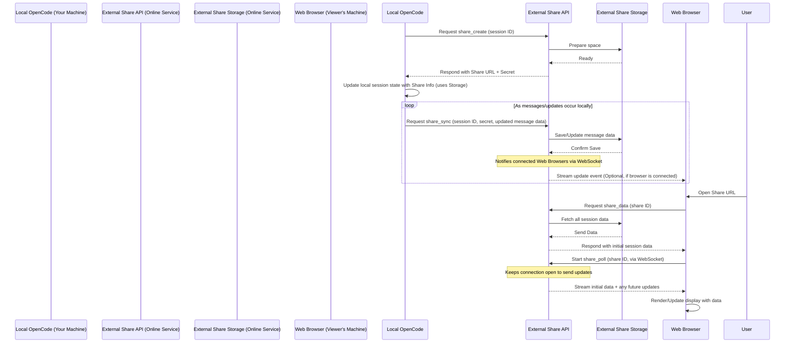

# Chapter 8: Share Feature

Welcome back! In our journey through the OpenCode architecture, we've seen how the [User Interface (TUI)](01_user_interface__tui__.md) helps you interact, how [AI Sessions](02_ai_session_.md) manage your conversations, how [AI Providers](03_ai_providers_.md) connect to powerful models, how [Tools](04_tools_.md) let the AI interact with your code, how the [API Server](05_api_server_.md) enables communication between components, and how [Application Context](06_application_context__.md) and [Storage](07_storage_.md) handle local settings and data persistence.

All of this keeps your AI conversations and work private and local to your machine. But what if you create something amazing with the AI and want to show it to a colleague or share a cool code snippet generated during a session? Copy-pasting a long conversation isn't ideal.

This is where the **Share Feature** comes in.

## What is the Share Feature?

The Share Feature allows you to take one of your private [AI Sessions](02_ai_session_.md) and make a *read-only*, public copy of its conversation history available via a simple web link. Anyone you send that link to can open it in their web browser and see the transcript of that specific AI session, including user messages, AI responses, and even details about the [Tools](04_tools_.md) the AI used.

Think of it like publishing a static blog post of your conversation. It's a snapshot (or a live view if updates happen) of your interaction that others can observe without needing OpenCode installed themselves.

## Why Share Sessions?

*   **Showcase AI Capabilities:** Easily demonstrate how OpenCode or a specific AI model handled a complex coding problem.
*   **Collaboration:** Share a debugging session transcript to get help from a teammate.
*   **Documentation:** Create a public record of how a task was completed or how a specific piece of code was generated.
*   **Reproducibility:** Allow others to see the exact steps (including tool calls) the AI took.

It turns your dynamic, local AI session into a static, shareable web page.

## Your Use Case: Sharing a Session Transcript

Let's imagine you've just had a great session with the AI where it helped you write a tricky regular expression using the `GrepTool`. You want to share this conversation with your team.

Here's the high-level flow:

1.  You are in the TUI, viewing the session you want to share.
2.  You trigger the "Share" action (this might be a command or a keybinding in the TUI).
3.  OpenCode initiates the sharing process. This involves talking to an **external Share API server** running online (not your local API server from Chapter 5).
4.  The external Share API creates a unique identifier for your shared session and gives OpenCode a special, secret URL.
5.  OpenCode saves this share information (the URL and a secret) with your local [AI Session](02_ai_session_.md) data ([Storage](07_storage_.md)).
6.  OpenCode starts sending the content of your local session (messages, tool results) to the external Share API. The API stores this data in an **external Share Storage**.
7.  The TUI shows you the share URL.
8.  You copy and share this URL with others.
9.  Someone opens the URL in their web browser.
10. A separate **Web View Application** (built with Astro and Solid.js) loads in their browser.
11. This Web View Application talks directly to the external Share API to fetch the session data.
12. The Web View displays the conversation transcript in a nicely formatted way.
13. If you continue the session locally and new messages are added, OpenCode automatically syncs these updates to the external Share API, and the Web View updates live for anyone viewing it.

This process involves coordination between your local OpenCode application, an external online service (the Share API and Storage), and a separate web application.

## How Sharing Works (Simplified Flow)

Let's trace the path of data and requests when you share a session:



This diagram highlights the key players and their interactions: your local app initiates sharing and sends updates, the external API manages the shared data and communicates with the web view, the external storage holds the data, and the web browser fetches and displays it.

## Inside the Share Feature: Key Concepts

The Share Feature isn't just one piece of code; it's a system involving several components:

*   **Local Share Logic (`packages/opencode/src/share/share.ts`):** This code runs within your OpenCode application. It's responsible for initiating the share process by talking to the external API, receiving the share URL, and most importantly, listening for updates to the local session data and syncing them to the external storage.
*   **External Share API (`packages/function/src/api.ts`):** This is a separate application running online (hosted using Cloudflare Workers). It acts as the backend for sharing. It handles requests to create shares, receive updates from local OpenCode instances, and serve session data to the web view. It also manages the external storage.
*   **External Share Storage:** This is where the shared session data is actually stored online. OpenCode uses Cloudflare Durable Objects (for managing WebSocket connections and temporary state per shared session) and R2 (object storage for the actual message files). For simplicity, we can think of this as the online "database" for shared sessions.
*   **Web View Application (`packages/web/`):** This is the public-facing part. It's an Astro site using Solid.js for interactive components. When someone visits a share URL, this application fetches the necessary data from the External Share API and renders the conversation.

## Initiating and Syncing from Local OpenCode

The code that runs on your machine to handle sharing is primarily in `packages/opencode/src/share/share.ts`.

### Creating a Share Link

When you trigger the share action in the TUI, the local OpenCode code calls `Share.create`:

```typescript
// packages/opencode/src/share/share.ts (Simplified Share.create)
export async function create(sessionID: string) {
  // Fetch the external Share API to create a new share for this session ID
  return fetch(`${URL}/share_create`, {
    method: "POST",
    body: JSON.stringify({ sessionID: sessionID }),
  })
    .then((x) => x.json()) // Parse the JSON response
    .then((x) => x as { url: string; secret: string }) // Expect URL and secret
}
```

This function simply makes an HTTP `POST` request to the external `share_create` endpoint, sending the ID of the session you want to share. The response from the external API contains the public `url` for viewing and a private `secret` that your local OpenCode instance will use to authenticate when sending updates.

After getting the URL and secret, your local OpenCode instance updates the metadata of the specific [AI Session](02_ai_session_.md) to mark it as shared and store the secret. This update is then saved to local [Storage](07_storage_.md).

### Syncing Local Updates to the External Storage

To keep the shared web view up-to-date, OpenCode needs to send any changes to the shared session (new messages, edited messages, tool call results) to the external Share API. This is done by listening to events on the local [Event Bus](10_event_bus_.md).

The `Share.init` function sets up this listener:

```typescript
// packages/opencode/src/share/share.ts (Simplified Share.init and sync trigger)
export async function init() {
  await state() // Ensure the share module state is initialized
}

// This is part of the state initialization logic mentioned briefly in Chapter 6
const state = App.state("share", async () => {
  // Subscribe to the event that fires whenever something is written to local Storage
  Bus.subscribe(Storage.Event.Write, async (payload) => {
    // The payload contains the 'key' (file path) and 'content' that was saved
    const key = payload.properties.key
    const content = payload.properties.content
    await sync(key, content) // Call the sync function with the updated data
  })
  return {} // Return initial state (can be empty)
})

// Function to sync data
export async function sync(key: string, content: any) {
  // Check if the saved data is a session-related key
  const [root, ...splits] = key.split("/")
  if (root !== "session") return // Only sync session data

  // Extract session ID from the key (e.g., "session/message/abc-123/...")
  const [, sessionID] = splits

  // Get the session info from local storage to check if it's shared
  const session = await Session.get(sessionID)
  if (!session.share) return // Only sync if the session is marked as shared

  const { secret } = session.share // Get the secret for authentication

  // Add the update to a pending queue (simplified logic shown)
  pending.set(key, content)

  // Send the update to the external API using the secret
  // (Simplified fetch logic)
  queue = queue.then(async () => {
    const content = pending.get(key)
    if (content === undefined) return
    pending.delete(key)
    // Make the actual HTTP POST request to the external share_sync endpoint
    return fetch(`${URL}/share_sync`, {
      method: "POST",
      body: JSON.stringify({
        sessionID: sessionID,
        secret, // Use the secret to prove this is your shared session
        key: key, // The storage key (e.g., "session/message/...")
        content, // The actual data that was saved
      }),
    })
  })
}
```

The `init` function subscribes to `Storage.Event.Write` events using the [Event Bus](10_event_bus_.md). This means *any* time OpenCode saves something to its local storage using `Storage.writeJSON` (which happens whenever a message is created or updated in a session, as seen in Chapter 7), the subscribed function is called.

Inside the subscriber, it checks if the `key` being saved is related to a session message or info. If it is, it retrieves the session information from local storage. If that session is marked as *shared* (meaning it has a `share` property with a `secret`), it calls the `sync` function.

The `sync` function uses the `secret` to make a `POST` request to the external `/share_sync` endpoint, sending the specific data that was just saved locally (`content`) along with its unique `key` and the `sessionID`. This updates the corresponding data in the external Share Storage. A simple queue (`pending` and `queue`) is used to avoid sending too many updates at once.

## Serving Data to the Web View (External API)

The external Share API is where the web view gets its data. It's defined in `packages/function/src/api.ts`. This API is designed to be stateless and run on a serverless platform like Cloudflare Workers, using Durable Objects and R2 for state and storage.

It provides endpoints for the web view:

*   `/share_data?id=<share ID>`: This endpoint is typically called once when the web page first loads. It fetches *all* current data (session info and messages) from the External Share Storage associated with the given share ID and returns it as a JSON response.

    ```typescript
    // packages/function/src/api.ts (Simplified share_data endpoint)
    if (request.method === "GET" && method === "share_data") {
      const id = url.searchParams.get("id") // Get the share ID from the URL
      // ... validation ...
      const stub = env.SYNC_SERVER.get(env.SYNC_SERVER.idFromName(id)) // Get the Durable Object for this share
      const data = await stub.getData() // Call a method on the DO to get all data

      // Process the raw data into a structured info + messages object
      let info
      const messages: Record<string, any> = {}
      data.forEach((d) => {
        const [root, type, ...splits] = d.key.split("/")
        // ... parse keys like "session/info/..." and "session/message/..."
        if (type === "info") info = d.content
        if (type === "message") messages[splits[1]] = d.content // Store by message ID
      })

      return new Response(
        JSON.stringify({ info, messages }), // Return structured JSON
        { headers: { "Content-Type": "application/json" } },
      )
    }
    ```
    This snippet shows the `share_data` endpoint receiving a share `id`. It interacts with a Durable Object (`stub`) which manages the data for that specific shared session. It calls `stub.getData()` to retrieve everything saved in the external storage for this ID, structures it into a simple `{ info, messages }` object, and returns it as JSON.

*   `/share_poll?id=<share ID>`: This endpoint is called by the web view after the initial data fetch. It establishes a **WebSocket connection**. This connection stays open, and the External Share API uses it to **stream** real-time updates to the web view whenever the local OpenCode instance syncs new data via `/share_sync`.

    ```typescript
    // packages/function/src/api.ts (Simplified share_poll endpoint setup)
    if (request.method === "GET" && method === "share_poll") {
      // ... check for websocket upgrade header ...
      const id = url.searchParams.get("id")
      // ... validation ...
      const stub = env.SYNC_SERVER.get(env.SYNC_SERVER.idFromName(id)) // Get the Durable Object
      // Pass the request to the Durable Object, which handles the WebSocket
      return stub.fetch(request) // Durable Object's fetch handles the websocket connection and initial data push
    }
    ```
    This endpoint receives the share `id`, validates that it's a WebSocket request, and then delegates the handling of the connection to the specific Durable Object instance responsible for that share ID (`stub.fetch(request)`). The Durable Object code (not fully shown here, but in the provided `SyncServer` class) handles accepting the WebSocket and pushing updates (`client.send(...)`) when new data arrives via the `/share_sync` endpoint.

## Displaying the Share View (Web Application)

The web application lives in `packages/web/`. When someone visits `https://dev.opencode.ai/s/<share-id>`, the Astro framework routes the request to `packages/web/src/pages/s/[id].astro`.

```astro
---
// packages/web/src/pages/s/[id].astro (Simplified)
// Fetch necessary data from the external API when the page loads
const apiUrl = import.meta.env.VITE_API_URL; // Get the API URL
const { id } = Astro.params; // Get the share ID from the URL path

// Initial fetch of session data from the external API
const res = await fetch(`${apiUrl}/share_data?id=${id}`);
const data = await res.json();

// Prepare metadata for the page (e.g., for social media previews)
// ...

---
<StarlightPage
  // ... page metadata ...
>
  {/* Render the Solid.js component, passing initial data */}
  <Share
    id={id}
    api={apiUrl}
    info={data.info} // Initial session info
    messages={data.messages} // Initial messages
    client:only="solid" {/* Tell Astro this component runs only in the browser */}
  />
</StarlightPage>

```

The Astro page (`[id].astro`) uses server-side rendering to initially fetch the shared session data by making a `fetch` request to the `/share_data` endpoint of the external Share API. It then passes this initial data (`data.info`, `data.messages`) as props to the `Share` Solid.js component.

The `Share.tsx` component handles rendering the conversation and setting up the live updates:

```typescript
// packages/web/src/components/Share.tsx (Simplified Solid.js component)
export default function Share(props: {
  id: string // Share ID
  api: string // API URL
  info: SessionInfo // Initial session info
  messages: Record<string, SessionMessage> // Initial messages
}) {
  // Create a Solid.js store to hold the session data
  const [store, setStore] = createStore<{
    info?: SessionInfo
    messages: Record<string, SessionMessage>
  }>({ info: props.info, messages: props.messages })

  // Computed property to get sorted messages as an array
  const messages = createMemo(() =>
    Object.values(store.messages).toSorted((a, b) => a.id?.localeCompare(b.id)),
  )

  // Effect that runs when the component mounts to set up WebSocket
  onMount(() => {
    let socket: WebSocket | null = null;
    const wsBaseUrl = props.api.replace(/^https?:\/\//, "wss://")
    const wsUrl = `${wsBaseUrl}/share_poll?id=${props.id}`

    // Function to create and set up WebSocket
    const setupWebSocket = () => {
       // ... connection setup, error handling, reconnect logic ...
       socket = new WebSocket(wsUrl)

       // Handle incoming messages from the WebSocket
       socket.onmessage = (event) => {
         try {
           const d = JSON.parse(event.data)
           // Check if the message is a session info or message update
           const [root, type, ...splits] = d.key.split("/")
           if (root !== "session") return
           if (type === "info") {
             // Update the session info in the Solid.js store
             setStore("info", reconcile(d.content))
             return
           }
           if (type === "message") {
             const [, messageID] = splits
             // Update the specific message in the Solid.js store
             setStore("messages", messageID, reconcile(d.content))
           }
         } catch (error) {
           console.error("Error parsing WebSocket message:", error)
         }
       }
       // ... onopen, onerror, onclose handlers ...
    }

    setupWebSocket() // Start the initial WebSocket connection

    // Cleanup the WebSocket when the component is removed
    onCleanup(() => {
      if (socket) {
        socket.close()
      }
    })
  })

  // Render the conversation using the 'messages()' memo and other store data
  return (
    <main>
      {/* Display session info (title, stats) using store.info */}
      {/* Loop through messages() array to display each message part */}
      {/* ... rendering logic omitted for brevity ... */}
    </main>
  )
}
```

The `Share` component uses a Solid.js `createStore` to manage the session data it receives initially and updates from the WebSocket. The `onMount` effect sets up the WebSocket connection to the `/share_poll` endpoint. When a message is received via the WebSocket (`socket.onmessage`), it parses the data (which corresponds to the `key` and `content` format sent by the External Share API) and updates the `store` using `setStore`. Solid.js automatically updates the parts of the UI that depend on the `store`, providing a live view of the conversation as you continue it in your local OpenCode instance.

The rest of the `Share.tsx` code, not shown in detail here, contains logic to format and display the different types of message parts (user text, AI markdown, tool calls, etc.) using other helper components like `MarkdownPart`, `TextPart`, and specific rendering logic for each tool based on its `toolInvocation` data and `metadata`.

## Conclusion

The Share Feature allows you to extend the utility of your local AI sessions by creating viewable, public web links. It relies on a distributed system involving your local OpenCode application (which initiates the share and syncs data), an external online API server (which manages the shared state and handles connections), an external storage system (where the data is kept online), and a separate web application (which fetches and displays the conversation in a browser). This multi-component approach ensures that your core OpenCode application remains local and private while providing a mechanism for controlled, read-only external access to specific conversations.

Now that we've explored how OpenCode interacts with the external world (via Providers and the Share Feature), let's look at how it integrates more deeply with your local development environment, specifically through Language Server Protocol (LSP).

[Next Chapter: LSP Integration](09_lsp_integration_.md)

---

<sub><sup>Generated by [AI Codebase Knowledge Builder](https://github.com/The-Pocket/Tutorial-Codebase-Knowledge).</sup></sub> <sub><sup>**References**: [[1]](https://github.com/sst/opencode/blob/c5eefd17528fd03a5c2553c8bf9d5c931597e09c/packages/function/src/api.ts), [[2]](https://github.com/sst/opencode/blob/c5eefd17528fd03a5c2553c8bf9d5c931597e09c/packages/opencode/src/share/share.ts), [[3]](https://github.com/sst/opencode/blob/c5eefd17528fd03a5c2553c8bf9d5c931597e09c/packages/web/src/components/Share.tsx), [[4]](https://github.com/sst/opencode/blob/c5eefd17528fd03a5c2553c8bf9d5c931597e09c/packages/web/src/pages/s/[id].astro)</sup></sub>
````