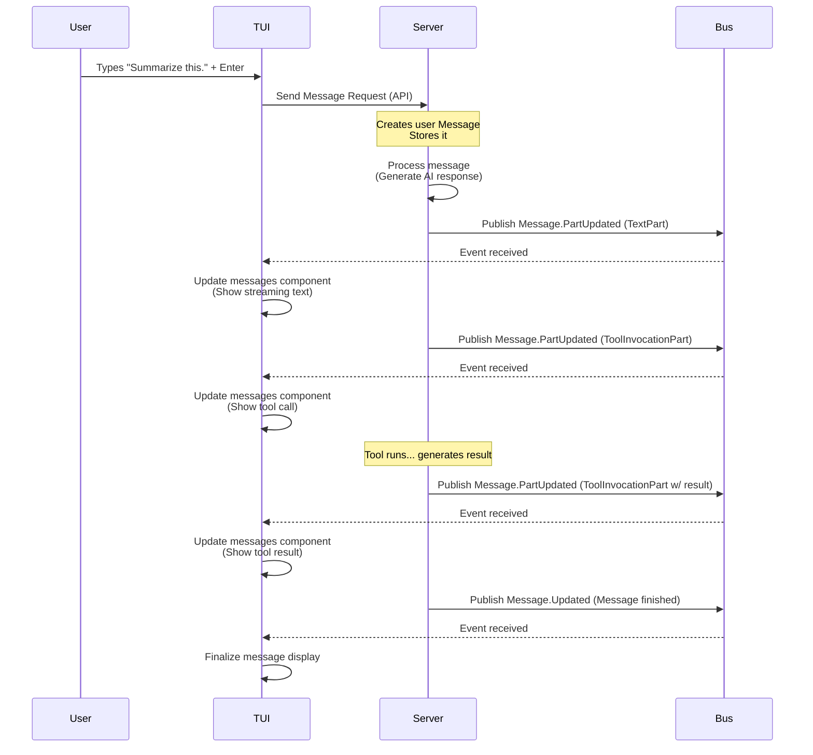

# Chapter 2: Message

Welcome back to the `opencode` tutorial! In [Chapter 1: TUI](01_tui__terminal_user_interface__.md), we explored the Terminal User Interface – the part of `opencode` you see and interact with. We learned how the TUI takes your input and displays the AI's responses, acting as the "face" of the application.

But what exactly *is* that input you type, and what *is* the AI's response that gets displayed? They aren't just simple strings of text floating around. They are structured data objects called **Messages**.

### What is a Message?

Imagine a conversation you have with someone. Each time you speak, and each time they respond, that's a "turn" in the conversation. In `opencode`, a **Message** is the digital representation of one of those turns.

Think of it like a chat bubble in a messaging app. Each bubble contains:

*   **Who** sent it: Was it you (the user) or the AI (the assistant)?
*   **What** was said or done: The actual content, which could be text, a command for the AI to run a tool, or the result of a tool being run.
*   **When** it happened: A timestamp.
*   **Which conversation** it belongs to: A reference to the [Session](03_session_.md).

Messages are the fundamental building blocks of any conversation you have with `opencode`. They are created in chronological order and together form the history of your interaction in a specific [Session](03_session_.md).

### Why Messages?

Why not just store plain text? Structuring the conversation into `Message` objects is crucial because they contain more than just text. They can include:

*   Information about **tool calls** the AI decides to make.
*   The **results** it gets back from those tools.
*   Metadata like timestamps, session IDs, and even technical details about the AI's response (like which model was used or how many tokens it cost).

This rich structure allows `opencode` to do more than just simple chat; it enables complex interactions involving tools and helps track session details.

### Anatomy of a Message

Let's look at the key pieces of information stored in a `Message`. In `opencode`, a Message is represented by a data structure (specifically, a Zod schema and TypeScript type) called `Message.Info`.

```typescript
// Simplified structure based on packages/opencode/src/session/message.ts
export namespace Message {
  export const Info = z.object({
    id: z.string(), // Unique ID for this message
    role: z.enum(["user", "assistant"]), // Who sent it
    parts: z.array(Part), // The content of the message
    metadata: z.object({
      sessionID: z.string(), // Which session this belongs to
      time: z.object({
        created: z.number(), // When it was created
        completed: z.number().optional(), // When the AI finished responding (for assistant messages)
      }),
      // ... other metadata like tool info, assistant details, errors ...
    }),
  });
  export type Info = z.infer<typeof Info>;

  // Definition of the 'Part' type is below...
}
```

Let's break down the important fields for a beginner:

*   `id`: A unique identifier given to each Message. Useful for tracking and referring to specific messages.
*   `role`: This tells you who sent the message. It can be either `"user"` for messages you type, or `"assistant"` for messages generated by the AI.
*   `parts`: This is the main content of the message. It's an *array* because a single message can contain different types of content mixed together (e.g., text and a tool call, or a tool result followed by text). We'll look at `Part` next.
*   `metadata`: This object holds extra information about the message, like the `sessionID` it belongs to and timestamps (`time.created`, `time.completed`).

### Message Parts: The Content

The `parts` array within a `Message.Info` holds the actual content. Each element in this array is a `Message.Part`. There are several types of parts defined, but for a beginner, the most important ones are:

*   **TextPart**: This is just plain text. Your input message will likely be a single `TextPart`. The AI's response will often start with text, contain tool calls/results, and then finish with more text.
*   **ToolInvocationPart**: This represents the AI either deciding to call a tool or reporting the result of a tool call.

```typescript
// Simplified structure based on packages/opencode/src/session/message.ts
export namespace Message {
  // ... Info definition above ...

  export const TextPart = z.object({
    type: z.literal("text"), // This part is text
    text: z.string(), // The actual text content
  });
  export type TextPart = z.infer<typeof TextPart>;

  export const ToolInvocation = z.object({
    state: z.enum(["partial-call", "call", "result"]), // Where is the tool call process?
    toolCallId: z.string(), // ID linking call/result parts
    toolName: z.string(), // Name of the tool being called
    args: z.custom<Required<unknown>>(), // Arguments for the tool (can be partial during streaming)
    result: z.string().optional(), // The output from the tool (only in 'result' state)
  });
  export type ToolInvocation = z.infer<typeof ToolInvocation>;

  export const ToolInvocationPart = z.object({
    type: z.literal("tool-invocation"), // This part is a tool interaction
    toolInvocation: ToolInvocation, // The details of the tool interaction
  });
  export type ToolInvocationPart = z.infer<typeof ToolInvocationPart>;

  // A Message Part can be one of these types
  export const Part = z.discriminatedUnion("type", [
    TextPart,
    ToolInvocationPart,
    // ... other part types like ReasoningPart, SourceUrlPart, FilePart, StepStartPart ...
  ]);
  export type Part = z.infer<typeof Part>;
}
```

The `ToolInvocationPart`'s `state` field is interesting:

*   `partial-call`: The AI is starting to generate the tool call, but the arguments might be incomplete yet.
*   `call`: The AI has specified the tool name and arguments it wants to use.
*   `result`: The tool has finished running, and this part contains its output (`result` field).

This allows the TUI to show the tool execution process as it happens.

### Messages and the TUI

In [Chapter 1: TUI](01_tui__terminal_user_interface__.md), we saw that the `messages` component (`chat.MessagesComponent`) is responsible for displaying the conversation history. This component receives `Message.Info` objects from the [Server](08_server_.md) and renders their content (the `parts`) onto the screen, formatting user messages differently from assistant messages, showing tool calls, etc.

When you type a message in the TUI editor and press Enter:

1.  The TUI creates the content (a `TextPart`).
2.  It packages this content into a request sent to the [Server](08_server_.md).
3.  The [Server](08_server_.md) then creates a *new* `Message.Info` object with the `role` set to `"user"`, your text as a `TextPart`, assigns it an `id`, links it to the current `sessionID`, adds timestamps, and saves it to [Storage](07_storage_.md).
4.  The [Server](08_server_.md) processes the user message to generate an AI response.
5.  As the AI generates its response (text, tool calls), the [Server](08_server_.md) creates another new `Message.Info` object with the `role` set to `"assistant"`, the same `sessionID`, a new `id`, etc. It adds `Part`s to this message as they are generated.
6.  The [Server](08_server_.md) doesn't wait until the AI is completely finished. It *streams* updates about the assistant message back to the TUI. It does this by publishing events on the [Bus](09_bus__event_bus__.md).
7.  The TUI is subscribed to these events via its API client. When it receives a `message.part.updated` event (defined in `Message.Event.PartUpdated` in `packages/opencode/src/session/message.ts`), it knows a part of the assistant message has been updated (e.g., more text has arrived, or a tool call state changed).
8.  The TUI's `messagesComponent` updates its display based on this new information.

This process is how you see the AI's response appear character by character or see tool calls and results show up in real-time in the terminal.

Here's a simplified sequence diagram showing this flow:



This diagram illustrates how the TUI and [Server](08_server_.md) coordinate using Messages and the [Bus](09_bus__event_bus__.md) to provide a dynamic chat experience.

### Messages in the Code

Let's look at a couple of simplified code references to see where Messages appear.

In the `Session.chat` function (`packages/opencode/src/session/index.ts`), which is responsible for handling the chat flow (user input -> AI response), you can see messages being created and updated:

```typescript
// Simplified snippet from packages/opencode/src/session/index.ts
export namespace Session {
  // ... other functions ...

  async function updateMessage(msg: Message.Info) {
    // Save the message to storage
    await Storage.writeJSON(
      "session/message/" + msg.metadata.sessionID + "/" + msg.id,
      msg,
    );
    // Notify others (like the TUI) that the message was updated
    Bus.publish(Message.Event.Updated, {
      info: msg,
    });
  }

  export async function chat(input: {
    sessionID: string;
    // ... other chat parameters ...
    parts: Message.Part[]; // Input content comes as Message.Part array
  }) {
    // ... logic to get previous messages ...

    // Create the new user message
    const userMsg: Message.Info = {
      role: "user",
      id: Identifier.ascending("message"), // Generate a unique ID
      parts: input.parts,
      metadata: {
        time: { created: Date.now() },
        sessionID: input.sessionID,
        tool: {},
      },
    };
    await updateMessage(userMsg); // Save and publish the user message

    // Create the initial assistant message placeholder
    const assistantMsg: Message.Info = {
      id: Identifier.ascending("message"), // Generate unique ID
      role: "assistant",
      parts: [], // Start empty, parts will be added as generated
      metadata: {
        // ... assistant specific metadata ...
        time: { created: Date.now() },
        sessionID: input.sessionID,
        tool: {},
      },
    };
    await updateMessage(assistantMsg); // Save and publish the placeholder

    // ... logic to stream AI response ...
    // As parts arrive (text, tool calls), they are added to assistantMsg.parts
    // and updateMessage(assistantMsg) is called repeatedly.
  }
  // ... other functions ...
}
```

This snippet shows that Messages (`Message.Info`) are created within the `Session` logic on the [Server](08_server_.md). The `updateMessage` helper function is key; it saves the current state of the message (to [Storage](07_storage_.md)) and then publishes an event on the [Bus](09_bus__event_bus__.md) to notify listeners (like the TUI) about the change. The `chat` function explicitly creates both the `user` and `assistant` messages.

In the TUI, the `messagesComponent` (`packages/tui/internal/components/chat/messages.go`) needs to listen for these updates to display them. This is done by subscribing to the `Message.Event.PartUpdated` and `Message.Event.Updated` events from the [Bus](09_bus__event_bus__.md) (via the API client). You can see a subscription example in the command line runner (`packages/opencode/src/cli/cmd/run.ts`):

```typescript
// Simplified snippet from packages/opencode/src/cli/cmd/run.ts
export const RunCommand = cmd({
  // ... command setup ...
  handler: async (args) => {
    // ... session and setup logic ...

    // Subscribe to message part updates from the Bus
    Bus.subscribe(Message.Event.PartUpdated, async (evt) => {
      // Check if the update is for the current session
      if (evt.properties.sessionID !== session.id) return;

      const part = evt.properties.part;
      // Retrieve the full message info if needed (e.g., for tool metadata)
      const message = await Session.getMessage(
        evt.properties.sessionID,
        evt.properties.messageID,
      );

      // Logic to display the part based on its type
      if (part.type === "tool-invocation") {
        // Display tool call/result details
        // ... formatting based on tool name and state ...
      }

      if (part.type === "text") {
        // Display streaming text
        // ... formatting text ...
      }
      // The actual TUI component handles displaying within the terminal window
    });

    // Initiate the chat conversation (sends the user message)
    await Session.chat({
      sessionID: session.id,
      // ... model and parts ...
    });
    // ... cleanup ...
  },
});
```

This snippet, although from the command-line runner logic (which uses similar components to the TUI for simple output), shows how the code subscribes to `Message.Event.PartUpdated`. When an event arrives, it processes the included `part` data and the message `id`/`sessionID` to update the display. The TUI's `messagesComponent` does something similar internally, managing the rendering within the terminal window using Bubble Tea components like a `viewport`.

### Conclusion

Messages are the core units of conversation in `opencode`. Each `Message.Info` object represents a turn, containing content in the form of `Part`s (text, tool calls, tool results), along with metadata about who sent it, when, and which [Session](03_session_.md) it belongs to. They are created by the [Server](08_server_.md), stored in [Storage](07_storage_.md), and streamed to the TUI (and other interested components) via the [Bus](09_bus__event_bus__.md) using specific events.

Understanding the Message structure is essential because it's the data that makes up your conversation history. Now that we know what individual messages are, let's see how these messages are grouped together to form a complete conversation history.

Let's move on to the concept of a Session.

[Chapter 3: Session](03_session_.md)

---

<sub><sup>Generated by [AI Codebase Knowledge Builder](https://github.com/The-Pocket/Tutorial-Codebase-Knowledge).</sup></sub> <sub><sup>**References**: [[1]](https://github.com/sst/opencode/blob/100d6212be5b1475692116397aa9bef05da79cbf/packages/function/src/api.ts), [[2]](https://github.com/sst/opencode/blob/100d6212be5b1475692116397aa9bef05da79cbf/packages/opencode/src/bus/index.ts), [[3]](https://github.com/sst/opencode/blob/100d6212be5b1475692116397aa9bef05da79cbf/packages/opencode/src/cli/cmd/run.ts), [[4]](https://github.com/sst/opencode/blob/100d6212be5b1475692116397aa9bef05da79cbf/packages/opencode/src/session/index.ts), [[5]](https://github.com/sst/opencode/blob/100d6212be5b1475692116397aa9bef05da79cbf/packages/opencode/src/session/message.ts), [[6]](https://github.com/sst/opencode/blob/100d6212be5b1475692116397aa9bef05da79cbf/packages/opencode/src/tool/task.ts)</sup></sub>
````