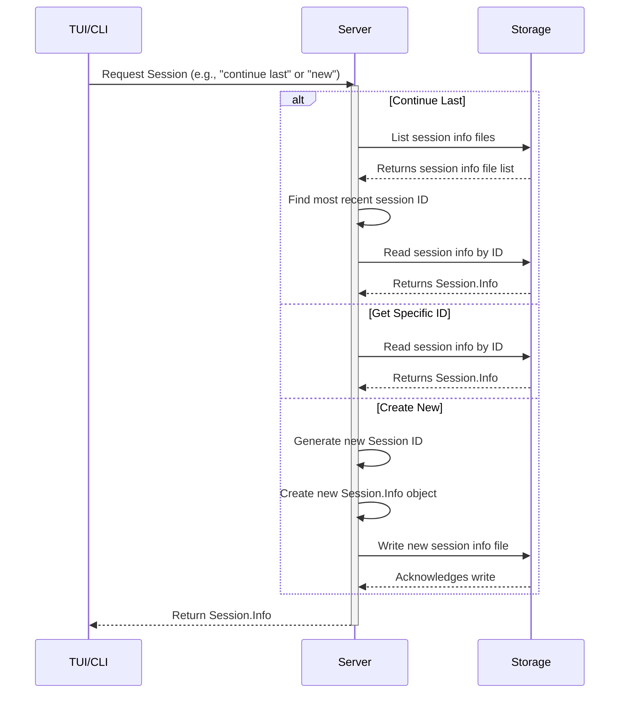

# Chapter 3: Session

Welcome back! In [Chapter 1: TUI](01_tui__terminal_user_interface__.md), we saw how the Terminal User Interface is your window into `opencode`. In [Chapter 2: Message](02_message_.md), we learned that the individual pieces of a conversation – your input, the AI's response, tool calls, and results – are structured as `Message` objects.

But what happens when you have multiple conversations going? Maybe you're working on fixing a bug in one file, and then you want to ask the AI a quick question about a different topic, and then go back to the bug fix. You wouldn't want those conversations to get mixed up!

This is where the concept of a **Session** comes in.

### What is a Session?

Think of a **Session** as a dedicated workspace or a single, continuous conversation thread with the `opencode` AI. It's like opening a specific chat window for one particular problem or task.

Why do we need sessions? Because context matters! When you're working on a coding problem, the AI needs to remember the previous messages – the code you shared, the errors you encountered, the steps you've already taken, and the tools it used. A Session keeps all those related [Messages](02_message_.md) together, maintaining the context for that specific task.

So, a Session is essentially:

1.  A container for a sequence of [Messages](02_message_.md).
2.  A way to maintain conversation context for a specific goal (like "Fix bug in file X" or "Write tests for function Y").
3.  Something you can start, continue later, and even share with others.

Each time you start `opencode` without telling it otherwise, it usually creates a brand new Session for you, ready for a fresh conversation.

### Anatomy of a Session

Just like a `Message` has structure, so does a Session. It's represented by a data structure called `Session.Info`.

```typescript
// Simplified structure based on packages/opencode/src/session/index.ts
export namespace Session {
  export const Info = z.object({
    id: z.string(), // Unique ID for this session
    parentID: z.string().optional(), // If this session branched off another
    share: z.object({ // Information if the session is shared
      url: z.string(),
    }).optional(),
    title: z.string(), // A human-readable title for the session
    version: z.string(), // Which opencode version created this session
    time: z.object({
      created: z.number(), // When the session was created
      updated: z.number(), // When the session was last updated
    }),
    // ... other metadata ...
  });
  export type Info = z.infer<typeof Info>;

  // ... other session related definitions ...
}
```

Key parts of a `Session.Info`:

*   `id`: A unique identifier for the session. These IDs are generated to be roughly time-ordered, helping to list recent sessions easily.
*   `title`: A descriptive name for the session. `opencode` tries to automatically generate a title based on the first message.
*   `time`: Timestamps for when the session was created and last used (`updated`).
*   `parentID`: This is used if you "branch" a session to explore a different path, linking the new session back to the one it came from.
*   `share`: Contains details if the session has been shared.

All the [Messages](02_message___.md) you send and receive within a Session are tagged with that Session's `id` in their `metadata.sessionID` field. This is how `opencode` knows which conversation thread each message belongs to.

### Using Sessions in `opencode`

When you run `opencode`, you interact with Sessions primarily through the TUI or command-line arguments.

**1. Starting a New Session:**

This is the default behavior. If you just run `opencode` or use the `run` command without specifying a session, a new one is created automatically.

```bash
# Starts the TUI, creates a new session
opencode

# Runs a single message in a new session (command line)
opencode run "What is the capital of France?"
```

**2. Continuing an Existing Session:**

You can pick up where you left off in a previous conversation.

*   **Continue the most recent session:** Use the `--continue` or `-c` flag.

    ```bash
    # Opens the TUI, loading the last active session
    opencode -c

    # Continues the last session with a new message (command line)
    opencode run -c "What about Germany?"
    ```

*   **Continue a specific session:** Use the `--session <session_id>` or `-s <session_id>` flag. You'll need the ID of the session you want to load. The TUI usually shows the current session ID in the status bar.

    ```bash
    # Opens the TUI with a specific session
    opencode -s ses_abcdefg123...

    # Continues a specific session with a new message (command line)
    opencode run -s ses_abcdefg123... "Now tell me about Italy."
    ```

**3. Listing Sessions:**

How do you find the ID of an old session? Currently, the easiest way is typically through the TUI interface or potentially future commands that list sessions.

**4. Sharing a Session:**

One cool feature is sharing your conversation. This creates a web link where others can view (but not modify) the conversation history. This is also done on a per-session basis. The `Session.share` function handles this.

```typescript
// Simplified snippet from packages/opencode/src/cli/cmd/run.ts
export const RunCommand = cmd({
  // ...
  handler: async (args) => {
    await App.provide(
      {
        cwd: process.cwd(),
      },
      async () => {
        // ... session finding logic based on args.continue or args.session ...
        const session = await (async () => {
          if (args.continue) {
            // Find the last session using Session.list()
            const first = await Session.list().next()
            if (first.done) return
            return first.value // Return the last session
          }

          if (args.session) return Session.get(args.session) // Get session by ID

          return Session.create() // Create a new session by default
        })()

        if (!session) {
          UI.error("Session not found")
          return
        }

        // ... Display session info ...

        // Share the session if requested (args.share or auto-share config)
        const cfg = await Config.get()
        if (cfg.autoshare || Flag.OPENCODE_AUTO_SHARE || args.share) {
          await Session.share(session.id)
          UI.println(
            UI.Style.TEXT_INFO_BOLD +
            "~  https://opencode.ai/s/" +
            session.id.slice(-8), // Display share URL
          )
        }

        // ... chat logic using session.id ...
        await Session.chat({
          sessionID: session.id, // Pass the session ID to chat
          // ... provider, model, parts ...
        });
        // ... cleanup ...
      },
    );
  },
});
```

This `run` command handler shows how it checks the arguments (`--continue`, `--session`), uses `Session.list()`, `Session.get()`, or `Session.create()` to determine which session to use, and then passes that session's `id` to the `Session.chat()` function, which starts the AI interaction within that specific session context. It also calls `Session.share()` if sharing is enabled.

### How Sessions Work (Internal Implementation)

Sessions are managed primarily by the [Server](08_server_.md). When you start the TUI or run a command, the application logic decides which session to load or create.

**1. Finding or Creating a Session:**

When `opencode` starts up or a command like `run` is executed:



This diagram shows the server logic for handling a session request. It either looks up existing session information in [Storage](07_storage__.md) (by listing or reading specific files) or generates a new session ID and saves a new `Session.Info` file.

**2. Storing Sessions:**

Session information (the `Session.Info` object) and its associated [Messages](02_message_.md) are saved as files in `opencode`'s [Storage](07_storage_.md).

*   Session info is typically saved at a path like `session/info/<session_id>.json`.
*   Each message within that session is saved at `session/message/<session_id>/<message_id>.json`.

```typescript
// Simplified snippet from packages/opencode/src/session/index.ts
export namespace Session {
  // ... state definition ...

  export async function create(parentID?: string) {
    const result: Info = {
      id: Identifier.descending("session"), // Generates a time-ordered ID
      version: Installation.VERSION,
      parentID,
      title:
        (parentID ? "Child session - " : "New Session - ") +
        new Date().toISOString(), // Default title
      time: {
        created: Date.now(),
        updated: Date.now(),
      },
    };
    // ... logging and state update ...
    await Storage.writeJSON("session/info/" + result.id, result); // Save session info
    // ... auto-share logic and Bus publish ...
    return result;
  }

  export async function get(id: string) {
    // ... check state cache ...
    const read = await Storage.readJSON<Info>("session/info/" + id); // Read from storage
    // ... update state cache ...
    return read as Info;
  }

  export async function messages(sessionID: string) {
    const result = [] as Message.Info[];
    const list = Storage.list("session/message/" + sessionID); // List messages for this session
    for await (const p of list) {
      const read = await Storage.readJSON<Message.Info>(p); // Read each message
      result.push(read);
    }
    result.sort((a, b) => (a.id > b.id ? 1 : -1)); // Sort messages by ID (time)
    return result;
  }

  async function updateMessage(msg: Message.Info) {
    await Storage.writeJSON(
      "session/message/" + msg.metadata.sessionID + "/" + msg.id, // Save message by session/message ID
      msg,
    );
    // ... Bus publish ...
  }

  export async function chat(input: {
    sessionID: string; // Input requires a sessionID
    // ... other inputs ...
  }) {
    // ... get messages for this session ...
    let msgs = await messages(input.sessionID);

    // Create and save the user message
    const userMsg: Message.Info = {
      role: "user",
      id: Identifier.ascending("message"), // New message ID
      parts: input.parts,
      metadata: {
        time: { created: Date.now() },
        sessionID: input.sessionID, // Link message to session
        tool: {},
      },
    };
    await updateMessage(userMsg); // Save and publish user message
    msgs.push(userMsg);

    // Create and save the assistant message placeholder
    const assistantMsg: Message.Info = {
      id: Identifier.ascending("message"), // New message ID
      role: "assistant",
      parts: [],
      metadata: {
        // ... assistant details ...
        time: { created: Date.now() },
        sessionID: input.sessionID, // Link message to session
        tool: {},
      },
    };
    await updateMessage(assistantMsg); // Save and publish placeholder
    // ... streaming logic adds parts and calls updateMessage repeatedly ...
  }

  // ... share, update, abort, list functions ...
}
```

This code from `packages/opencode/src/session/index.ts` demonstrates how:
*   `create` and `get` handle saving and loading `Session.Info` using `Storage.writeJSON` and `Storage.readJSON`.
*   `messages` loads all messages for a given `sessionID` by listing and reading files under the `session/message/<sessionID>/` path.
*   `updateMessage` saves individual messages, ensuring they are stored within the correct session's message directory.
*   `chat` explicitly takes a `sessionID` and creates new user and assistant messages linked to that ID.

The session IDs themselves are generated using the `Identifier` utility (`packages/opencode/src/id/id.ts`), which creates unique, time-based IDs with prefixes (`ses_` for sessions, `msg_` for messages).

```typescript
// Simplified snippet from packages/opencode/src/id/id.ts
export namespace Identifier {
  const prefixes = {
    session: "ses", // Prefix for session IDs
    message: "msg", // Prefix for message IDs
    user: "usr",
  } as const

  // Function to generate a new time-ordered ID with a specific prefix
  export function ascending(prefix: keyof typeof prefixes, given?: string) {
    return generateID(prefix, false, given)
  }

  export function descending(prefix: keyof typeof prefixes, given?: string) {
    return generateID(prefix, true, given)
  }

  function generateID(
    prefix: keyof typeof prefixes,
    descending: boolean,
    given?: string,
  ): string {
    // ... logic to generate ID based on timestamp and counter ...
    // Returns something like "ses_..." or "msg_..."
  }

  // ... other helper functions ...
}
```
This shows that `Identifier.ascending("session")` or `Identifier.descending("session")` is used to create the unique `ses_...` ID for each new session.

**3. Session Sharing:**

Sharing is managed by the `Share` concept (`packages/opencode/src/share/share.ts`). When a session is shared, its `Session.Info` and all its [Messages](02_message_.md) are synced to a remote [Server](08_server_.md) (the `SyncServer` defined in `packages/function/src/api.ts`). This remote server stores the shared data and serves it via a public URL. The `Session.share` function orchestrates this synchronization.

```typescript
// Simplified snippet from packages/opencode/src/session/index.ts
export namespace Session {
  // ... create, get, update, messages, chat etc ...

  export async function share(id: string) {
    const session = await get(id)
    if (session.share) return session.share // Already shared

    const share = await Share.create(id) // Create the share link via Share service
    await update(id, (draft) => {
      draft.share = { url: share.url } // Update session info with share URL
    })
    await Storage.writeJSON<ShareInfo>("session/share/" + id, share) // Save share info
    await Share.sync("session/info/" + id, session) // Sync session info to remote
    for (const msg of await messages(id)) {
      await Share.sync("session/message/" + id + "/" + msg.id, msg) // Sync messages to remote
    }
    return share
  }

  // ... unshare, abort etc ...
}
```
The `Session.share` function relies on `Share.create` to get the share URL/secret and then uses `Share.sync` (which is triggered automatically by `Storage.writeJSON` via a [Bus](09_bus__event_bus__.md) event) to push the session data to the remote sharing service.

### Conclusion

In this chapter, we learned that a Session is the fundamental container for your conversation with `opencode`. It groups related [Messages](02_message_.md) together, maintaining context for a specific task. Sessions have unique IDs, titles, and timestamps and can be continued or even shared. The [Server](08_server_.md) manages sessions, saving their state and messages in [Storage](07_storage_.md) and linking messages to their parent session via the `sessionID` field.

Now that we understand how conversations are organized into sessions, the next step is to explore how `opencode` knows *how* to behave – what models to use, which providers to connect to, and other settings.

Let's dive into the concept of Config.

[Chapter 4: Config](04_config_.md)

---

<sub><sup>Generated by [AI Codebase Knowledge Builder](https://github.com/The-Pocket/Tutorial-Codebase-Knowledge).</sup></sub> <sub><sup>**References**: [[1]](https://github.com/sst/opencode/blob/100d6212be5b1475692116397aa9bef05da79cbf/packages/function/src/api.ts), [[2]](https://github.com/sst/opencode/blob/100d6212be5b1475692116397aa9bef05da79cbf/packages/opencode/src/cli/cmd/run.ts), [[3]](https://github.com/sst/opencode/blob/100d6212be5b1475692116397aa9bef05da79cbf/packages/opencode/src/id/id.ts), [[4]](https://github.com/sst/opencode/blob/100d6212be5b1475692116397aa9bef05da79cbf/packages/opencode/src/index.ts), [[5]](https://github.com/sst/opencode/blob/100d6212be5b1475692116397aa9bef05da79cbf/packages/opencode/src/session/index.ts), [[6]](https://github.com/sst/opencode/blob/100d6212be5b1475692116397aa9bef05da79cbf/packages/opencode/src/session/message.ts), [[7]](https://github.com/sst/opencode/blob/100d6212be5b1475692116397aa9bef05da79cbf/packages/opencode/src/share/share.ts), [[8]](https://github.com/sst/opencode/blob/100d6212be5b1475692116397aa9bef05da79cbf/packages/opencode/src/tool/task.ts)</sup></sub>
````