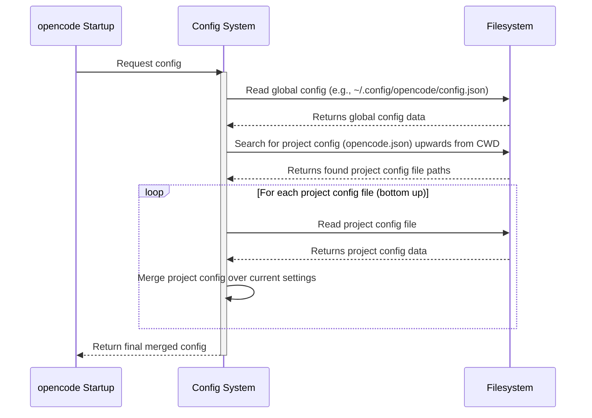

# Chapter 4: Config

Welcome back to the `opencode` tutorial! In our previous chapters, we've explored the [Chapter 1: TUI](01_tui__terminal_user_interface__.md) (how you see and interact with `opencode`), [Chapter 2: Message](02_message_.md) (the structure of the conversation turns), and [Chapter 3: Session](03_session_.md) (how messages are grouped into continuous conversations).

Now that you know how to interact and how conversations are organized, you might start wondering: "How can I make `opencode` work the way *I* want it to?" Maybe you prefer a different AI model, or you want to change keyboard shortcuts, or connect to a specific service. This is where **Config** comes in.

### What is Config?

**Config** is `opencode`'s system for managing all its settings and preferences. It's like the control panel or settings menu for the application. It allows you to customize various aspects of `opencode`'s behavior.

Why is this important? Every developer has different needs and preferences. You might have access to specific AI models, work with particular tools, or just prefer a different color theme in your terminal. Config gives you the power to tailor `opencode` to your workflow.

The core idea is simple: you tell `opencode` how you want things configured, and it remembers those settings.

### Where Does Config Live?

`opencode` loads configuration settings from special files. These files are typically named `opencode.json` or `opencode.jsonc` (the `c` stands for comments, allowing you to add notes in the file).

`opencode` looks for these files in a few standard places:

1.  **Global Config:** It first loads a global configuration file, usually located in your user's configuration directory (like `~/.config/opencode/config.json` on Linux/macOS, or `AppData\Roaming\opencode\config.json` on Windows). These are settings that apply everywhere.
2.  **Project Config:** Then, it looks for `opencode.json` or `opencode.jsonc` starting from the directory you run `opencode` in, and working its way up the directory tree until it reaches your home directory or the root of the project (if detected).

**Important:** Project configuration files *override* settings from the global configuration file. This means you can have general settings for `opencode` globally, but then create a specific `opencode.json` file in a project directory to change settings *just* for that project (like using a different model better suited for that project's code).

### Customizing `opencode`: A Use Case

Let's walk through a common customization: changing the default AI model `opencode` uses.

By default, `opencode` tries to find a suitable model based on available providers. But maybe you have a specific model you prefer or need to use.

Here's how you'd change the default model using Config:

1.  **Find or Create a Config File:** You can edit the global `config.json` or create an `opencode.json` file in your project directory. Creating one in your project is a good way to test without affecting your global settings.
2.  **Add the `model` Setting:** Open the `opencode.json` file in a text editor and add the `model` setting. The value should be the provider ID followed by a slash and the model ID (e.g., `"anthropic/claude-3-sonnet-20240229"` or `"openai/gpt-4o"`).

Here's a minimal `opencode.json` example:

```json
// opencode.json
{
  "model": "anthropic/claude-3-sonnet-20240229"
}
```

This is a simple JSON object. The `"model"` key tells `opencode` which setting you're changing, and the value `"anthropic/claude-3-sonnet-20240229"` specifies the desired model.

3.  **Run `opencode`:** Now, when you run `opencode` (either the TUI or a command like `opencode run`) from the directory containing this `opencode.json` file (or any subdirectory within it), `opencode` will load this configuration and use `anthropic/claude-3-sonnet-20240229` as the default model for that session.

You'll typically see the active model displayed in the TUI status bar or in the command-line output when using `opencode run`.

### Anatomy of the Config

The structure of the settings is defined internally using a Zod schema called `Config.Info`. You don't need to know all the details, but it gives you an idea of what can be configured.

Here are some common top-level settings you might find in a `config.json` or `opencode.json` file:

| Setting              | Description                                                              | Example Value                                  |
| :------------------- | :----------------------------------------------------------------------- | :--------------------------------------------- |
| `theme`              | Sets the color theme for the TUI.                                        | `"dark"` or `"light"`                          |
| `keybinds`           | Customizes keyboard shortcuts in the TUI.                                | `{ "app_exit": "ctrl+c" }`                     |
| `autoshare`          | Automatically shares new sessions (creates a web link).                  | `true` or `false`                              |
| `disabled_providers` | A list of [Provider](05_provider_.md) IDs to ignore.                     | `["openai", "google"]`                         |
| `model`              | Sets the default model (e.g., `"providerID/modelID"`).                   | `"anthropic/claude-3-sonnet-20240229"`         |
| `provider`           | Advanced configuration for specific [Provider](05_provider_.md) options. | `{ "openai": { "apiKey": "..." } }`            |
| `mcp`                | Configures connections to external [MCP](08_server_.md) servers.         | `{ "mytoolserver": { "type": "remote", ... } }`|

You can combine these settings in a single configuration file. For instance, here's an example `opencode.json` that sets a model and disables a provider:

```json
// opencode.json
{
  "model": "openai/gpt-4o",
  "disabled_providers": ["anthropic"]
}
```

### How Config Works (Internal Implementation)

Let's look behind the scenes at how `opencode` loads and uses configuration.

**1. Loading the Configuration:**

When `opencode` starts, one of the first things it does is load the configuration. It performs a sequence of steps:



This diagram shows that `opencode` starts by reading the global config, then searches for project-specific configs, and merges them in order (from the lowest directory up), so settings in files closer to the current directory override those further up or in the global file.

This loading logic is handled by the `Config.state` and `Config.load` functions in the `packages/opencode/src/config/config.ts` file.

The `Config.state` uses an `App.state` helper to ensure the configuration is loaded only once when the application starts:

```typescript
// Simplified snippet from packages/opencode/src/config/config.ts
export namespace Config {
  // ... logging and zod schemas ...

  export const state = App.state("config", async (app) => {
    // 1. Load global config
    let result = await global()

    // 2. Find and load project configs
    for (const file of ["opencode.jsonc", "opencode.json"]) {
      const found = await Filesystem.findUp(file, app.path.cwd, app.path.root)
      for (const resolved of found.toReversed()) {
        // 3. Merge project config (using mergeDeep from 'remeda')
        result = mergeDeep(result, await load(resolved))
      }
    }
    log.info("loaded", result) // Log the final config
    return result // Store the final config in the app state
  })

  // Helper function to load a single config file
  async function load(path: string) {
    // ... reads JSON/JSONC file ...
    // ... parses with Info.safeParse ...
    // ... handles errors (ENOENT, invalid JSON) ...
    return parsed.data // Returns the parsed config object
  }

  // ... other helpers ...
}
```

This snippet shows that `Config.state` orchestrates the loading. It calls `global()` to get the base config, then uses `Filesystem.findUp` to locate project files, and `mergeDeep` to combine the settings, with later files overriding earlier ones. The `load` function handles reading and parsing individual JSON/JSONC files.

**2. Accessing the Configuration:**

Once loaded, the configuration is stored in the application's state. Any part of `opencode` that needs a setting can access the final, merged configuration using the `Config.get()` function.

For example, when the `opencode run` command starts a session, it needs to know which model to use. It calls `Config.get()` and then `Provider.defaultModel()` which uses the config:

```typescript
// Simplified snippet from packages/opencode/src/cli/cmd/run.ts
export const RunCommand = cmd({
  // ... command setup ...
  handler: async (args) => {
    await App.provide(
      { cwd: process.cwd() },
      async () => {
        // ... session finding logic ...

        // Get the configuration
        const cfg = await Config.get()

        // Check if autoshare is enabled in the config or via flag
        if (cfg.autoshare || Flag.OPENCODE_AUTO_SHARE || args.share) {
          await Session.share(session.id) // Share the session if enabled
          // ... print share URL ...
        }

        // Determine the default model, checking args first, then config
        const { providerID, modelID } = args.model
          ? Provider.parseModel(args.model) // Use model from command args if provided
          : await Provider.defaultModel() // Otherwise, ask Provider to find default (which uses config)

        // ... print model info ...

        // Start the chat session using the determined model
        await Session.chat({
          sessionID: session.id,
          providerID,
          modelID,
          parts: [
            {
              type: "text",
              text: message,
            },
          ],
        })
        // ... cleanup ...
      },
    )
  },
})
```

This snippet from the `run` command handler shows `Config.get()` being called. The returned `cfg` object contains the loaded settings. The code then checks `cfg.autoshare` to decide whether to share the session and calls `Provider.defaultModel()`, which internally uses `cfg.model` if it's set, demonstrating how different parts of the application read the configuration.

### Conclusion

Config is the backbone of `opencode`'s flexibility. By using `opencode.json` or `opencode.jsonc` files in your project or globally, you can easily customize settings like the default AI model, keybindings, enabled features, and connections to external services. `opencode` loads these configurations, merging them with project settings overriding global ones, and makes the final configuration available to all parts of the application via `Config.get()`.

Understanding Config empowers you to tailor `opencode` precisely to your needs. Now that we know how to configure which models to use, let's dive into how `opencode` actually connects to and interacts with those models and other AI services.

Let's move on to the concept of a Provider.

[Chapter 5: Provider](05_provider_.md)

---

<sub><sup>Generated by [AI Codebase Knowledge Builder](https://github.com/The-Pocket/Tutorial-Codebase-Knowledge).</sup></sub> <sub><sup>**References**: [[1]](https://github.com/sst/opencode/blob/100d6212be5b1475692116397aa9bef05da79cbf/packages/opencode/script/schema.ts), [[2]](https://github.com/sst/opencode/blob/100d6212be5b1475692116397aa9bef05da79cbf/packages/opencode/src/cli/cmd/auth.ts), [[3]](https://github.com/sst/opencode/blob/100d6212be5b1475692116397aa9bef05da79cbf/packages/opencode/src/cli/cmd/run.ts), [[4]](https://github.com/sst/opencode/blob/100d6212be5b1475692116397aa9bef05da79cbf/packages/opencode/src/config/config.ts), [[5]](https://github.com/sst/opencode/blob/100d6212be5b1475692116397aa9bef05da79cbf/packages/opencode/src/index.ts), [[6]](https://github.com/sst/opencode/blob/100d6212be5b1475692116397aa9bef05da79cbf/packages/opencode/src/installation/index.ts), [[7]](https://github.com/sst/opencode/blob/100d6212be5b1475692116397aa9bef05da79cbf/packages/opencode/src/mcp/index.ts), [[8]](https://github.com/sst/opencode/blob/100d6212be5b1475692116397aa9bef05da79cbf/packages/opencode/src/provider/provider.ts), [[9]](https://github.com/sst/opencode/blob/100d6212be5b1475692116397aa9bef05da79cbf/packages/opencode/src/session/index.ts)</sup></sub>
````