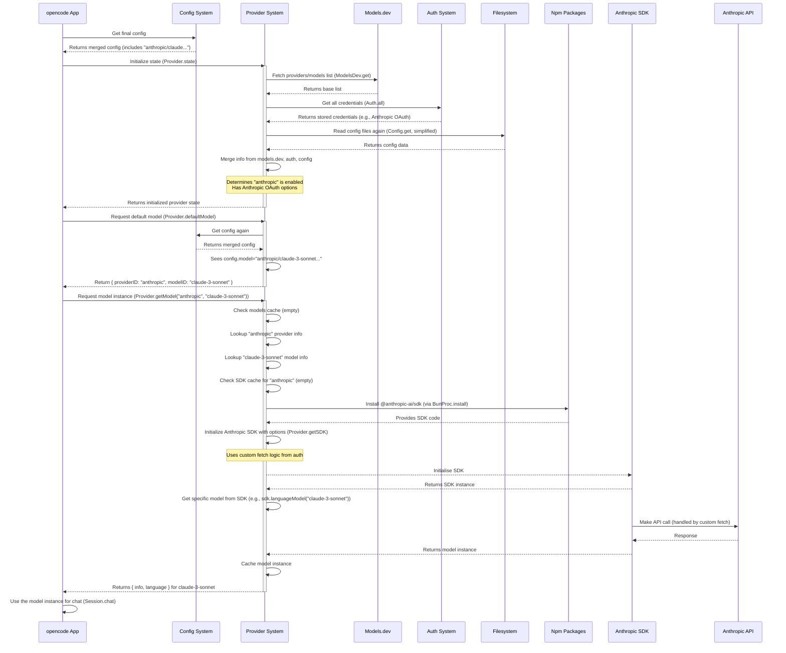

# Chapter 5: Provider

Welcome back to the `opencode` tutorial! In the previous chapters, we explored the [Chapter 1: TUI](01_tui__terminal_user_interface__.md) (the user interface), [Chapter 2: Message](02_message_.md) (the building blocks of conversation), [Chapter 3: Session](03_session_.md) (how conversations are organized), and [Chapter 4: Config](04_config_.md) (how to customize settings like the default model).

Now, let's connect the dots. [Chapter 4: Config](04_config_.md) allows you to *tell* `opencode` which AI model you want to use. But how does `opencode` actually *talk* to that model? How does it know how to send requests to OpenAI, or Anthropic, or any other service?

This is where the **Provider** concept comes in.

### What is a Provider?

Think of a **Provider** in `opencode` like a language translation service specifically for AI models. `opencode` has a standard way it likes to interact with AI models (sending messages, receiving responses, handling tool calls), but each AI service (like OpenAI, Anthropic, Google, etc.) has its own specific API (Application Programming Interface) – its own "language" for communication, often requiring specific ways to send requests, handle authentication, and interpret responses.

A **Provider** acts as the translator. It takes `opencode`'s standard request format and translates it into the specific format required by, say, the Anthropic API. It also translates the response from the Anthropic API back into `opencode`'s standard [Message](02_message_.md) format.

The **Provider** abstraction solves the problem of needing to write custom code for every single AI service `opencode` wants to support. Instead of `opencode`'s core logic talking directly to OpenAI, then directly to Anthropic, etc., it just talks to a `Provider`, and the `Provider` handles the details for its specific service.

Key responsibilities of a Provider:

*   Knowing how to communicate with a specific AI service's API (like the correct URLs, request formats).
*   Handling authentication requirements for that service (like using API keys or OAuth tokens).
*   Listing the different AI models available from that service.
*   Potentially handling service-specific configurations or options.

### Your Use Case: Using Different AI Models

You already know from [Chapter 4: Config](04_config_.md) that you can set your preferred model using the `model` setting in your `opencode.json`. For example:

```json
// opencode.json
{
  "model": "openai/gpt-4o"
}
```

or

```json
// opencode.json
{
  "model": "anthropic/claude-3-sonnet-20240229"
}
```

When you set this, you're telling `opencode`: "Hey, I want to use the `gpt-4o` model from the `openai` provider" or "...the `claude-3-sonnet-20240229` model from the `anthropic` provider".

The **Provider** system is the part of `opencode` that understands these names (`openai`, `anthropic`, `gpt-4o`, `claude-3-sonnet-20240229`) and knows how to connect to the correct service and select the specified model.

### How `opencode` Finds Providers and Models

`opencode` doesn't hardcode information about every possible AI model in the world. Instead, it gets information from a few sources:

1.  **models.dev:** `opencode` fetches a list of known providers and their models from `https://models.dev/api.json`. This provides a baseline of supported services, their model IDs, capabilities (like tool calling, attachments), and even cost estimates.
    *   This list is represented by the `ModelsDev.Provider` and `ModelsDev.Model` structures in the code.
2.  **Config:** Your `opencode.json` or global config file ([Chapter 4: Config](04_config_.md)) can override or add provider information. This is where you'd put API keys or specific options for a provider. It's also where you can explicitly disable providers.
3.  **Authentication:** `opencode`'s authentication system (`Auth` concept, partially seen in `auth.ts`) stores credentials (like API keys or OAuth tokens) for different providers. When the `Provider` system initializes, it checks these stored credentials to enable providers you've logged into via `opencode auth login`.
4.  **Custom Loaders:** For some providers that require more complex setup than just an API key (like Anthropic OAuth or GitHub Copilot), `opencode` has specific "custom loader" functions that handle the unique connection logic.

The `Provider` system combines information from all these sources to build a list of the *available* providers and models you can use in your current `opencode` environment.

You can list the providers opencode knows about using the `opencode auth list` command:

```bash
opencode auth list
```

This command uses the `Auth.all()` and `ModelsDev.get()` functions internally to show you which providers `opencode` has detected credentials for or knows about.

### Anatomy of Provider Information

The `ModelsDev.Provider` structure gives us a good idea of the information `opencode` keeps track of for each provider:

```typescript
// Simplified structure based on packages/opencode/src/provider/models.ts
export namespace ModelsDev {
  export const Provider = z.object({
    id: z.string(), // Unique ID (e.g., "openai", "anthropic")
    name: z.string(), // Human-readable name (e.g., "OpenAI", "Anthropic")
    api: z.string().optional(), // Base URL for the API (if applicable)
    npm: z.string().optional(), // The name of the npm package to use (e.g., "@ai-sdk/openai")
    env: z.array(z.string()), // Environment variables used for auth (e.g., ["OPENAI_API_KEY"])
    models: z.record(Model), // A list of models offered by this provider
  });
  export type Provider = z.infer<typeof Provider>;

  export const Model = z.object({
      id: z.string(), // Model ID (e.g., "gpt-4o", "claude-3-sonnet-20240229")
      name: z.string(), // Human-readable model name
      // ... other capabilities like attachment, tool_call, cost, limit ...
  });
  export type Model = z.infer<typeof Model>
}
```

This structure (`ModelsDev.Provider`) provides essential details: its unique `id`, a friendly `name`, how to find the code needed to talk to it (`npm` package name), how it might be authenticated (environment variables `env`), and the specific `models` it offers.

### How Providers Work (Internal Implementation)

When `opencode` starts, or when a command like `run` or `auth` needs to interact with providers, the `Provider.state` function is called to initialize the provider system. This function performs the loading and merging logic described above.

```typescript
// Simplified snippet from packages/opencode/src/provider/provider.ts
export namespace Provider {
  const state = App.state("provider", async () => {
    const config = await Config.get() // Get the merged configuration
    const database = await ModelsDev.get() // Get baseline info from models.dev

    const providers: {
      [providerID: string]: {
        // ... info about provider source, options, etc. ...
        info: ModelsDev.Provider // Store the provider's base info
        getModel?: (sdk: any, modelID: string) => Promise<any> // Custom logic for getting models
        options: Record<string, any> // Options passed to the SDK
      }
    } = {}
    const models = new Map<
      string,
      { info: ModelsDev.Model; language: LanguageModel } // Cache loaded models
    >()
    const sdk = new Map<string, SDK>() // Cache initialized SDK clients

    // 1. Check environment variables (e.g., OPENAI_API_KEY)
    //    If keys are found, add basic provider info to 'providers' map.
    // 2. Check stored API keys (`Auth.all()`)
    //    If API keys are found, add provider info with apiKey option to 'providers' map.
    // 3. Run custom loaders (e.g., for Anthropic OAuth, GitHub Copilot)
    //    If custom auth succeeds, add provider info with custom fetch/getModel logic.
    // 4. Merge config overrides (`config.provider`)
    //    Merge options from opencode.json into the provider info.

    // ... filtering out disabled providers ...

    return {
      models, // The cache of loaded model instances
      providers, // Info about available providers and their options
      sdk, // The cache of initialized SDK clients
    }
  })

  // Function to get the details and instance of a specific model
  export async function getModel(providerID: string, modelID: string) {
    const key = `${providerID}/${modelID}`
    const s = await state() // Get the initialized provider state

    if (s.models.has(key)) {
      return s.models.get(key)! // Return from cache if already loaded
    }

    const provider = s.providers[providerID] // Find the provider info
    if (!provider) throw new ModelNotFoundError({ providerID, modelID }) // Not found/enabled

    const info = provider.info.models[modelID] // Find the model info
    if (!info) throw new ModelNotFoundError({ providerID, modelID }) // Model not found

    const sdk = await getSDK(provider.info) // Get the SDK instance for this provider

    // Use the SDK to get the language model instance
    const language = provider.getModel
      ? await provider.getModel(sdk, modelID) // Use custom logic if defined
      : sdk.languageModel(modelID) // Otherwise, use standard SDK method

    s.models.set(key, { info, language }) // Cache the loaded model

    return {
      info,
      language,
    }
  }

  // Helper function to get or initialize the SDK client for a provider
  async function getSDK(provider: ModelsDev.Provider) {
    const s = await state() // Get the initialized provider state
    const existing = s.sdk.get(provider.id)
    if (existing) return existing // Return from cache if already initialized

    const pkg = provider.npm ?? provider.id // Determine npm package name
    // Use BunProc.install to ensure package is available and import it
    const mod = await import(await BunProc.install(pkg, "latest"))

    // Find the SDK initialization function (like createOpenAI, createAnthropic)
    const fn = mod[Object.keys(mod).find((key) => key.startsWith("create"))!]

    // Call the initializer with collected options
    const loaded = fn(s.providers[provider.id]?.options)

    s.sdk.set(provider.id, loaded) // Cache the SDK instance
    return loaded as SDK
  }

  // ... other functions like list(), defaultModel(), parseModel(), tools() ...
}
```

Let's trace the process when `opencode` needs a specific model, for instance, when you run `opencode run "hello"` after setting `"model": "anthropic/claude-3-sonnet-20240229"` in your config:



This sequence diagram shows how the `Provider` system:
1.  Loads information from multiple sources during initialization.
2.  Provides the default model ID/Provider ID based on configuration.
3.  When a model instance is actually needed, it finds the corresponding provider, ensures the necessary code (npm package) is available, initializes the provider's SDK with the correct options (including authentication details), retrieves the specific model instance from the SDK, caches it, and returns it.

The `getSDK` function is crucial here, abstracting away the detail of getting the right npm package and initializing the client correctly with the options gathered from Config and Auth. The `getModel` function then uses that SDK client to get the specific model instance requested.

The `defaultModel()` function simply looks at the configured `cfg.model` or picks a default from the enabled providers if none is specified:

```typescript
// Simplified snippet from packages/opencode/src/provider/provider.ts
export namespace Provider {
  // ... state, getModel, getSDK ...

  export async function defaultModel() {
    const cfg = await Config.get() // Get the merged configuration
    if (cfg.model) return parseModel(cfg.model) // If model is set in config, use it

    // Otherwise, find an enabled provider and pick a default model from it
    const providers = await list() // Get list of enabled providers
    const provider = Object.values(providers).find(
      // Find a suitable provider (skipping those explicitly configured but maybe not usable yet)
      (p) =>
        !cfg.provider || Object.keys(cfg.provider).includes(p.info.id),
    )

    if (!provider) throw new Error("no providers found") // No providers available

    // Sort models by a predefined priority list to pick a good default
    const [model] = sort(Object.values(provider.info.models))
    if (!model) throw new Error("no models found") // Provider has no models

    return {
      providerID: provider.info.id,
      modelID: model.id,
    }
  }

  // Helper to parse "providerID/modelID" string
  export function parseModel(model: string) {
    const [providerID, ...rest] = model.split("/")
    return {
      providerID: providerID,
      modelID: rest.join("/"),
    }
  }

  // ... other functions ...
}
```

This shows how `Provider.defaultModel()` uses the `Config` to decide which model string (`providerID/modelID`) to aim for, or falls back to selecting a default from the available `Providers`.

### Conclusion

The Provider abstraction is essential for `opencode`'s flexibility. It allows `opencode` to interact with various AI model services (like OpenAI, Anthropic, Google) through a single, consistent interface. By acting as a translator and handling API specifics, authentication, and model listing, the `Provider` system enables you to easily switch between different AI models using the [Chapter 4: Config](04_config_.md) settings. `opencode` finds and manages these providers by combining information from `models.dev`, your configuration, and your authentication credentials.

Now that we understand how `opencode` talks to the AI models themselves, let's explore how the AI models can interact with the world outside of the conversation – by using external tools.

Let's move on to the concept of a Tool.

[Chapter 6: Tool](06_tool_.md)

---

<sub><sup>Generated by [AI Codebase Knowledge Builder](https://github.com/The-Pocket/Tutorial-Codebase-Knowledge).</sup></sub> <sub><sup>**References**: [[1]](https://github.com/sst/opencode/blob/100d6212be5b1475692116397aa9bef05da79cbf/packages/opencode/src/cli/cmd/auth.ts), [[2]](https://github.com/sst/opencode/blob/100d6212be5b1475692116397aa9bef05da79cbf/packages/opencode/src/cli/cmd/run.ts), [[3]](https://github.com/sst/opencode/blob/100d6212be5b1475692116397aa9bef05da79cbf/packages/opencode/src/index.ts), [[4]](https://github.com/sst/opencode/blob/100d6212be5b1475692116397aa9bef05da79cbf/packages/opencode/src/provider/models.ts), [[5]](https://github.com/sst/opencode/blob/100d6212be5b1475692116397aa9bef05da79cbf/packages/opencode/src/provider/provider.ts), [[6]](https://github.com/sst/opencode/blob/100d6212be5b1475692116397aa9bef05da79cbf/packages/opencode/src/provider/transform.ts), [[7]](https://github.com/sst/opencode/blob/100d6212be5b1475692116397aa9bef05da79cbf/packages/opencode/src/session/index.ts)</sup></sub>
````