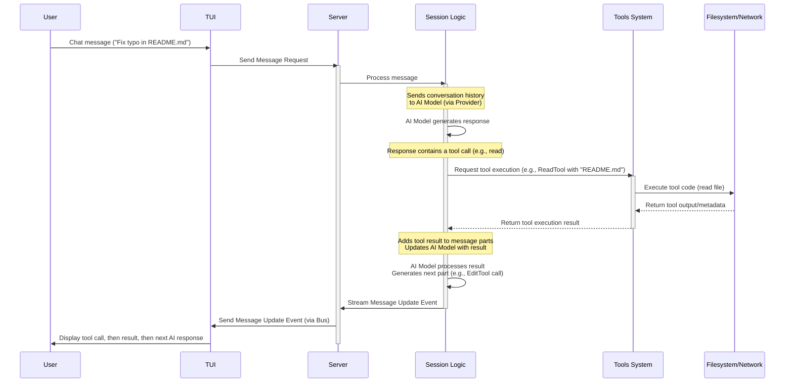

# Chapter 6: Tool

Welcome back to the `opencode` tutorial! In our last chapter, [Chapter 5: Provider](05_provider_.md), we learned how `opencode` connects to different AI models and services, acting as a translator between `opencode`'s internal structure and the specific APIs of services like OpenAI or Anthropic. You saw how `Config` and `Provider` work together to let you choose *which* AI brain you want to use.

But AI models, even the most powerful ones, live in a kind of vacuum. They can generate text based on their training data, but they can't inherently *do* things in the real world, like read a file on your computer or run a command in your terminal.

This is where the concept of a **Tool** comes in.

### What is a Tool?

Imagine you're working with a very smart assistant who can understand complicated instructions, but they're stuck in a room without hands or eyes. You could tell them, "Summarize the contents of the file `report.txt`," but they couldn't actually *read* the file. You'd have to read it to them.

**Tools** are the "hands and eyes" you give to the AI assistant in `opencode`. They are specific, well-defined actions or capabilities that the AI can choose to use to interact with your computer's environment or access external information.

Instead of just talking *about* code, the AI can use a:

*   **Read** tool to look at the actual content of a file.
*   **Edit** tool to modify a file.
*   **Bash** tool to run a terminal command and see its output.
*   **List** tool to see what files are in a directory.
*   **Grep** tool to search for patterns inside files.
*   **WebFetch** tool to get content from a URL.

By equipping the AI with Tools, `opencode` allows it to perform tasks that go far beyond simply generating text. The AI can observe the state of your project (read files, list directories), take action (edit files, run commands), and incorporate the results of those actions back into the conversation.

### Your Use Case: Asking the AI to Read and Edit a File

Let's consider a common scenario: you want the AI to help you modify a specific file in your project.

1.  You might ask, "Can you fix the typo in the `README.md` file?"
2.  The AI needs to *see* the file content first to find the typo. It realizes it needs a Tool for this.
3.  The AI decides to use the **Read** tool, specifying `README.md` as the file path parameter.
4.  `opencode` runs the **Read** tool.
5.  The **Read** tool reads the file and returns its content as output.
6.  `opencode` gives this output back to the AI.
7.  Now that the AI has the file content, it can analyze it, identify the typo, and figure out how to fix it.
8.  The AI then decides it needs to *change* the file. It realizes it needs another Tool.
9.  The AI decides to use the **Edit** tool, specifying the file path (`README.md`), the old string (the text with the typo), and the new string (the corrected text).
10. `opencode` runs the **Edit** tool.
11. The **Edit** tool modifies the file on your filesystem and returns the result (e.g., success, error, diff).
12. `opencode` gives the result back to the AI.
13. The AI sees the successful edit and might confirm to you that it fixed the typo, potentially showing the change (diff) or asking if you want it to check for new errors (using an LSP tool, for instance).

This flow demonstrates how Tools enable a multi-step interaction where the AI uses its understanding (from the model) and its ability to act (via tools) to achieve a goal.

### Anatomy of a Tool

In `opencode`, a Tool is defined with a clear structure so that both `opencode` and the AI model know how to use it. It's represented by the `Tool.Info` type (defined in `packages/opencode/src/tool/tool.ts`).

```typescript
// Simplified structure based on packages/opencode/src/tool/tool.ts
export namespace Tool {
  export interface Info<Parameters = any, Metadata = any> {
    id: string; // A unique identifier (e.g., "read", "edit", "bash")
    description: string; // Explains to the AI what the tool does
    parameters: any; // Defines the inputs the tool needs (like file path, content)
    execute(
      args: any, // The inputs provided by the AI based on 'parameters'
      ctx: any, // Contextual info (session ID, message ID, abort signal)
    ): Promise<{
      metadata: Metadata; // Extra info about the execution (e.g., diff, file stats)
      output: string; // The result the AI sees (e.g., file content, command output)
    }>;
  }

  // Helper function to define a tool
  export function define<Parameters, Result>(
    input: Info<Parameters, Result>
  ): Info<Parameters, Result> {
    return input;
  }
}
```

Let's look at the key parts using the `ReadTool` definition as an example:

```typescript
// Simplified snippet from packages/opencode/src/tool/read.ts
import { z } from "zod"
import { Tool } from "./tool"
import DESCRIPTION from "./read.txt" // Description text

export const ReadTool = Tool.define({
  id: "read", // Unique ID
  description: DESCRIPTION, // Human/AI readable description
  parameters: z.object({ // What inputs does it need? Defined using Zod
    filePath: z.string().describe("The path to the file to read"),
    offset: z.number().optional().describe("Line number to start reading"),
    limit: z.number().optional().describe("Number of lines to read"),
  }),
  async execute(params, ctx) { // The function that does the work
    // ... logic to read the file content based on params.filePath, offset, limit ...
    // ... handle file not found, size limits, errors ...
    const fileContent = "... content of the file ..." // Simplified
    const metadata = { title: "README.md", preview: "..." } // Simplified metadata

    return {
      metadata: metadata,
      output: `<file>\n${fileContent}\n</file>`, // Output formatted for AI
    }
  },
})
```

*   `id`: `"read"` - This is how the AI refers to the tool.
*   `description`: `DESCRIPTION` - A multi-line string (often loaded from a `.txt` file like `read.txt`) explaining what the tool does. AI models use this to understand *when* to use the tool.
*   `parameters`: `z.object({...})` - This uses the `zod` library to define the expected structure of the arguments the AI should provide when calling this tool. For `read`, it expects a `filePath` (string) and optionally `offset` and `limit` (numbers). AI models that support function calling or tool use understand how to format their response to match this schema.
*   `execute`: This is the actual code (a Go function in the server, exposed via API) that runs when the tool is called. It takes the arguments provided by the AI (`params`) and a `ctx` object (containing `sessionID`, `messageID`, and an `abort` signal to stop the execution). It performs the task (reading the file) and returns an object containing `metadata` (structured data about the result, like the file path) and `output` (a string representation of the result, often formatted with XML-like tags like `<file>...</file>` to help the AI parse it).

### How Tools Work (Internal Implementation)

Tools are not just abstract concepts; they are executable code. When the AI decides to use a tool, here's a simplified look at what happens:



This diagram shows that the AI model's decision to call a tool triggers a specific execution path within the `opencode` Server's `Session` logic. The `Session` logic acts as the orchestrator, taking the AI's requested tool call, passing it to the `Tools System` for execution, and then feeding the output back to the AI model so it can continue the conversation, often by deciding to use another tool or generating a final text response.

Let's dive a bit into the code references provided:

**1. Where are Tools Defined?**

Individual tools are defined in files like `packages/opencode/src/tool/read.ts`, `bash.ts`, `edit.ts`, etc., using the `Tool.define` helper we saw earlier.

**2. How Does `opencode` Know Which Tools are Available?**

The list of tools available to the AI depends on the selected [Chapter 5: Provider](05_provider_.md) and potentially connected [Chapter 8: Server](08_server_.md)s (via MCP - MCP stands for "Multi-Capability Provider").

The `Provider.tools()` function (`packages/opencode/src/provider/provider.ts`) returns the list of tools that are compatible with a specific AI provider.

```typescript
// Simplified snippet from packages/opencode/src/provider/provider.ts
export namespace Provider {
  // ... other functions ...

  // Array of built-in tools
  const TOOLS = [
    BashTool,
    EditTool,
    WebFetchTool,
    GlobTool,
    GrepTool,
    ListTool,
    ReadTool,
    WriteTool,
    // ... other tools ...
  ]

  // Mapping of providers to lists of tools
  const TOOL_MAPPING: Record<string, Tool.Info[]> = {
    anthropic: TOOLS.filter((t) => t.id !== "patch"), // Example: Anthropic might not get 'patch' tool
    openai: TOOLS.map((t) => ({ // Example: OpenAI might need slightly adjusted parameters (optional -> nullable)
      ...t,
      parameters: optionalToNullable(t.parameters),
    })),
    azure: TOOLS.map((t) => ({ // Azure often uses OpenAI's API format
      ...t,
      parameters: optionalToNullable(t.parameters),
    })),
    google: TOOLS, // Google might use the standard set
  }

  export async function tools(providerID: string) {
    // Return the list of tools for the given providerID, falling back to the default set
    return TOOL_MAPPING[providerID] ?? TOOLS
  }

  // ... helper functions like optionalToNullable ...
}
```

This code shows that `opencode` maintains a list of its built-in `TOOLS` and a `TOOL_MAPPING` that specifies which subset (or slightly modified version) of tools is available for each specific `providerID` (like `"anthropic"`, `"openai"`, `"google"`). When the `Session` starts a chat with a specific provider, it calls `Provider.tools(providerID)` to get the relevant list of tools to potentially offer to the AI model.

Additionally, tools can come from external sources via the MCP system ([Chapter 8: Server](08_server_.md)). The `MCP.tools()` function (`packages/opencode/src/mcp/index.ts`) aggregates tools provided by connected MCP servers.

```typescript
// Simplified snippet from packages/opencode/src/mcp/index.ts
export namespace MCP {
  // ... state and client connection logic ...

  export async function tools() {
    const result: Record<string, Tool> = {}
    // Iterate over connected MCP clients
    for (const [clientName, client] of Object.entries(await clients())) {
      // Ask each client for its list of tools
      for (const [toolName, tool] of Object.entries(await client.tools())) {
        // Prefix tool names to avoid conflicts
        result[clientName + "_" + toolName] = tool
      }
    }
    return result // Return combined list of tools from all MCPs
  }
}
```
This shows that `MCP.tools()` collects tools from potentially multiple external sources (like a tool server running on your local machine or a remote one) and makes them available. These are then added to the list of tools the AI can potentially use during a session.

**3. How are Tools Executed During a Session?**

The core logic for handling tool calls and execution resides within the `Session.chat` function (`packages/opencode/src/session/index.ts`). This is where `opencode` manages the interaction with the AI model, including detecting tool calls in the AI's response and running the corresponding tool code.

```typescript
// Simplified snippet from packages/opencode/src/session/index.ts
export namespace Session {
  // ... session state, create, get, messages, updateMessage, etc. ...

  export async function chat(input: {
    sessionID: string
    providerID: string
    modelID: string
    parts: Message.Part[] // User input parts
    // ... other inputs ...
    tools?: Tool.Info[] // Tools available for this chat (passed from Provider.tools)
  }) {
    // ... logic to prepare messages history and system prompt ...
    const model = await Provider.getModel(input.providerID, input.modelID)

    // ... create user message ...
    // ... create assistant message placeholder (next) ...

    // Combine built-in tools (from Provider) and MCP tools
    const availableTools: Record<string, AITool> = {} // Using ai-sdk's Tool type
    // Add tools from Provider.tools(input.providerID)
    for (const item of await Provider.tools(input.providerID)) {
      availableTools[item.id.replaceAll(".", "_")] = tool({
        id: item.id as any,
        description: item.description,
        parameters: item.parameters as ZodSchema,
        async execute(args, opts) {
          // This execute function WRAPS the tool's actual execute function
          // It handles running the tool and updating the assistant message metadata
          try {
            const result = await item.execute(args, { // CALL THE TOOL'S execute function
              sessionID: input.sessionID,
              abort: abort.signal,
              messageID: next.id,
              metadata: async (val) => {
                 // Update message metadata as tool runs
                 next.metadata!.tool![opts.toolCallId] = { ...val, time: { start: 0, end: 0 } }
                 await updateMessage(next)
              },
            })
            // Update message metadata with final result and time
            next.metadata!.tool![opts.toolCallId] = { ...result.metadata, time: { start: 0, end: Date.now() } } // Simplified time
            await updateMessage(next)
            return result.output // Return the tool's output string
          } catch (e: any) {
            // Handle errors and update message metadata
            next.metadata!.tool![opts.toolCallId] = { error: true, message: e.toString(), title: "Tool Error", time: { start: 0, end: Date.now() } } // Simplified time
            await updateMessage(next)
            return e.toString() // Return error message as output
          }
        },
      })
    }
    // Add tools from MCP.tools() (similar wrapping logic)
    for (const [key, item] of Object.entries(await MCP.tools())) {
      // ... add MCP tool to availableTools with wrapping execute function ...
    }


    // Stream response from the AI model, passing available tools
    const result = streamText({
      // ... stream setup ...
      tools: model.info.tool_call === false ? undefined : availableTools, // Pass tools to the model
      model: model.language,
      // ... other parameters ...
    })

    // Process streaming parts from the AI
    for await (const value of result.fullStream) {
      switch (value.type) {
        // ... handle text-delta ...
        case "tool-call-streaming-start": // AI starts generating a tool call
            // Add partial tool-invocation part to the message
            next.parts.push({
              type: "tool-invocation",
              toolInvocation: { state: "partial-call", toolName: value.toolName, toolCallId: value.toolCallId, args: {} },
            })
            Bus.publish(Message.Event.PartUpdated, { part: next.parts.at(-1), messageID: next.id, sessionID: next.metadata.sessionID }) // Notify TUI
            break
        case "tool-call": // AI completes a tool call with arguments
            // Update the tool-invocation part with full arguments
            const match = next.parts.find((p) => p.type === "tool-invocation" && p.toolInvocation.toolCallId === value.toolCallId)
            if (match && match.type === "tool-invocation") {
              match.toolInvocation.args = value.args // Capture args
              match.toolInvocation.state = "call" // State is now 'call'
              Bus.publish(Message.Event.PartUpdated, { part: match, messageID: next.id, sessionID: next.metadata.sessionID }) // Notify TUI
            }
            // ** The AI SDK handles executing the tool after this part **
            break
        // @ts-expect-error - ai-sdk claims it doesn't send this, but it does for some providers
        case "tool-result": // AI SDK returns tool execution result
             // Update the tool-invocation part with the result
             const resultMatch = next.parts.find((p) => p.type === "tool-invocation" && p.toolInvocation.toolCallId === value.toolCallId)
             if (resultMatch && resultMatch.type === "tool-invocation") {
               resultMatch.toolInvocation.state = "result" // State is now 'result'
               resultMatch.toolInvocation.result = value.result as string // Capture the output string
               Bus.publish(Message.Event.PartUpdated, { part: resultMatch, messageID: next.id, sessionID: next.metadata.sessionID }) // Notify TUI
             }
             break
        // ... handle other part types (like step-start) ...
      }
      await updateMessage(next) // Save and publish message updates
    }
    // ... handle end of stream ...
  }

  // ... other functions ...
}
```

This simplified snippet from `Session.chat` shows:
1.  It gets the list of available tools (both built-in via `Provider.tools` and external via `MCP.tools`).
2.  It prepares these tools to be passed to the AI model's `streamText` function. Each tool's `execute` function is wrapped so `opencode` can add metadata and handle errors before returning the simple output string to the AI model.
3.  As the AI model streams its response, `opencode` listens for `tool-call-streaming-start` and `tool-call` parts. When it sees a completed `tool-call` part (or implicitly, when the AI SDK decides to call the tool function provided in the `tools` parameter), the wrapped `execute` function for that tool is invoked.
4.  When the wrapped `execute` function finishes, its returned `output` string is given back to the AI model as a `tool-result`.
5.  The stream continues, and the AI model might process the `tool-result` and generate more text or another tool call.
6.  `opencode` continually updates the assistant [Message](02_message_.md) with the new parts and publishes `Message.Event.PartUpdated` events on the [Bus](09_bus__event_bus__.md) so the [TUI](01_tui__terminal_user_interface__.md) can display the progress in real-time (showing "Calling tool...", then the output).

This complex interaction is abstracted away, allowing you to interact with the AI naturally, asking it to perform actions without needing to manually execute commands or read files for it.

### Conclusion

Tools are the capabilities that transform the AI assistant from a conversational partner into an active participant in your workflow. They allow the AI to interact with your file system, run commands, and access external information by executing specific, predefined functions like `ReadTool`, `EditTool`, or `BashTool`. `opencode` manages these tools, presents the relevant ones to the AI model (based on the selected [Provider](05_provider_.md) and connected [Server](08_server_.md)s), orchestrates their execution when the AI requests them, and feeds the results back to the AI model to continue the task.

With an understanding of how `opencode` uses Tools to interact with the environment, you might wonder where all the information generated during a session – the conversation history, tool outputs, session details – is actually kept persistent.

Let's dive into the concept of Storage.

[Chapter 7: Storage](07_storage_.md)

---

<sub><sup>Generated by [AI Codebase Knowledge Builder](https://github.com/The-Pocket/Tutorial-Codebase-Knowledge).</sup></sub> <sub><sup>**References**: [[1]](https://github.com/sst/opencode/blob/100d6212be5b1475692116397aa9bef05da79cbf/packages/opencode/src/mcp/index.ts), [[2]](https://github.com/sst/opencode/blob/100d6212be5b1475692116397aa9bef05da79cbf/packages/opencode/src/provider/provider.ts), [[3]](https://github.com/sst/opencode/blob/100d6212be5b1475692116397aa9bef05da79cbf/packages/opencode/src/session/index.ts), [[4]](https://github.com/sst/opencode/blob/100d6212be5b1475692116397aa9bef05da79cbf/packages/opencode/src/tool/bash.ts), [[5]](https://github.com/sst/opencode/blob/100d6212be5b1475692116397aa9bef05da79cbf/packages/opencode/src/tool/edit.ts), [[6]](https://github.com/sst/opencode/blob/100d6212be5b1475692116397aa9bef05da79cbf/packages/opencode/src/tool/glob.ts), [[7]](https://github.com/sst/opencode/blob/100d6212be5b1475692116397aa9bef05da79cbf/packages/opencode/src/tool/grep.ts), [[8]](https://github.com/sst/opencode/blob/100d6212be5b1475692116397aa9bef05da79cbf/packages/opencode/src/tool/ls.ts), [[9]](https://github.com/sst/opencode/blob/100d6212be5b1475692116397aa9bef05da79cbf/packages/opencode/src/tool/read.ts), [[10]](https://github.com/sst/opencode/blob/100d6212be5b1475692116397aa9bef05da79cbf/packages/opencode/src/tool/tool.ts), [[11]](https://github.com/sst/opencode/blob/100d6212be5b1475692116397aa9bef05da79cbf/packages/opencode/src/tool/write.ts)</sup></sub>
````