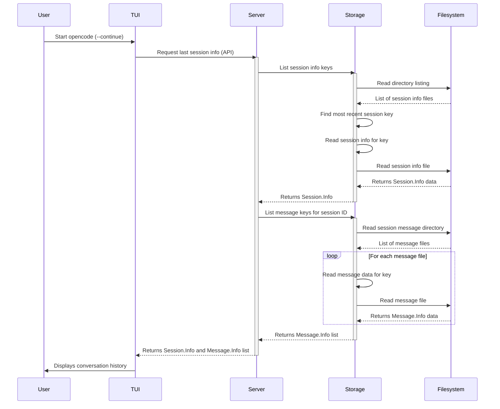

# Chapter 7: Storage

Welcome back to the `opencode` tutorial! So far, we've explored the user interface with [Chapter 1: TUI](01_tui__terminal_user_interface__.md), the building blocks of conversation in [Chapter 2: Message](02_message_.md), how conversations are grouped into [Chapter 3: Session](03_session_.md)s, how to configure `opencode` with [Chapter 4: Config](04_config_.md), how it talks to AI models via [Chapter 5: Provider](05_provider_.md)s, and how the AI can interact with your environment using [Chapter 6: Tool](06_tool_.md)s.

You've seen how you can start a new session or continue an old one. You've seen messages appear in the TUI, including the output from tools. But where does all this information *go* when you close `opencode`? How does it remember your previous conversations?

This is the job of **Storage**.

### What is Storage?

Think of **Storage** as `opencode`'s long-term memory or its persistent notebook. It's the part of the application responsible for saving important data to your computer's file system. This data includes:

*   The details of your [Sessions](03_session_.md) (like their IDs, titles, and when they were created).
*   All the [Messages](02_message_.md) within each session (your input, the AI's responses, tool calls, tool results).
*   Other application-specific data that needs to survive between `opencode` runs.

Without Storage, every time you opened `opencode`, it would be like the first time – it wouldn't remember any past conversations. Storage is crucial for picking up where you left off and having a continuous conversation history.

### Your Use Case: Remembering Past Sessions

Imagine you had a helpful conversation with `opencode` yesterday about debugging a tricky piece of code. You closed your terminal, went home, came back today, and opened `opencode` again. How does `opencode` know about that session and let you continue it?



This is the fundamental use case Storage enables. When you start `opencode` with `--continue`, the [Server](08_server_.md) uses Storage to:

1.  Find the location where session data is stored.
2.  List the available session information files.
3.  Determine which session is the most recent.
4.  Read the details ([Session.Info](03_session_.md)) of that session.
5.  Read all the [Message.Info](02_message_.md) files associated with that session ID.
6.  Load this data into memory.
7.  Send it to the [TUI](01_tui__terminal_user_interface__.md) to be displayed.

This allows you to seamlessly pick up exactly where you left off.

### Where Does Data Live?

`opencode` saves its data in a specific directory on your system. This is part of the application's data directory, which varies depending on your operating system (e.g., `~/.config/opencode/data` on Linux/macOS, or `AppData\Roaming\opencode\data` on Windows).

Inside this data directory, `opencode` creates a `storage` subdirectory. All the persistent data is saved here, organized further into subdirectories based on the type of data.

For example, session data is organized like this:

*   `.../opencode/data/storage/session/info/<session_id>.json` (Stores the main [Session.Info](03_session_.md) object)
*   `.../opencode/data/storage/session/message/<session_id>/<message_id>.json` (Stores each individual [Message.Info](02_message_.md) object)

This file-based structure is simple, transparent, and allows `opencode` to manage potentially large amounts of conversation history without relying on an external database.

### Anatomy of Storage Operations

The Storage system provides a simple set of operations to interact with this file structure. These operations work using a concept called a "key". A key is a logical path or name that identifies a piece of data, like `"session/info/ses_abcdefg"` or `"session/message/ses_abc/msg_123"`. Storage translates these keys into the actual file paths on disk.

The core functions provided by the `Storage` namespace (`packages/opencode/src/storage/storage.ts`) are:

| Function     | Description                                                                 |
| :----------- | :-------------------------------------------------------------------------- |
| `writeJSON`  | Saves a JavaScript/TypeScript object as a JSON file to a given key.         |
| `readJSON`   | Reads a JSON file from a given key and parses it back into an object.       |
| `list`       | Lists keys within a given directory prefix (returns an asynchronous iterator).|
| `remove`     | Deletes the file associated with a given key.                               |

These four functions are the primary way other parts of `opencode` interact with the persistent file storage.

### How Storage Works (Internal Implementation)

The `Storage` system is built on top of standard filesystem operations available in Node.js or Bun. It manages the base directory, translates keys to file paths, and handles the reading and writing of JSON data.

**1. Initialization:**

When `opencode` starts, the `Storage.state` function is called to determine the base directory where storage files will be kept. This directory path is stored in the application state.

```typescript
// Simplified snippet from packages/opencode/src/storage/storage.ts
export namespace Storage {
  // ... logging and event definitions ...

  const state = App.state("storage", () => {
    const app = App.info() // Get application info (including data path)
    const dir = path.join(app.path.data, "storage") // Construct the storage directory path
    log.info("init", { path: dir })
    return {
      dir, // Store the directory path
    }
  })

  // ... other functions ...
}
```

This simply uses `path.join` to combine the application's data path with the string `"storage"`.

**2. Writing Data (`writeJSON`):**

When `writeJSON(key, content)` is called, Storage constructs the full file path, serializes the `content` object into a JSON string, and saves it to the file. A temporary file is used and then renamed to prevent data corruption if the process is interrupted during writing.

```typescript
// Simplified snippet from packages/opencode/src/storage/storage.ts
export namespace Storage {
  // ... state, remove, readJSON ...

  export async function writeJSON<T>(key: string, content: T) {
    const target = path.join(state().dir, key + ".json") // Construct full path with .json extension
    const tmp = target + Date.now() + ".tmp" // Create temporary file name
    await Bun.write(tmp, JSON.stringify(content)) // Write JSON to temp file
    await fs.rename(tmp, target).catch(() => {}) // Rename temp file to target file (atomic on most filesystems)
    await fs.unlink(tmp).catch(() => {}) // Clean up temp file if rename didn't remove it
    Bus.publish(Event.Write, { key, content }) // Publish event to the Bus
  }

  // ... list function ...
}
```

Notice the `Bus.publish` call at the end. This is important! Whenever data is written to Storage, it publishes a `storage.write` event on the [Bus](09_bus__event_bus__.md). Other parts of the application, like the [Share](03_session_.md) feature, can subscribe to this event to know when data has changed and needs to be synced or updated elsewhere.

**3. Reading Data (`readJSON`):**

`readJSON(key)` reverses the process. It constructs the file path, reads the file content, and parses the JSON string back into a JavaScript/TypeScript object.

```typescript
// Simplified snippet from packages/opencode/src/storage/storage.ts
export namespace Storage {
  // ... state, remove ...

  export async function readJSON<T>(key: string) {
    const filePath = path.join(state().dir, key + ".json"); // Construct full path
    // Use Bun's file reader to read and parse JSON
    return Bun.file(filePath).json() as Promise<T>;
  }

  // ... writeJSON, list functions ...
}
```

This is straightforward – it builds the path and uses Bun's built-in function to read and parse the JSON.

**4. Listing Data (`list`):**

`list(prefix)` allows you to get a list of keys (representing files) within a specific subdirectory. This is used, for instance, by [Session.list()](03_session_.md) to find all session info files.

```typescript
// Simplified snippet from packages/opencode/src/storage/storage.ts
export namespace Storage {
  // ... state, remove, readJSON, writeJSON ...

  const glob = new Bun.Glob("**/*") // Define a glob pattern to match files

  export async function* list(prefix: string) {
    try {
      // Scan the directory corresponding to the prefix
      for await (const item of glob.scan({
        cwd: path.join(state().dir, prefix), // Set the current working directory for the scan
        onlyFiles: true, // Only list files, not directories
      })) {
        // item is the relative path within the cwd, e.g., "ses_abc.json" or "ses_123/msg_456.json"
        // Remove the ".json" extension and prepend the original prefix to get the key
        const result = path.join(prefix, item.slice(0, -5))
        yield result // Yield the generated key
      }
    } catch {
      // If the directory doesn't exist, the scan might throw; just return nothing
      return
    }
  }
}
```

This uses `Bun.Glob` to scan the file system starting from the directory specified by the `prefix`. For each file found, it removes the `.json` extension and combines it with the original `prefix` to recreate the logical "key" (`"session/info/ses_abc"` or `"session/message/ses_abc/msg_456"`) and yields it.

**5. Removing Data (`remove`):**

`remove(key)` simply deletes the file associated with the given key.

```typescript
// Simplified snippet from packages/opencode/src/storage/storage.ts
export namespace Storage {
  // ... state ...

  export async function remove(key: string) {
    const target = path.join(state().dir, key + ".json") // Construct full path
    await fs.unlink(target).catch(() => {}) // Delete the file, ignore error if it doesn't exist
  }

  // ... readJSON, writeJSON, list ...
}
```
This uses `fs.unlink` (standard filesystem delete) and ignores errors, which is useful if you try to remove a key that doesn't exist.

### Conclusion

Storage is `opencode`'s simple yet essential system for remembering data. It saves information like [Session](03_session_.md) details and [Message](02_message_.md) history as JSON files organized in a structured directory within your application's data folder. By providing basic `readJSON`, `writeJSON`, `list`, and `remove` operations based on logical keys, Storage allows other parts of `opencode` to easily save and load the data needed to provide a persistent and continuous experience, even across application restarts. Storage also plays a role in features like session sharing by publishing events when data is written.

With a solid understanding of how `opencode` remembers your conversations using Storage, it's time to look at the core component that orchestrates all the pieces we've discussed so far: the Server.

[Chapter 8: Server](08_server_.md)

---

<sub><sup>Generated by [AI Codebase Knowledge Builder](https://github.com/The-Pocket/Tutorial-Codebase-Knowledge).</sup></sub> <sub><sup>**References**: [[1]](https://github.com/sst/opencode/blob/100d6212be5b1475692116397aa9bef05da79cbf/packages/opencode/src/auth/index.ts), [[2]](https://github.com/sst/opencode/blob/100d6212be5b1475692116397aa9bef05da79cbf/packages/opencode/src/session/index.ts), [[3]](https://github.com/sst/opencode/blob/100d6212be5b1475692116397aa9bef05da79cbf/packages/opencode/src/share/share.ts), [[4]](https://github.com/sst/opencode/blob/100d6212be5b1475692116397aa9bef05da79cbf/packages/opencode/src/storage/storage.ts)</sup></sub>
````