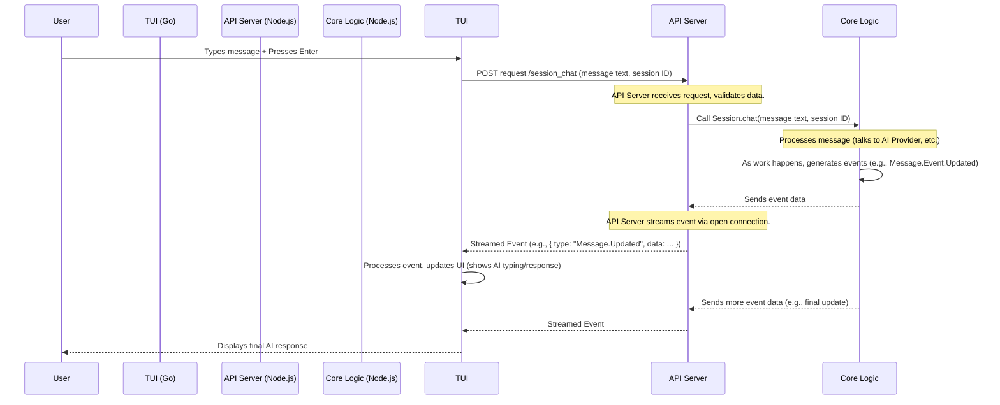

# Chapter 8.2: API Server

Welcome back to the OpenCode tutorial! In the previous chapters, we've introduced the core components of OpenCode:
*   The [User Interface (TUI)](01_user_interface__tui__.md) for interacting with the application.
*   The [AI Session](02_ai_session_.md) for managing your conversation history and context.
*   The [AI Providers](03_ai_providers_.md) for connecting to external AI models.
*   And [Tools](04_tools_.md) which allow the AI to interact with your environment.

All these pieces are like different specialized departments within the OpenCode application. But how do they talk to each other? For example, how does the TUI, which might be one program running in your terminal, tell the core OpenCode logic, which is another program running in the background, "Hey, the user just typed a message!" or "Show me the list of available sessions!"? And how does the core logic send updates back to the TUI, like "The AI just generated a new piece of text!"?

This is where the **API Server** comes in.

## What is an API Server?

Imagine OpenCode's core logic as a busy kitchen that prepares delicious AI responses and performs tasks. The TUI is like a waiter taking your order and bringing food to your table. They need a clear way to communicate.

An **API (Application Programming Interface) Server** is like the **service window** between the waiter (the TUI or other clients) and the kitchen (the core OpenCode logic). It defines a set of standard "order forms" and "delivery methods" that everyone agrees on.

Specifically, in OpenCode, the API Server is a **lightweight HTTP server** that runs **locally** on your computer in the background when OpenCode is running. It listens for requests from clients like the TUI and the web share view, processes those requests by talking to the core OpenCode logic, and sends responses back.

Think of it as:

*   **A Translator:** It understands requests coming from clients and translates them into actions for the core application logic.
*   **A Central Hub:** All communication between the TUI, core logic, and potentially other interfaces flows through it.
*   **An Information Provider:** It provides information from the core logic (like session lists or file contents) to the clients.
*   **An Action Executor:** It receives requests from clients to perform actions (like sending a message or running a tool).

## Why an API Server for a Local App?

You might wonder why we need a server running locally when everything is on your own machine. Good question! Here's why:

1.  **Separation of Concerns:** The TUI's job is *only* to display things and handle user input. The core logic's job is *only* to manage sessions, talk to AI providers, run tools, etc. The API Server keeps these roles separate and well-defined. The TUI doesn't need to know *how* a message is processed; it just needs to tell the API server "process this message".
2.  **Different Technologies:** The TUI is built with Go, while the core logic and API Server are built with Node.js/Bun. An API is a standard way for programs written in different languages to talk to each other.
3.  **Multiple Clients:** OpenCode has a TUI, but also a web-based share view ([Share Feature](08_share_feature_.md)). The API Server provides a single, consistent way for *both* the TUI and the web interface to interact with the core logic.
4.  **Async Operations:** Many core operations (like AI responses or tool executions) take time. The API server helps manage these asynchronous flows and send updates back to the clients as needed.

## Your Use Case Revisited: Sending a Message (Again!)

Let's trace the "Send a Message" flow again, focusing on the API Server's role.

1.  You type a message in the TUI's input box.
2.  You press `Enter`.
3.  The TUI captures your message text.
4.  Instead of processing it itself, the TUI makes an **HTTP request** to the **local API Server**. This request is sent to a specific **endpoint** (like `/session_chat`) and includes your message text and the current [Session ID](02_ai_session_.md).
5.  The API Server receives the request. It reads the message text and session ID.
6.  The API Server calls the appropriate function in the core OpenCode logic (specifically, the `Session.chat` function we saw in the [AI Session](02_ai_session_.md) chapter).
7.  The core logic processes the message (adds it to the session, talks to the [AI Provider](03_ai_providers_.md), possibly uses [Tools](04_tools_.md)).
8.  As the core logic gets updates (e.g., the AI is typing, a tool finished), it sends **events** back to the API Server.
9.  The API Server has a special connection open with the TUI (and any other connected clients) and streams these events back.
10. The TUI receives these events and updates the display (e.g., showing the AI's partial response in the messages area).

This back-and-forth communication, driven by requests *to* the server and events *from* the server, is the heart of how OpenCode's parts talk.

## Inside the API Server: Key Concepts

*   **HTTP:** The standard protocol used for communication on the web (like when your browser loads a webpage). The OpenCode API server uses HTTP requests (like POST) to receive commands and data.
*   **Endpoints:** Specific URLs that the server listens to for different types of requests. For example:
    *   `/session_chat`: To send a message to a session.
    *   `/session_list`: To get a list of all sessions.
    *   `/provider_list`: To get a list of available AI providers and models.
    *   `/event`: A special endpoint to receive a stream of updates (events).
*   **Requests:** Messages sent *to* the server from a client (like the TUI) asking it to do something or provide information.
*   **Responses:** Messages sent *back* from the server to the client, containing the result of the request (e.g., a list of sessions, the final AI message, or an error).
*   **Events (Server-Sent Events - SSE):** A mechanism where the server keeps a connection open and pushes real-time updates *to* the client without the client needing to constantly ask ("poll") for updates. The TUI uses this `/event` endpoint to efficiently receive updates about messages, session changes, tool calls, etc.

## How Communication Travels

Let's refine our diagram focusing on the API Server as the central switchboard.



This diagram shows the TUI sending a request to the API Server, the API Server relaying the action to the Core Logic, and the Core Logic sending updates *back* through the API Server via events, which the TUI listens for.

## Looking at the Code (Simplified)

The API Server code is primarily in `packages/opencode/src/server/server.ts`. It uses a web framework called `hono` to define the endpoints and handle requests/responses. OpenCode uses Bun's built-in HTTP server capabilities to run this `hono` application.

### Starting the Server

When OpenCode starts, it initializes the API server using `Server.listen()`:

```typescript
// packages/opencode/src/server/server.ts (Simplified listen function)
export function listen() {
  const server = Bun.serve({ // Use Bun's built-in server
    port: 0, // Use a random available port
    hostname: "0.0.0.0", // Listen on all interfaces
    idleTimeout: 0,
    fetch: app().fetch, // The 'app()' defines our routes
  })
  // The actual port is found on server.port after it starts
  log.info("server started", { port: server.port })
  return server // Return the server object
}
```

This snippet shows that OpenCode asks the operating system for a free port (`port: 0`) and then starts a Bun server that uses the `app()` function's logic to handle incoming requests. The actual port number is then used by the TUI client to know where to connect.

### Defining Endpoints

The `app()` function uses the `hono` framework to define different routes (endpoints) and the logic for handling requests to those routes. Each route definition includes the HTTP method (like `get` or `post`), the path (like `/session_chat`), and an async function to process the request.

Here's a simplified look at the `/session_chat` endpoint definition:

```typescript
// packages/opencode/src/server/server.ts (Simplified endpoint definition)
function app() {
  const app = new Hono(); // Create a new Hono application

  const result = app
    // ... other middleware like error handling and logging ...

    .post( // This endpoint handles POST requests
      "/session_chat", // This is the specific path (endpoint)
      // ... openapi schema description for documentation ...
      zValidator( // Use zod to validate the request body
        "json",
        z.object({ // Expects a JSON object with specific fields
          sessionID: z.string(),
          providerID: z.string(), // Required fields for Session.chat
          modelID: z.string(),
          parts: Message.Part.array(),
        }),
      ),
      async (c) => { // This is the handler function for the endpoint
        const body = c.req.valid("json"); // Get the validated request body
        // Call the core Session logic to process the chat message
        const msg = await Session.chat(body);
        return c.json(msg); // Return the result (the created message info) as JSON
      },
    );

    // ... other endpoint definitions like /session_list, /provider_list ...

  return result; // Return the configured Hono app
}
```

This code defines a `POST` endpoint at `/session_chat`. It uses `zod` (`zValidator`) to ensure the incoming JSON request has the correct structure (including `sessionID`, `providerID`, `modelID`, and message `parts`). Inside the async handler function, it extracts the validated data (`c.req.valid("json")`) and then calls the core `Session.chat` function from the [AI Session](02_ai_session_.md) module. The result from `Session.chat` (the created or updated message information) is then returned as a JSON response to the client (the TUI).

### Streaming Events

The `/event` endpoint is special because it doesn't just return a single response; it keeps the connection open and streams events.

```typescript
// packages/opencode/src/server/server.ts (Simplified /event endpoint)
.get( // This endpoint handles GET requests
  "/event", // The endpoint path for events
  // ... openapi schema description ...
  async (c) => { // The handler function
    log.info("event connected");
    return streamSSE(c, async (stream) => { // Hono function to start SSE stream
      stream.writeSSE({ data: JSON.stringify({}) }); // Send initial empty event

      // Subscribe to all events published by the core application (using the Event Bus)
      const unsub = Bus.subscribeAll(async (event) => {
        // For every event received, format it and send it to the connected client
        await stream.writeSSE({
          data: JSON.stringify(event), // Send the event data as JSON
        });
      });

      // Keep the connection open until the client disconnects
      await new Promise<void>((resolve) => {
        stream.onAbort(() => { // When the client closes the connection
          unsub(); // Unsubscribe from events in the core logic
          resolve();
          log.info("event disconnected");
        });
      });
    });
  },
)
```

This `/event` endpoint uses `streamSSE` from `hono/streaming` to set up a Server-Sent Events connection. It subscribes to the application's central [Event Bus](10_event_bus_.md) (`Bus.subscribeAll`). Whenever the core logic publishes an event (like a message update, a tool call starting, or a session being created), the handler receives it and writes it to the stream (`stream.writeSSE`), sending it immediately to the TUI. The `stream.onAbort` part cleans up the subscription when the TUI client disconnects.

### Share Feature API

While most endpoints talk to the local core logic, the [Share Feature](08_share_feature_.md) uses a separate API server hosted on Cloudflare Workers (`packages/function/src/api.ts`). This is necessary because sharing involves synchronizing data between different users, potentially on different machines.

The core OpenCode application running locally communicates with this *external* share API server for specific tasks:

*   `/share_create`: To initiate sharing a session and get a share ID.
*   `/share_sync`: To send updates (like new messages) from your local session to the shared online storage.
*   `/share_poll`: This is the endpoint the web share view client uses to receive updates and fetch initial data.

The local API server (`server.ts`) does *not* implement these share endpoints; the core OpenCode logic directly makes HTTP requests to the separate Cloudflare Worker API for sharing actions. The web share view, however, talks directly to the Cloudflare Worker API. This distinction is important for the [Share Feature](08_share_feature_.md) but kept high-level here.

## Conclusion

The API Server is the vital communication layer in OpenCode. It runs locally in the background, providing a set of HTTP endpoints that allow the TUI (and the web share view, indirectly for some actions) to request data and actions from the core application logic. It also uses Server-Sent Events to stream real-time updates back to the TUI. By acting as this central hub and translator, the API server keeps the different parts of OpenCode organized and allows them to be built with different technologies while still working together seamlessly.

Now that you understand how the different pieces communicate, the next question is: how does OpenCode manage its overall state, configuration, and access to shared resources like file paths? That's handled by the Application Context.

[Next Chapter: Application Context](06_application_context_.md)

---

<sub><sup>Generated by [AI Codebase Knowledge Builder](https://github.com/The-Pocket/Tutorial-Codebase-Knowledge).</sup></sub> <sub><sup>**References**: [[1]](https://github.com/sst/opencode/blob/c5eefd17528fd03a5c2553c8bf9d5c931597e09c/infra/app.ts), [[2]](https://github.com/sst/opencode/blob/c5eefd17528fd03a5c2553c8bf9d5c931597e09c/packages/function/src/api.ts), [[3]](https://github.com/sst/opencode/blob/c5eefd17528fd03a5c2553c8bf9d5c931597e09c/packages/opencode/src/server/server.ts)</sup></sub>
````