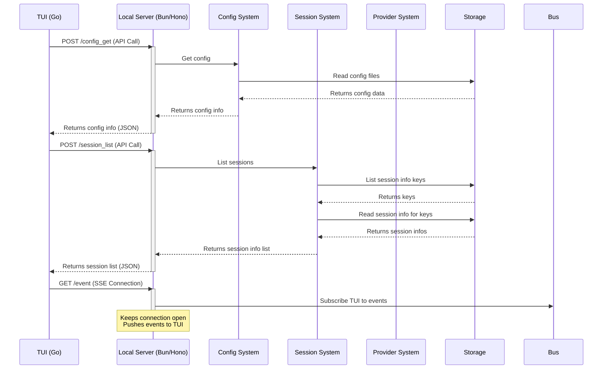

# Chapter 8: Server

Welcome back to the `opencode` tutorial! In our previous chapters, we've built up a picture of `opencode`: you interact with the [Chapter 1: TUI](01_tui__terminal_user_interface__.md), your conversations are made of [Chapter 2: Message](02_message_.md)s grouped into [Chapter 3: Session](03_session_.md)s, which are saved using [Chapter 7: Storage](07_storage_.md). You've learned how to customize settings with [Chapter 4: Config](04_config_.md), how `opencode` connects to AI models using [Chapter 5: Provider](05_provider_.md)s, and how the AI can take action via [Chapter 6: Tool](06_tool_.md)s.

All these pieces need something to orchestrate them, to run the complex logic, manage the state, and handle communication. This is the role of the **Server**.

### What is the Server?

Think of the `opencode` **Server** as the central nervous system or the "backend brain" of the application that runs quietly in the background. While the [Chapter 1: TUI](01_tui__terminal_user_interface__.md) is the face you interact with, the Server is the engine doing all the heavy lifting.

Why have a separate Server component?

*   **Separation of Concerns:** It keeps the core logic (talking to AI models, running tools, managing sessions, saving data) separate from the user interface code (displaying text, handling key presses). This makes both parts simpler and easier to develop and maintain.
*   **Consistency:** The Server exposes a consistent way (an API) for different clients to interact with the `opencode` core. This means not only the TUI, but potentially other future interfaces (like a web UI, or even scripting) could talk to the same Server backend.
*   **Background Processing:** Tasks like running complex AI calls or lengthy tool executions can happen on the Server without freezing the TUI.
*   **Enabling Features:** As mentioned in the concept details, features like session sharing leverage the same API structure, even exposing it publicly via a Cloudflare Worker.

The local `opencode` Server runs as a background process whenever you start `opencode` in the TUI or run certain commands. The [Chapter 1: TUI](01_tui__terminal_user_interface__.md) then connects to this running Server.

### Your Use Case: Sending a Message (Again!)

Let's revisit the simple use case from [Chapter 1: TUI](01_tui__terminal_user_interface__.md): sending a message to the AI. Now we can see the Server's role more clearly.

1.  You type your message in the [Chapter 1: TUI](01_tui__terminal_user_interface__.md) editor.
2.  When you press Enter, the TUI doesn't process the message content or talk to the AI directly.
3.  Instead, the TUI packages your message text into a request and sends it to the **local Server** via its API (specifically, the `/session_chat` endpoint).
4.  The **Server** receives this request.
5.  The Server's internal logic takes over:
    *   It uses the [Chapter 3: Session](03_session_.md) and [Chapter 7: Storage](07_storage_.md) systems to get the current conversation history.
    *   It uses the [Chapter 5: Provider](05_provider_.md) system to talk to the chosen AI model.
    *   If the AI decides to use a [Chapter 6: Tool](06_tool_.md), the Server orchestrates running that tool and feeding the results back to the AI.
6.  As the AI generates its response (text, tool calls/results), the Server creates and updates [Chapter 2: Message](02_message_.md) objects.
7.  The Server uses the [Chapter 9: Bus (Event Bus)](09_bus__event_bus__.md) to publish events about these message updates.
8.  The TUI, which is listening for events from the Server (via the `/event` API endpoint), receives these updates.
9.  The TUI updates its display based on the events, showing the AI's response as it streams in.

This flow highlights how the Server acts as the central hub, processing the request from the TUI and coordinating all the other `opencode` components to generate the AI's response.

### The Local Server

The primary Server you interact with is the one that starts alongside your `opencode` TUI or commands. This local Server handles most of the core `opencode` functionality.

It's built using Bun (a fast JavaScript runtime) and the Hono web framework to create an API.

Let's look at how it's started and what kind of API endpoints it provides.

From the main `opencode` entry point (`packages/opencode/src/index.ts`), you can see the Server being started:

```typescript
// Simplified snippet from packages/opencode/src/index.ts
const cli = yargs(...)
  // ... other setup ...
  .command({
    command: "$0 [project]", // This is the default command that starts the TUI
    handler: async (args) => {
      // ... app setup ...

      // Start the opencode Server
      const server = Server.listen()

      // Determine how to run the TUI client
      let cmd = ["go", "run", "./main.go"]
      let cwd = new URL("../../tui/cmd/opencode", import.meta.url).pathname

      // ... logic to use embedded binary if available ...

      // Spawn the TUI client process
      const proc = Bun.spawn({
        cmd: [...cmd, ...process.argv.slice(2)],
        signal: cancel.signal,
        cwd,
        stdout: "inherit",
        stderr: "inherit",
        stdin: "inherit",
        env: {
          ...process.env,
          // Pass the server URL to the TUI client via environment variable
          OPENCODE_SERVER: server.url.toString(),
          // Pass other app info the TUI might need
          OPENCODE_APP_INFO: JSON.stringify(app),
        },
        onExit: () => {
          server.stop() // Stop the server when the TUI exits
        },
      })
      // ... wait for TUI process to exit ...
      await proc.exited
      server.stop() // Ensure server stops even if proc.exited didn't call onExit
      // ... handle needs_provider result ...
    },
  })
  // ... other commands ...
```

This snippet shows that when the default command runs, it calls `Server.listen()` to start the backend server. It then launches the TUI client (`packages/tui/cmd/opencode/main.go`) as a separate process, passing the Server's address (URL) using the `OPENCODE_SERVER` environment variable. When the TUI process exits, the `onExit` handler stops the Server.

The `Server.listen()` function itself (in `packages/opencode/src/server/server.ts`) is quite simple:

```typescript
// Simplified snippet from packages/opencode/src/server/server.ts
export namespace Server {
  // ... app() function defines the Hono app with routes ...

  export function listen() {
    // Start a Bun server on a random available port (port: 0)
    const server = Bun.serve({
      port: 0,
      hostname: "0.0.0.0", // Listen on all network interfaces
      idleTimeout: 0,
      fetch: app().fetch, // Use the Hono app to handle requests
    })
    // Log the server URL for debugging (and used by client)
    log.info("listening", { url: server.url.toString() })
    return server // Return the Bun server instance
  }
}
```

This `listen()` function uses Bun's built-in `Bun.serve` to start an HTTP server. By specifying `port: 0`, it tells the operating system to pick any available port. The `fetch: app().fetch` line connects the server to the Hono application defined in the `app()` function, which sets up all the API endpoints.

### The Server API

The `app()` function in `packages/opencode/src/server/server.ts` defines the various API routes that the TUI client uses to communicate with the Server. These are standard HTTP endpoints (mostly POST requests) that accept and return JSON data.

Here's a look at some of the key API endpoints the Server exposes:

| Endpoint              | HTTP Method | Description                                                                  |
| :-------------------- | :---------- | :--------------------------------------------------------------------------- |
| `/event`              | `GET`       | Used by the TUI to establish an SSE (Server-Sent Events) connection to receive real-time updates from the [Bus](09_bus__event_bus__.md). |
| `/app_info`           | `POST`      | Get basic information about the running `opencode` application ([Chapter 10: App Context (App)](10_app_context__app__.md)). |
| `/config_get`         | `POST`      | Get the currently loaded configuration ([Chapter 4: Config](04_config_.md)). |
| `/session_create`     | `POST`      | Create a new session ([Chapter 3: Session](03_session_.md)).                 |
| `/session_list`       | `POST`      | List all saved sessions ([Chapter 3: Session](03_session_.md)).              |
| `/session_messages`   | `POST`      | Get all messages for a specific session ([Chapter 3: Session](03_session_.md), [Chapter 2: Message](02_message_.md)). |
| `/session_chat`       | `POST`      | Send a message to the AI within a session, triggering the chat flow.         |
| `/session_abort`      | `POST`      | Cancel an ongoing AI request in a session.                                   |
| `/provider_list`      | `POST`      | List available AI providers and models ([Chapter 5: Provider](05_provider_.md)). |
| `/file_search`        | `POST`      | Perform a file search (used by some [Chapter 6: Tool](06_tool_.md) logic or TUI features). |
| `/installation_info`  | `POST`      | Get information about the `opencode` installation/version.                 |

The TUI client (written in Go) uses a generated client library (`packages/tui/pkg/client`) to make calls to these endpoints. For example, to get the list of sessions, the Go TUI code would call `a.Client.PostSessionListWithResponse(ctx)`.

You can see the TUI client connecting to the Server and setting up the event listener in the TUI `main.go`:

```go
// Simplified snippet from packages/tui/cmd/opencode/main.go
func main() {
	// ... setup (logging, app info) ...

	// The Server URL was passed via env var by the Bun process
	url := os.Getenv("OPENCODE_SERVER")

	// Create an HTTP client to talk to the Server API
	httpClient, err := client.NewClientWithResponses(url)
	if err != nil {
		slog.Error("Failed to create client", "error", err)
		os.Exit(1)
	}

	ctx, cancel := context.WithCancel(context.Background())
	defer cancel()

	// Create the main application context holding the client etc.
	app_, err := app.New(ctx, version, appInfo, httpClient)
	if err != nil {
		panic(err)
	}

	// Create and run the Bubble Tea TUI program
	program := tea.NewProgram(
		tui.NewModel(app_), // Our main TUI model
		// ... other options ...
	)

	// Create a separate client for the event stream
	eventClient, err := client.NewClient(url)
	if err != nil {
		slog.Error("Failed to create event client", "error", err)
		os.Exit(1)
	}

	// Subscribe to the SSE event stream from the Server
	evts, err := eventClient.Event(ctx)
	if err != nil {
		slog.Error("Failed to subscribe to events", "error", err)
		os.Exit(1)
	}

	// Start a goroutine to forward events from the stream to the TUI program
	go func() {
		for item := range evts {
			// Send the event message to the Bubble Tea program's update loop
			program.Send(item)
		}
	}()

	// Run the TUI program, which handles user input and rendering
	result, err := program.Run()
	// ... error handling and exit ...
}
```

This Go code shows how the TUI:
1.  Reads the `OPENCODE_SERVER` environment variable to know the Server's address.
2.  Creates an `httpClient` to make standard API calls (like getting config, listing sessions).
3.  Creates a separate `eventClient` to connect to the `/event` endpoint.
4.  Starts a background goroutine (`go func()`) that continuously reads events from the Server's SSE stream and sends them as messages into the `program.Send(item)` queue, which is processed by the TUI's update loop.

This is how the TUI stays updated with changes happening on the Server, like new messages arriving or tool executions completing.

Here's a simplified sequence diagram illustrating the TUI-Server interaction for fetching initial data:



This shows how the TUI makes distinct API calls to the Server to fetch initial data (config, sessions) and maintains a separate long-lived connection (`/event`) to receive real-time updates.

### The Cloudflare Worker Server (for Sharing)

The concept details mention that the Server design enables sharing sessions "using the same API exposed publicly via a Cloudflare Worker". This refers to a *different* Server instance that runs in the cloud, not on your local machine.

This remote Server, defined in `packages/function/src/api.ts` and deployed as a Cloudflare Worker (see `infra/app.ts`), doesn't run the full `opencode` core logic. Its primary role is to handle the **sharing** feature:

*   It stores copies of shared session data ([Session.Info](03_session_.md) and [Message.Info](02_message_.md)) using Cloudflare's R2 Storage and Durable Objects (specifically, the `SyncServer` Durable Object).
*   It exposes specific API endpoints related to sharing (like `share_create`, `share_sync`, `share_poll`, `share_data`).
*   When your local `opencode` Server shares a session (`Session.share`), it uses the `share_sync` endpoint on the Cloudflare Worker to upload the session data.
*   When someone views a shared session link in a web browser, the web application (built in `packages/web` and also deployed to Cloudflare) talks to this same Cloudflare Worker Server using the `share_data` or `share_poll` endpoints to retrieve the session history.

You can see the Cloudflare Worker definition in `infra/app.ts`:

```typescript
// Simplified snippet from infra/app.ts
// Define a Cloudflare Worker
export const api = new sst.cloudflare.Worker("Api", {
  domain: `api.${domain}`, // Public domain for the API
  handler: "packages/function/src/api.ts", // The code running in the worker
  url: true,
  link: [bucket], // Link to Cloudflare R2 bucket for storage
  transform: {
    worker: (args) => {
      args.bindings = $resolve(args.bindings).apply((bindings) => [
        ...bindings,
        {
          name: "SYNC_SERVER", // Bind the Durable Object namespace
          type: "durable_object_namespace",
          className: "SyncServer", // The name of the Durable Object class
        },
      ])
      // ... migrations ...
    },
  },
})
```

This infrastructure code defines the `Api` worker, assigns it a public domain, specifies the code it runs (`packages/function/src/api.ts`), and links it to storage resources like an R2 Bucket and a `SyncServer` Durable Object. The `SyncServer` Durable Object (`packages/function/src/api.ts` also contains the `SyncServer` class implementation) is where the shared session data is actually stored and managed for each unique shared session ID.

So, while the local Server is your primary backend for interaction, `opencode` uses a separate Cloudflare Worker Server instance specifically for the sharing feature, making the shared sessions accessible publicly.

### Conclusion

The Server is the crucial backend component of `opencode`. It runs locally (using Bun and Hono) and acts as the central orchestrator for all the application's core logic, including managing [Chapter 3: Session](03_session_.md)s and [Chapter 2: Message](02_message_.md)s, interacting with [Chapter 5: Provider](05_provider_.md)s and [Chapter 6: Tool](06_tool_.md)s, and persisting data via [Chapter 7: Storage](07_storage_.md). It exposes an API consumed by the [Chapter 1: TUI](01_tui__terminal_user_interface__.md) client, allowing for a clean separation between the UI and the backend logic. Furthermore, the architecture extends to a separate Cloudflare Worker Server that handles the specific functionality of session sharing, demonstrating the power of abstracting the core logic behind an API.

You saw how the TUI connects to the Server via environment variables and uses both standard API calls and a real-time event stream to stay updated.

Now that we understand the Server's role as the central hub and how it communicates with the TUI, let's look at the mechanism it uses to send those real-time updates: the Event Bus.

[Chapter 9: Bus (Event Bus)](09_bus__event_bus__.md)

---

<sub><sup>Generated by [AI Codebase Knowledge Builder](https://github.com/The-Pocket/Tutorial-Codebase-Knowledge).</sup></sub> <sub><sup>**References**: [[1]](https://github.com/sst/opencode/blob/100d6212be5b1475692116397aa9bef05da79cbf/infra/app.ts), [[2]](https://github.com/sst/opencode/blob/100d6212be5b1475692116397aa9bef05da79cbf/packages/function/src/api.ts), [[3]](https://github.com/sst/opencode/blob/100d6212be5b1475692116397aa9bef05da79cbf/packages/function/sst-env.d.ts), [[4]](https://github.com/sst/opencode/blob/100d6212be5b1475692116397aa9bef05da79cbf/packages/opencode/src/index.ts), [[5]](https://github.com/sst/opencode/blob/100d6212be5b1475692116397aa9bef05da79cbf/packages/opencode/src/server/server.ts), [[6]](https://github.com/sst/opencode/blob/100d6212be5b1475692116397aa9bef05da79cbf/packages/tui/cmd/opencode/main.go), [[7]](https://github.com/sst/opencode/blob/100d6212be5b1475692116397aa9bef05da79cbf/packages/tui/internal/app/app.go), [[8]](https://github.com/sst/opencode/blob/100d6212be5b1475692116397aa9bef05da79cbf/packages/tui/pkg/client/event.go), [[9]](https://github.com/sst/opencode/blob/100d6212be5b1475692116397aa9bef05da79cbf/sst-env.d.ts), [[10]](https://github.com/sst/opencode/blob/100d6212be5b1475692116397aa9bef05da79cbf/sst.config.ts)</sup></sub>
````