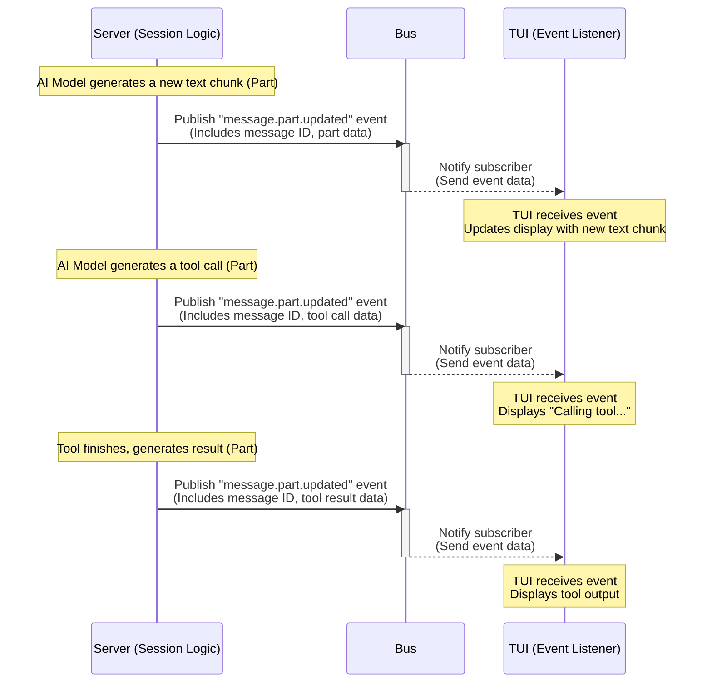

# Chapter 9: Bus (Event Bus)

Welcome back to the `opencode` tutorial! In our last chapter, [Chapter 8: Server](08_server_.md), we learned that the `opencode` Server acts as the central brain, orchestrating the AI interactions, managing sessions, and saving data. We also saw that the [Chapter 1: TUI](01_tui__terminal_user_interface__.md) is a separate program that talks to the Server via an API and receives real-time updates through a special connection.

But how does the Server, which is busy processing AI responses and running [Chapter 6: Tool](06_tool_.md)s, efficiently tell the TUI (or anything else that might be listening) *exactly* when something important happens, like a new part of the AI's response arriving or a tool execution finishing? It doesn't want to constantly check if there's an update, and the TUI doesn't want to constantly *ask* the Server "Is anything new yet?".

This is where the **Bus (Event Bus)** comes in.

### What is the Bus (Event Bus)?

Imagine you're in a busy office. Instead of everyone constantly asking everyone else for updates, there's a central announcement board or a public address system. When something important happens (like "Meeting in Room 3!"), someone makes an announcement. Anyone who needs to know about meetings hears the announcement and reacts. People who don't care about that specific announcement just ignore it.

The **Bus** in `opencode` works similarly. It's a central communication channel that allows different parts of the application (components) to announce that something has happened. These announcements are called **Events**.

*   A component that has something to announce **publishes** an event to the Bus. It doesn't need to know *who* might be interested.
*   Components that *are* interested in specific types of events **subscribe** to the Bus. When an event they've subscribed to is published, the Bus notifies them.

This pattern, known as "Publish-Subscribe" or "Pub/Sub", is incredibly useful because it **decouples** components. The part of the code that updates a [Chapter 2: Message](02_message_.md) doesn't need to have direct code to tell the TUI to update its display. It just publishes a "message updated" event to the Bus, and the TUI, which is subscribed to those events, receives the notification and updates itself.

Benefits of using a Bus:

*   **Decoupling:** Components don't need direct knowledge of each other.
*   **Flexibility:** New components can easily be added and subscribe to existing events without modifying the publisher.
*   **Real-time Updates:** Allows components like the TUI to react instantly to changes happening in the Server.

### Your Use Case: Real-time Message Streaming in the TUI

Let's look again at how the AI's response appears character-by-character or how tool calls show up as they happen in the TUI. This was hinted at in [Chapter 2: Message](02_message_.md) and [Chapter 8: Server](08_server_.md).



This diagram shows the core role of the Bus in this scenario. The Server's `Session` logic, while interacting with the AI model and [Chapter 6: Tool](06_tool_.md)s, is the publisher. As soon as it has a new piece of information (like a `TextPart` or `ToolInvocationPart`), it packages it into a `Message.Event.PartUpdated` event and publishes it to the Bus. The TUI's event listener (which is connected to the Server's `/event` endpoint, as seen in [Chapter 8: Server](08_server_.md)) is a subscriber. It receives this event immediately and can update the display without needing to poll or wait for the full message to complete.

### Anatomy of an Event

An event in the `opencode` Bus is structured data, typically with two main parts:

*   `type`: A string identifying what kind of event this is (e.g., `"message.part.updated"`, `"session.updated"`, `"storage.write"`).
*   `properties`: A structured object containing the details relevant to this specific event. The structure of `properties` is defined using Zod, ensuring type safety.

`opencode` uses a helper function `Bus.event()` to define these event types and their expected properties:

```typescript
// Simplified snippet from packages/opencode/src/bus/index.ts
export namespace Bus {
  // ... state and other functions ...

  // Helper to define an event type
  export function event<Type extends string, Properties extends z.ZodType>(
    type: Type,
    properties: Properties,
  ) {
    const result = {
      type,
      properties, // Zod schema for the event data
    }
    // Register the event type for internal use
    registry.set(type, result)
    return result
  }

  // ... publish, subscribe, etc. ...
}
```

This snippet shows that `Bus.event()` is a function that takes a string `type` and a Zod schema for `properties`. It returns an object representing the event definition, which is also stored internally.

You'll see this `Bus.event()` helper used throughout the `opencode` codebase whenever a system defines something that others might want to subscribe to.

Here's how the `Message.Event.PartUpdated` event is defined in `packages/opencode/src/session/message.ts`:

```typescript
// Simplified snippet from packages/opencode/src/session/message.ts
export namespace Message {
  // ... Message.Info and Part definitions ...

  export const Event = {
    Updated: Bus.event(
      "message.updated",
      z.object({ // Properties for message.updated
        info: Info, // Contains the full Message.Info object
      }),
    ),
    PartUpdated: Bus.event(
      "message.part.updated",
      z.object({ // Properties for message.part.updated
        part: Part, // Contains the specific Part that was updated
        sessionID: z.string(),
        messageID: z.string(),
      }),
    ),
  }
}
```
This clearly defines two types of message-related events: `message.updated` (for when the whole message state changes) and `message.part.updated` (specifically for streaming parts). It specifies exactly what data (`properties`) you'll get with each event: the full `Message.Info` for `Updated`, and the specific `Part`, `sessionID`, and `messageID` for `PartUpdated`.

### How the Bus Works (Internal Implementation)

Let's dive into the core functions in `packages/opencode/src/bus/index.ts` that make the Bus work: `publish` and `subscribe`.

**1. Subscribing (`Bus.subscribe`):**

When a component wants to listen for an event, it calls `Bus.subscribe()`.

```typescript
// Simplified snippet from packages/opencode/src/bus/index.ts
export namespace Bus {
  // ... state, event, publish, etc. ...

  // The core logic for subscribing
  function raw(type: string, callback: (event: any) => void) {
    log.info("subscribing", { type })
    const subscriptions = state().subscriptions // Get the map of subscriptions
    let match = subscriptions.get(type) ?? [] // Get existing callbacks for this type (or empty array)
    match.push(callback) // Add the new callback
    subscriptions.set(type, match) // Store the updated list back in the map

    // Return a function to unsubscribe later
    return () => {
      log.info("unsubscribing", { type })
      const match = subscriptions.get(type)
      if (!match) return
      const index = match.indexOf(callback)
      if (index === -1) return
      match.splice(index, 1) // Remove the callback
    }
  }

  // Wrapper for type safety (used by components)
  export function subscribe<Definition extends EventDefinition>(
    def: Definition,
    callback: (event: {
      type: Definition["type"]
      properties: z.infer<Definition["properties"]>
    }) => void,
  ) {
    // Call the raw function, passing the event type string and the callback
    return raw(def.type, callback)
  }

  // Allow subscribing to all events using a wildcard '*'
  export function subscribeAll(callback: (event: any) => void) {
    return raw("*", callback)
  }

  // ... once, etc. ...
}
```

The `raw` function is the core of the subscription logic. It maintains a `Map` called `subscriptions` where keys are event types (strings like `"message.part.updated"`) and values are arrays of callback functions that have subscribed to that type. When you call `subscribe`, it adds your callback to the list for the specified event type. It also returns an "unsubscribe" function, which, when called, removes your callback from the list. `subscribeAll` is a shortcut to subscribe to a special `"*" ` type, which receives *all* published events.

**2. Publishing (`Bus.publish`):**

When a component wants to announce something, it calls `Bus.publish()`.

```typescript
// Simplified snippet from packages/opencode/src/bus/index.ts
export namespace Bus {
  // ... state, event, subscribe, etc. ...

  export function publish<Definition extends EventDefinition>(
    def: Definition,
    properties: z.output<Definition["properties"]>,
  ) {
    // Construct the full event payload
    const payload = {
      type: def.type, // The event type string
      properties, // The data matching the Zod schema
    }
    log.info("publishing", {
      type: def.type,
    })
    // Notify subscribers of the specific event type AND subscribers of the wildcard '*'
    for (const key of [def.type, "*"]) {
      const match = state().subscriptions.get(key) // Get the list of callbacks for this type or '*'
      for (const sub of match ?? []) {
        sub(payload) // Call each subscribed callback with the event payload
      }
    }
  }

  // ... raw, once, etc. ...
}
```

The `publish` function takes an event definition and the relevant properties. It constructs the complete event object (`payload`) and then looks up subscribers for both the specific event `type` and the wildcard `"*"`. For every callback function found in those lists, it calls the function, passing the `payload` data.

This simple mechanism is how events flow through the application.

**Examples of Publishing and Subscribing:**

You've already seen examples of publishing and subscribing in the code snippets from previous chapters, even if we didn't explicitly call out the Bus.

*   **Server Publishing (Message Updates):** In `packages/opencode/src/session/index.ts`, the `updateMessage` function, which is called whenever an assistant message receives new parts, explicitly publishes an event:

    ```typescript
    // Simplified snippet from packages/opencode/src/session/index.ts
    async function updateMessage(msg: Message.Info) {
      await Storage.writeJSON(
        "session/message/" + msg.metadata.sessionID + "/" + msg.id,
        msg,
      )
      // Publish the event after saving the message
      Bus.publish(Message.Event.Updated, {
        info: msg,
      })
      // Also publish specific PartUpdated events within Session.chat loop
      // ... Bus.publish(Message.Event.PartUpdated, { part: match, ... }) ...
    }
    ```
    Here, the `Session` logic is the publisher, announcing that a message has been updated or a part has arrived.

*   **Server Publishing (Storage Writes):** In `packages/opencode/src/storage/storage.ts`, the `writeJSON` function publishes an event whenever data is saved:

    ```typescript
    // Simplified snippet from packages/opencode/src/storage/storage.ts
    export async function writeJSON<T>(key: string, content: T) {
      // ... write file logic ...
      // Publish the event after writing
      Bus.publish(Event.Write, { key, content })
    }
    ```
    The `Storage` system is another publisher, announcing changes to persistent data.

*   **Share Subscribing (to Storage Writes):** In `packages/opencode/src/share/share.ts`, the sharing logic subscribes to `Storage.Event.Write` events to know when data needs to be synced remotely:

    ```typescript
    // Simplified snippet from packages/opencode/src/share/share.ts
    const state = App.state("share", async () => {
      // Subscribe to Storage write events
      Bus.subscribe(Storage.Event.Write, async (payload) => {
        // When data is written to Storage, trigger a sync
        await sync(payload.properties.key, payload.properties.content)
      })
    })
    ```
    Here, the `Share` system is a subscriber, reacting to events published by `Storage`. This clearly shows decoupling – `Storage` doesn't know *how* to share, it just announces "I wrote something!", and `Share` knows *it* should handle syncing when that happens.

*   **CLI Subscribing (to Message Part Updates):** In `packages/opencode/src/cli/cmd/run.ts`, the command line runner subscribes to `Message.Event.PartUpdated` to print streaming output (similar to the TUI):

    ```typescript
    // Simplified snippet from packages/opencode/src/cli/cmd/run.ts
    export const RunCommand = cmd({
      // ... setup ...
      handler: async (args) => {
        // ... session logic ...
        Bus.subscribe(Message.Event.PartUpdated, async (evt) => {
          if (evt.properties.sessionID !== session.id) return
          const part = evt.properties.part
          // ... logic to print the part based on type ...
        })
        // ... chat logic ...
      }
    })
    ```
    Here, the command line interface acts as a subscriber, listening for specific message updates relevant to its session.

*   **LSP Client Publishing (Diagnostics):** In `packages/opencode/src/lsp/client.ts`, the Language Server Protocol client publishes events when it receives diagnostic information (like errors or warnings) for a file:

    ```typescript
    // Simplified snippet from packages/opencode/src/lsp/client.ts
    export namespace LSPClient {
      // ... other definitions ...

      export const Event = {
        Diagnostics: Bus.event( // Define the event
          "lsp.client.diagnostics",
          z.object({
            serverID: z.string(),
            path: z.string(),
          }),
        ),
      }

      // ... create function ...
      connection.onNotification("textDocument/publishDiagnostics", (params) => {
        // ... process diagnostics ...
        // Publish the event after receiving diagnostics from the LSP server
        Bus.publish(Event.Diagnostics, { path, serverID })
      })
      // ... rest of create function ...
    }
    ```
    The LSP client is a publisher, announcing diagnostic updates. Other parts of `opencode` (like a future UI component that shows file errors) could subscribe to this event.

These examples show how different, independent parts of `opencode` use the Bus to communicate without directly depending on each other. The Server's API (`/event` endpoint) essentially acts as a bridge, forwarding these internal Bus events over the network connection to the TUI client, allowing the Go TUI program to also subscribe to these events, even though it's a separate process.

### Conclusion

The Bus (Event Bus) is `opencode`'s internal notification system. It allows different components to communicate in a decoupled way by publishing events when something happens and subscribing to events they are interested in. This publish-subscribe pattern is essential for enabling real-time updates in the [Chapter 1: TUI](01_tui__terminal_user_interface__.md) as the [Chapter 8: Server](08_server_.md) processes information, and for allowing different systems like [Chapter 7: Storage](07_storage_.md) and [Chapter 12: Share](03_session_.md) to interact flexibly.

Now that we understand how `opencode`'s components communicate using the Bus, let's zoom out and look at how all these pieces are held together within the overall structure of the application.

Let's move on to the concept of the App Context.

[Chapter 10: App Context (App)](10_app_context__app__.md)

---

<sub><sup>Generated by [AI Codebase Knowledge Builder](https://github.com/The-Pocket/Tutorial-Codebase-Knowledge).</sup></sub> <sub><sup>**References**: [[1]](https://github.com/sst/opencode/blob/100d6212be5b1475692116397aa9bef05da79cbf/packages/opencode/src/bus/index.ts), [[2]](https://github.com/sst/opencode/blob/100d6212be5b1475692116397aa9bef05da79cbf/packages/opencode/src/cli/cmd/run.ts), [[3]](https://github.com/sst/opencode/blob/100d6212be5b1475692116397aa9bef05da79cbf/packages/opencode/src/index.ts), [[4]](https://github.com/sst/opencode/blob/100d6212be5b1475692116397aa9bef05da79cbf/packages/opencode/src/installation/index.ts), [[5]](https://github.com/sst/opencode/blob/100d6212be5b1475692116397aa9bef05da79cbf/packages/opencode/src/lsp/client.ts), [[6]](https://github.com/sst/opencode/blob/100d6212be5b1475692116397aa9bef05da79cbf/packages/opencode/src/mcp/index.ts), [[7]](https://github.com/sst/opencode/blob/100d6212be5b1475692116397aa9bef05da79cbf/packages/opencode/src/permission/index.ts), [[8]](https://github.com/sst/opencode/blob/100d6212be5b1475692116397aa9bef05da79cbf/packages/opencode/src/session/index.ts), [[9]](https://github.com/sst/opencode/blob/100d6212be5b1475692116397aa9bef05da79cbf/packages/opencode/src/session/message.ts), [[10]](https://github.com/sst/opencode/blob/100d6212be5b1475692116397aa9bef05da79cbf/packages/opencode/src/share/share.ts), [[11]](https://github.com/sst/opencode/blob/100d6212be5b1475692116397aa9bef05da79cbf/packages/opencode/src/storage/storage.ts)</sup></sub>
````