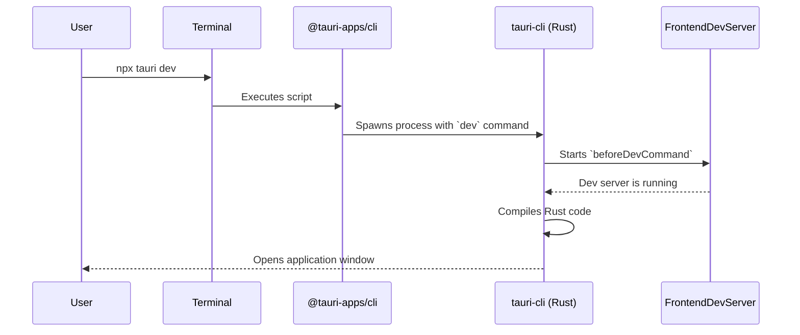

# Chapter 1: Tauri Command-Line Interface (CLI)

Welcome to your first step into the world of Tauri! Before we can build amazing desktop applications, we need to meet our most important tool: the Tauri Command-Line Interface, or CLI for short.

Think of the Tauri CLI as your project's friendly and tireless construction foreman. It's a program you run in your terminal that takes care of all the heavy lifting. Need to start a new project? Ask the foreman. Want to see your app in action while you code? The foreman will set up a live development environment. Ready to ship your app to users? The foreman will package everything up neatly for you.

This chapter will introduce you to this essential tool. We'll learn what it is, how to use its most common commands, and take a quick peek at how it works its magic behind the scenes.

### Your First Commands: `init`, `dev`, and `build`

The Tauri CLI has many commands, but you'll use three of them constantly. Let's get to know them.

1.  **`tauri init`**: This command "initializes" Tauri in your existing frontend project. It creates a new `src-tauri` folder, which will hold all the desktop-related "backend" code, written in Rust. It's like telling the foreman, "Alright, this web project is now going to become a desktop app. Please set up the foundation."

2.  **`tauri dev`**: This is your go-to command during development. It fires up your application in a "development mode." It opens a native window that displays your web app, and most importantly, it watches for changes. If you edit your frontend code (like a CSS file) or your Rust code, the CLI will automatically reload or rebuild your app. This gives you instant feedback.

3.  **`tauri build`**: When your application is finished and ready for the world, this command builds and bundles it into a final, distributable package. It compiles your Rust code, packages your web assets, and creates an installer (`.msi` on Windows, `.dmg` on macOS) or an executable file (`.AppImage` on Linux) that you can share with anyone.

### Turning a Web Project into a Desktop App

Let's see the CLI in action! Imagine you have a simple web project with an `index.html`, a `style.css`, and a `script.js` file. Here’s how you would use the Tauri CLI to turn it into a desktop app.

#### Step 1: Install the CLI

First, we need to hire our "foreman." The Tauri CLI is delivered as a package we can add to our project using a JavaScript package manager like npm, pnpm, or yarn.

```bash
# Using npm
npm install --save-dev @tauri-apps/cli

# Or using pnpm
pnpm add -D @tauri-apps/cli
```

This command adds `@tauri-apps/cli` to your project's development dependencies.

#### Step 2: Initialize Your Project

Now, navigate to your project's root directory in the terminal and run the `init` command. We use `npx` here to run the CLI tool we just installed.

```bash
npx tauri init
```

The CLI will ask you a few questions, like your app's name and what the window title should be. For now, you can just press Enter to accept the defaults. After it's done, you'll see a new folder: `src-tauri`. This is the home for all your app's desktop-specific logic!

#### Step 3: Run the Development Server

Time to see our app live! Just run the `dev` command.

```bash
npx tauri dev
```

After a few moments, two things will happen:
1.  Your web app's development server (if you have one) will start.
2.  A native desktop window will appear on your screen, displaying your web project.

Try changing some text in your `index.html` or a color in your `style.css`. The window will update automatically!

#### Step 4: Build the Final Application

Once you are happy with your app, it's time to build it for distribution.

```bash
npx tauri build
```

This command takes longer because it's doing a lot of work: compiling your Rust code in "release mode" (for performance) and bundling everything into a polished, final package. When it's finished, you'll find the installer or executable inside `src-tauri/target/release/bundle/`. That's it! You have a real desktop app.

### How Does it Work Under the Hood?

You might be wondering, "What magic is happening when I type `npx tauri dev`?" Let's pull back the curtain. The process involves two main layers: a tiny JavaScript wrapper and the powerful Rust CLI.

When you run a `tauri` command, here’s a simplified step-by-step:

1.  **Node.js Wrapper**: The `@tauri-apps/cli` package you installed is a lightweight JavaScript wrapper. Its main job is to find and execute the powerful, pre-compiled Rust CLI binary that comes with it.
2.  **Rust CLI Takes Over**: The Rust program starts up. It reads your project's configuration to know what to do. We'll learn all about this in the next chapter on the [Configuration System (tauri.conf.json)](02_configuration_system__tauri_conf_json__.md).
3.  **Running Commands**: For `tauri dev`, the Rust CLI runs your `beforeDevCommand` (like `npm run dev`) to start your web server.
4.  **Launching the App**: The CLI then compiles the Rust part of your app and launches a native webview window, telling it to load the URL from your development server.

Here is a diagram showing the flow for the `tauri dev` command:



#### A Glimpse into the Code

You don't need to understand the CLI's source code to use it, but seeing a tiny piece can help connect the dots.

The JavaScript wrapper (`packages/cli/tauri.js`) is quite simple. Its goal is to pass your arguments along to the real Rust executable.

```javascript
// A simplified view of packages/cli/tauri.js
const cli = require('./main') // This holds the Rust binary logic
const [,, ...args] = process.argv

// Run the Rust CLI with the arguments you provided
cli.run(args, 'npx tauri').catch((err) => {
  // ... handle errors
  process.exit(1)
})
```

The Rust CLI (`crates/tauri-cli/src/lib.rs`) then parses these arguments to figure out which command to execute, like `dev` or `build`.

```rust
// A simplified view of crates/tauri-cli/src/lib.rs
#[derive(Subcommand)]
enum Commands {
  Init(init::Options),
  Dev(dev::Options),
  Build(build::Options),
  // ... other commands
}
```

If the command is `build`, the code eventually compiles your app and then calls the [Application Bundler](07_application_bundler_.md) to create the final installer.

```rust
// A simplified view of crates/tauri-cli/src/build.rs
pub fn command(options: Options, verbosity: u8) -> Result<()> {
  // ... lots of setup and compilation happens here ...

  // Build the main application binary
  let bin_path = interface.build(interface_options)?;

  // If bundling is enabled, create the installer/package
  if !options.no_bundle {
    crate::bundle::bundle(/* ... */)?;
  }

  Ok(())
}
```

Don't worry if this code looks complex. The beauty of the Tauri CLI is that it manages all this complexity for you, letting you focus on building your app's features.

### Conclusion

You've now met the Tauri CLI, your primary tool for managing your application's lifecycle. You learned about the three most important commands—`init`, `dev`, and `build`—and saw how they can take a web project and turn it into a distributable desktop application. We also took a quick peek under the hood to see how the CLI uses a combination of JavaScript and Rust to get the job done.

Now that you know *how* to give commands to your "foreman," it's time to learn *what* instructions you can give it. In the next chapter, we will explore the main configuration file that the CLI reads to understand your project's specific needs.

Next, let's dive into the [Configuration System (tauri.conf.json)](02_configuration_system__tauri_conf_json__.md).

---

Generated by [AI Codebase Knowledge Builder](https://github.com/The-Pocket/Tutorial-Codebase-Knowledge)