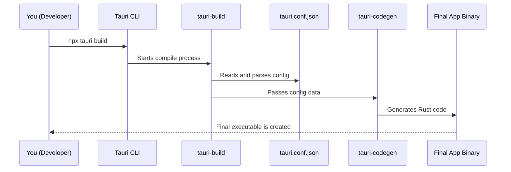

# Chapter 2: Configuration System (tauri.conf.json)

In the [previous chapter](01_tauri_command_line_interface__cli__.md), you met the Tauri CLI, your project's "construction foreman." You learned how to tell it *when* to do things with commands like `tauri dev` and `tauri build`. Now, it's time to learn how to tell it *what* to build.

Imagine you've hired a contractor to build a house. You wouldn't just say "build a house!"; you'd give them a blueprint. The blueprint specifies the number of rooms, the window sizes, the color of the paint, and so on.

In Tauri, your app's blueprint is the **configuration file**. By default, this file is named `tauri.conf.json`. It's your application's central control panel, a single place where you define everything about your app.

### Your App's Blueprint

When you first run `npx tauri init`, Tauri creates a `src-tauri` directory. Inside, you'll find the `tauri.conf.json` file. Let's open it up and see what a basic configuration looks like.

It will look something like this (some parts have been removed for simplicity):

```json
{
  "build": {
    "devUrl": "http://localhost:1420",
    "frontendDist": "../dist"
  },
  "package": {
    "productName": "my-tauri-app",
    "version": "0.0.0"
  },
  "tauri": {
    "bundle": {
      "active": true,
      "identifier": "com.tauri.dev"
    },
    "windows": [
      {
        "title": "My Tauri App",
        "width": 800,
        "height": 600
      }
    ]
  }
}
```

This JSON file is a collection of settings organized into sections. Don't worry about understanding every line right now. Let's focus on a few key parts to get started.

*   `package.productName`: This is the name of your application that users will see.
*   `package.version`: Your app's version number.
*   `tauri.bundle.identifier`: A unique ID for your app, typically in reverse domain name notation. This is very important for app stores and operating systems.
*   `tauri.windows`: An array of windows your app can have. Here, we define our main window's `title`, `width`, and `height`.

### Let's Make a Change!

Let's use this file to solve a simple problem: **we want to change our app's default window title and make it a bit bigger.**

1.  **Find the File**: Open `src-tauri/tauri.conf.json` in your code editor.
2.  **Locate the Settings**: Find the `tauri.windows` section.
3.  **Edit the Values**: Let's change the `title`, `width`, and `height`.

Here's our "before" snippet:
```json
// src-tauri/tauri.conf.json

"windows": [
  {
    "title": "My Tauri App",
    "width": 800,
    "height": 600
  }
]
```

And here's our "after" snippet:
```json
// src-tauri/tauri.conf.json

"windows": [
  {
    "title": "My Awesome App!",
    "width": 1024,
    "height": 768,
    "resizable": true
  }
]
```
We've changed the title, increased the dimensions, and even added a new property, `resizable`, to make sure the user can resize the window.

4.  **See the Result**: Save the file and run the `dev` command from your terminal:

```bash
npx tauri dev
```

Your application window will now pop up with the new title "My Awesome App!" and a larger default size. It's that easy! You've just used the configuration system to customize your app.

### How Does This Work Under the Hood?

You might think that your app reads this JSON file every time it starts. That's a common approach, but Tauri does something clever to make your app faster and more secure.

Your `tauri.conf.json` is read only once, **at compile-time**.

When you run `tauri dev` or `tauri build`, a special process reads your configuration file and translates its settings into native Rust code. This generated code is then compiled directly into your final application. This means by the time a user runs your app, the configuration is already "baked in" as fast, efficient machine code. There's no file to parse at runtime, which means a faster startup.

Let's visualize the process when you run `tauri build`:



This compile-time approach is powerful. It means the structure of your app (like its windows and security rules) is static and predictable.

#### A Glimpse into the Code

You don't need to understand Rust to use Tauri, but seeing where the magic happens can be helpful.

1.  **Reading the Config**: The process starts in a crate called `tauri-build`. Its job is to run during compilation. It uses helper functions to find and parse your config file.

    ```rust
    // A simplified view of crates/tauri-build/src/lib.rs
    
    // This function runs when you build your app.
    pub fn try_build(attributes: Attributes) -> Result<()> {
      // ...
    
      // Find and parse tauri.conf.json (and platform-specific files)
      let (mut config, config_paths) =
        tauri_utils::config::parse::read_from(target, &env::current_dir().unwrap())?;
    
      // ... more build steps
      Ok(())
    }
    ```
    This code snippet shows the `try_build` function calling `read_from` to load your configuration from the project directory.

2.  **Generating Code**: Once the configuration is loaded into memory, it's passed to another crate, `tauri-codegen` (short for "code generator"). This crate takes the configuration data and writes actual Rust code.

    ```rust
    // A simplified view of crates/tauri-codegen/src/context.rs
    
    // This function generates the final code for the app context.
    pub fn context_codegen(data: ContextData) -> EmbeddedAssetsResult<TokenStream> {
      let config = data.config; // The config we loaded earlier
    
      // ...
    
      // Generate Rust code for the window configuration
      let default_window_icon = quote!( /* ... code for the icon ... */ );
    
      // Create the final context object in code
      let context = quote!({
        #root::Context::new(
          #config, // The config is embedded here!
          // ... other generated values
        )
      });
    
      // ...
      Ok(context)
    }
    ```
    The `quote!` macro is a powerful tool that builds Rust code programmatically. Here, it's creating a `Context` object for your application, embedding the `#config` you defined directly into the source code. This all happens automatically for you when you run `tauri build`.

### Conclusion

You've now learned about the second pillar of Tauri development: the configuration file. You know that `tauri.conf.json` is your app's blueprint, allowing you to define its name, version, window properties, and much more. Most importantly, you understand that this configuration is applied at **compile-time**, making your final application lean and fast.

You now know how to give the "foreman" (the CLI) a "blueprint" (the config file). But a desktop app is more than just a static window. We need the web part (frontend) and the native part (backend) to be able to talk to each other. How do you call Rust code from JavaScript? And how can Rust send events to your UI?

In the next chapter, we'll explore exactly that. Let's dive into the core of Tauri's power with [Inter-Process Communication (IPC) & Commands](03_inter_process_communication__ipc____commands_.md).

---

Generated by [AI Codebase Knowledge Builder](https://github.com/The-Pocket/Tutorial-Codebase-Knowledge)