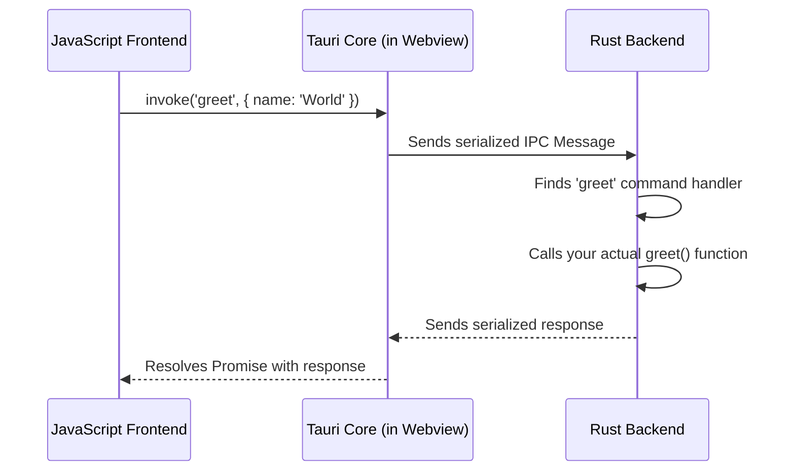

# Chapter 3: Inter-Process Communication (IPC) & Commands

In the [previous chapter](02_configuration_system__tauri_conf_json__.md), we learned how to use `tauri.conf.json` as a blueprint for our application, defining things like window size and app identity. Our app now has a solid foundation and a nice window, but it's a bit like a house with no doors or windows connecting the rooms. The user interface (frontend) and the core logic (backend) are in separate worlds.

This chapter introduces the "nervous system" of a Tauri app: **Inter-Process Communication (IPC)**. This is how your JavaScript code running in the webview can talk to your powerful Rust code, and how Rust can send information back.

### Why Do We Need to Communicate?

Imagine your web-based UI is a clerk in a secure bank lobby. The clerk can talk to customers and use the computer in front of them, but they can't go into the vault. The vault is where the powerful tools and valuable assets are stored—like reading files from the user's computer, accessing a database, or performing heavy calculations.

In Tauri, your JavaScript is the clerk, and the Rust backend is the secure vault. For security reasons, the webview (where your JS runs) is sandboxed and can't just access the entire computer. To perform a privileged action, the JavaScript "clerk" needs to make a secure request to the Rust "vault." This secure request system is the IPC.

Our goal for this chapter is simple: We will create an app where you can type your name into a text box, click a button, and have the Rust backend send back a personalized greeting.

### Step 1: Creating a Command in Rust

First, we need to teach our Rust backend a new trick. We'll create a function that can generate our greeting message.

In your project, open the `src-tauri/src/main.rs` file. Let's add a new function called `greet`.

```rust
// src-tauri/src/main.rs

// This is the attribute that turns a Rust function into a Command.
#[tauri::command]
fn greet(name: &str) -> String {
  format!("Hello, {}! You've been greeted from Rust!", name)
}
```

This looks like a normal Rust function, but there's one magical part: `#[tauri::command]`. This is a **Rust attribute** that tells Tauri to do something special. It transforms our `greet` function into a "Command" that can be safely called from the frontend.

Our function takes one argument, `name` (which is a string slice, a view into a string), and returns a new `String`.

### Step 2: Registering the Command

Just defining the command isn't enough. We need to tell our application that this command exists. Think of it as plugging the new intercom button into the main switchboard.

We do this in the `main` function inside the same file, `src-tauri/src/main.rs`.

```rust
// src-tauri/src/main.rs

#[tauri::command]
fn greet(name: &str) -> String {
  format!("Hello, {}! You've been greeted from Rust!", name)
}

fn main() {
  tauri::Builder::default()
    // This is where you register your commands
    .invoke_handler(tauri::generate_handler![greet])
    .run(tauri::generate_context!())
    .expect("error while running tauri application");
}
```

The key line is `.invoke_handler(tauri::generate_handler![greet])`. The `generate_handler!` macro takes a list of our command functions and prepares them to receive messages from the JavaScript frontend. We'll learn more about the builder pattern in the [Application Builder](05_application_builder_.md) chapter, but for now, just know this is how you make your commands available to the app.

### Step 3: Calling the Command from JavaScript

Now for the other side of the conversation! Let's write the HTML and JavaScript to call our new `greet` command.

Let's assume you have a simple `index.html` file in your project's root:

```html
<!-- index.html -->
<div>
  <input id="greet-input" placeholder="Enter a name..." />
  <button id="greet-button">Greet</button>
  <p id="greet-msg"></p>
</div>

<!-- Make sure you have this script tag -->
<script src="/src/main.js" type="module"></script>
```

Next, let's edit `src/main.js` to add the logic. We will use the `invoke` function from Tauri's JavaScript API.

```javascript
// src/main.js
import { invoke } from '@tauri-apps/api/core';

let greetInputEl;
let greetMsgEl;

async function greet() {
  // Invoke the "greet" command with a payload
  greetMsgEl.textContent = await invoke('greet', {
    name: greetInputEl.value,
  });
}

window.addEventListener('DOMContentLoaded', () => {
  greetInputEl = document.querySelector('#greet-input');
  greetMsgEl = document.querySelector('#greet-msg');
  document
    .querySelector('#greet-button')
    .addEventListener('click', () => greet());
});
```
Let's break down the `greet` function in JavaScript:
1.  `import { invoke } from '@tauri-apps/api/core';`: We import the `invoke` function. This is our "intercom button" on the frontend. We'll explore more of this API in the next chapter on the [JavaScript API (@tauri-apps/api)](04_javascript_api___tauri_apps_api__.md).
2.  `await invoke('greet', { name: greetInputEl.value })`: This is the core of the IPC call.
    *   The first argument, `'greet'`, is the name of the Rust command we want to call. By convention, Rust's `snake_case` function names are called with `snake_case` in JavaScript.
    *   The second argument is a JSON object containing the arguments for our Rust function. Our `greet` function in Rust expects an argument named `name`, so we provide a key `name` in our JavaScript object.
    *   The `invoke` function returns a [Promise](https://developer.mozilla.org/en-US/docs/Web/JavaScript/Reference/Global_Objects/Promise), which resolves with the value returned by the Rust function.

Now, run `npx tauri dev`. Type your name in the box and click the button. You should see the greeting message from Rust appear!

### How Does it Work Under the Hood?

When you call `invoke('greet', ...)`, a fascinating sequence of events happens in a fraction of a second.

1.  **JavaScript (`invoke`)**: The `invoke` function in `@tauri-apps/api` formats your command name and arguments into a special message.
2.  **Serialization**: This message is serialized (turned into a string) and sent into a tiny, private channel exposed by the webview to the host application.
3.  **Rust (`invoke_handler`)**: The Rust backend is constantly listening for messages on this channel. It receives the message and sees it's for the `greet` command.
4.  **Command Execution**: The `generate_handler!` we used earlier created a routing system. It finds the `greet` function wrapper, safely deserializes the arguments (`{ name: "YourName" }`), and calls your original Rust `greet` function with "YourName".
5.  **Return Value**: Your Rust function returns the string `"Hello, YourName! ..."`.
6.  **Response**: The handler takes this return value, serializes it, and sends it back to the webview.
7.  **JavaScript (Promise Resolution)**: The webview receives the response and uses it to resolve the JavaScript Promise that the original `invoke` call returned. Your `.then()` or `await` code now runs with the result.

Here’s a diagram of that flow:



#### A Glimpse into the Code

You never need to touch this code, but seeing it demystifies the magic.

**Frontend:** The `invoke` function in `packages/api/src/core.ts` is a wrapper that prepares and sends the message.

```typescript
// A simplified view of packages/api/src/core.ts
async function invoke<T>(
  cmd: string,
  args: InvokeArgs = {},
  options?: InvokeOptions
): Promise<T> {
  // This internal function handles the actual communication
  // with the Rust backend.
  return window.__TAURI_INTERNALS__.invoke(cmd, args, options)
}
```

**Backend:** The `#[tauri::command]` attribute uses another macro in `crates/tauri-macros/src/command/wrapper.rs`. It generates a new, hidden function that wraps yours. This wrapper function knows how to handle the raw `Invoke` message from the frontend.

```rust
// Conceptual code generated by #[tauri::command]
// You do not write this!
fn __cmd__greet<R: Runtime>(
  invoke: tauri::Invoke<R>
) -> impl Fn() -> tauri::ipc::Response {
  // 1. Logic to parse `name` from invoke.message.payload()
  // 2. Call your original function: greet(parsed_name)
  // 3. Serialize the result and prepare it to be sent back
}
```

Then, `tauri::generate_handler![greet]` in `main.rs` (from `crates/tauri-macros/src/command/handler.rs`) creates a `match` statement that acts as a switchboard.

```rust
// Conceptual code generated by generate_handler!
move |invoke| {
  match invoke.message.command() {
    "greet" => __cmd__greet(invoke), // Route to the greet wrapper
    // ... other commands would go here
    _ => { /* command not found */ },
  }
}
```

This compile-time code generation is what makes Tauri's IPC both fast and type-safe.

### Conclusion

You've just learned the most fundamental concept in Tauri: how to make the frontend and backend communicate. You now know how to:

*   Create a Rust function and expose it as a secure **Command** with `#[tauri::command]`.
*   Register your command so the application knows about it.
*   Call that command from JavaScript using `invoke`, passing data to it and receiving a response.

This simple request-response pattern is the foundation for building complex, feature-rich applications. You can now build a UI that triggers powerful backend logic for file operations, databases, native OS notifications, and anything else Rust can do.

So far, we've only used the `invoke` function from Tauri's frontend API. But what else can it do? In the next chapter, we'll take a comprehensive tour of all the helpful tools available in the official JavaScript package.

Next, let's explore the [JavaScript API (@tauri-apps/api)](04_javascript_api___tauri_apps_api__.md).

---

Generated by [AI Codebase Knowledge Builder](https://github.com/The-Pocket/Tutorial-Codebase-Knowledge)