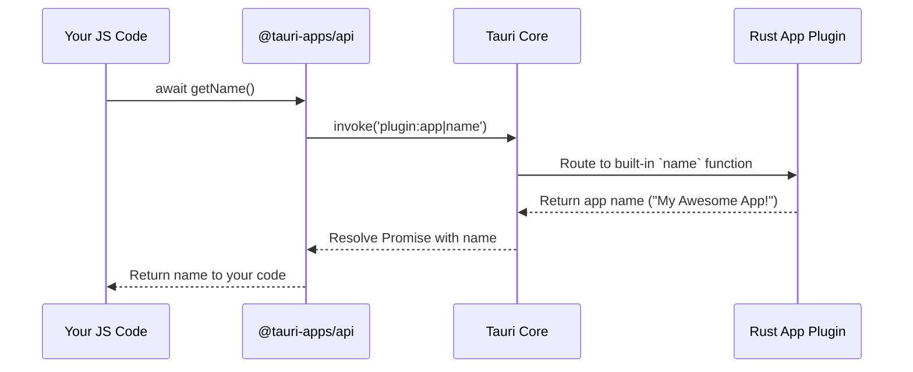

# Chapter 4: JavaScript API (@tauri-apps/api)

In the [previous chapter on IPC & Commands](03_inter_process_communication__ipc____commands_.md), you learned the fundamentals of how your JavaScript frontend can talk to your Rust backend. You used the powerful `invoke` function to call a custom Rust command. This is the bedrock of all communication in Tauri.

However, imagine you had to build a complex application. Your JavaScript code would be filled with `invoke("this_command")`, `invoke("that_command")`, and so on. It works, but it can get messy. What if you misspell a command name? What if you forget the exact arguments it needs?

This is where Tauri's JavaScript API comes in. It's a pre-built toolkit that makes these interactions much cleaner, safer, and more intuitive.

### A Smarter Remote Control

Think of `invoke` as a universal remote control where you have to manually type in a code for every single action. To turn on the TV, you type `001`. To switch to HDMI 1, you type `453`. It's powerful, but you need a manual to remember all the codes.

The `@tauri-apps/api` package is like a modern smart remote. It has clearly labeled buttons: "Power," "Volume," "Netflix." When you press the "Netflix" button, it sends the correct code (`789`) behind the scenes. You don't need to know the code; you just need to know you want to watch Netflix.

The JavaScript API provides these "smart buttons" for interacting with your app's native capabilities, like managing windows, accessing file paths, and reading your app's configuration.

### Let's Upgrade Our App

Our goal is to display the application's name and version on our greeting page. Without the JS API, we'd have to:
1.  Write a `get_app_name` function in Rust.
2.  Write a `get_app_version` function in Rust.
3.  Register both as commands in `main.rs`.
4.  Call `invoke("get_app_name")` and `invoke("get_app_version")` from JavaScript.

With the JS API, we can skip the Rust steps entirely! Let's see how.

#### Step 1: Install the API Package

First, we need to add the `@tauri-apps/api` package to our frontend project. Open your terminal in the project's root directory and run:

```bash
# Using npm
npm install @tauri-apps/api

# Or using pnpm
pnpm add @tauri-apps/api
```

This makes all the API modules available to our JavaScript code.

#### Step 2: Use the API to Get App Info

Now, let's update our frontend to fetch and display the app's name and version.

First, let's add some elements to our `index.html` to hold this information.

```html
<!-- index.html -->
<div>
  <!-- ... existing input and button ... -->
  <p id="greet-msg"></p>
  <div id="app-info"></div> <!-- Add this line -->
</div>

<script src="/src/main.js" type="module"></script>
```

Next, let's modify `src/main.js`. We will import the `getName` and `getVersion` functions from the `app` module of the API.

```javascript
// src/main.js
import { invoke } from '@tauri-apps/api/core';
// Import the functions we need from the 'app' module
import { getName, getVersion } from '@tauri-apps/api/app';

// ... existing variables ...
let appInfoEl;

// ... existing greet() function ...

async function showAppInfo() {
  const appName = await getName();
  const appVersion = await getVersion();
  appInfoEl.textContent = `${appName} v${appVersion}`;
}

window.addEventListener('DOMContentLoaded', () => {
  // ... existing querySelectors ...
  appInfoEl = document.querySelector('#app-info');
  document
    .querySelector('#greet-button')
    .addEventListener('click', () => greet());
  
  // Call our new function when the page loads
  showAppInfo();
});
```
Let's break down the new parts:

1.  `import { getName, getVersion } from '@tauri-apps/api/app';`: Instead of just importing `invoke`, we now pull in specific, named functions from the API's `app` module. This is much more descriptive.
2.  `const appName = await getName();`: We call the function directly. There's no magic string to remember. Your code editor might even show you documentation for this function!
3.  `const appVersion = await getVersion();`: Same thing for the version. It's clean, readable, and less prone to errors.

Now run `npx tauri dev`. Your app window will appear, and below the greeting area, you should see your application's name and version, pulled directly from your `tauri.conf.json`!

### How Does it Work Under the Hood?

You might be wondering, if we didn't write any new Rust code, how did this work? The magic is that `@tauri-apps/api` is a clever wrapper around the same `invoke` system you've already learned.

When you call `app.getName()`, the JavaScript API is simply calling `invoke` for you with a special, reserved command name.

Here is a simplified flow of what happens:

1.  Your JavaScript calls the `getName()` function.
2.  The `getName()` function, inside the `@tauri-apps/api` package, calls `invoke('plugin:app|name')`.
3.  Tauri's Rust core receives this message. The `plugin:app|name` format tells it: "Don't look for a user-defined command. Instead, look inside the built-in `app` plugin for a function named `name`."
4.  The built-in Rust plugin runs its `name` function, which reads the `package.productName` from the configuration that was embedded during compile time.
5.  The value is returned to the frontend, resolving the Promise from `getName()`.

Here is a diagram of that process:



#### A Glimpse into the Code

The source code for the JS API makes this crystal clear. It's surprisingly simple! Here is the actual implementation of `getName` you just used.

```typescript
// A simplified view of packages/api/src/app.ts

import { invoke } from './core'

/**
 * Gets the application name.
 */
async function getName(): Promise<string> {
  return invoke('plugin:app|name')
}
```

That's it! It's just a named function that calls `invoke` with the correct string. The API package is a collection of hundreds of these helpful wrappers, organized into logical modules like:
*   `app`: For getting app name, version, etc.
*   `window`: For controlling windows (minimize, maximize, set title).
*   `event`: For emitting and listening to events across your application.
*   `path`: For getting common directory paths (like Documents or Downloads).

By using this API, you get the benefits of auto-completion from your code editor, type safety (if you're using TypeScript), and much more readable code. You should always prefer using a function from `@tauri-apps/api` over writing your own command for functionality that Tauri already provides out of the box.

### Conclusion

You've now seen how the `@tauri-apps/api` package acts as a clean, safe, and convenient bridge to Tauri's native power. You learned that:

*   It's an npm package you add to your frontend.
*   It provides named functions (`app.getName()`) that are easier to use than raw `invoke()` calls.
*   It works by calling `invoke()` with special command names under the hood.
*   It should be your first choice for interacting with built-in features like windows, events, and the file system.

In the last two chapters, we've seen the `invoke_handler` in `main.rs` and mentioned how configuration is "baked in" at compile time. Both of these things are controlled by a central piece of code: the `tauri::Builder`. This builder is responsible for assembling all the parts of your application.

Next, let's take a closer look at this powerful tool in the [Application Builder](05_application_builder_.md) chapter.

---

Generated by [AI Codebase Knowledge Builder](https://github.com/The-Pocket/Tutorial-Codebase-Knowledge)