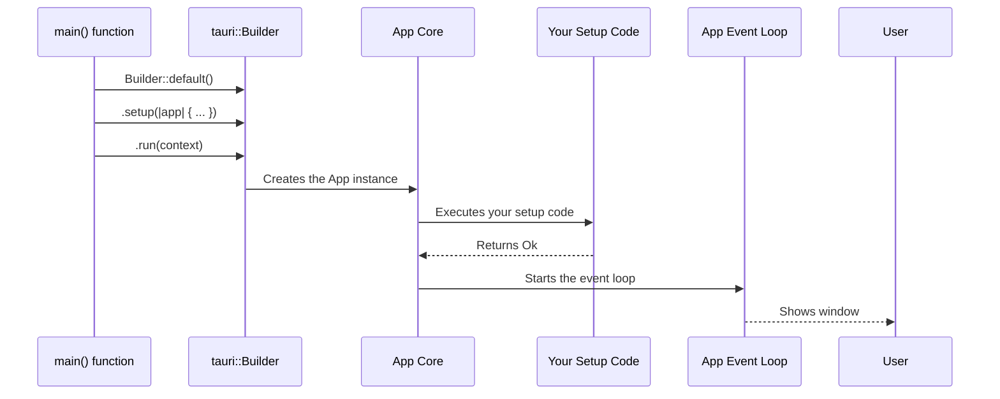

# Chapter 5: Application Builder

In the [previous chapter](04_javascript_api___tauri_apps_api__.md), we explored the `@tauri-apps/api` JavaScript package, our "smart remote" for controlling native features from the frontend. We saw how functions like `app.getName()` make it easy to interact with the Rust backend.

Now, let's switch our focus back to the Rust side. Where is the application actually assembled? If your app is a car, what's the factory's main assembly line that puts the engine, chassis, and wheels together?

That assembly line is the **`tauri::Builder`**. It's the central point in your Rust code where you construct your application, piece by piece, before telling it to run.

### Your App's Recipe

Think of the `tauri::Builder` as a recipe for your application. In your `src-tauri/src/main.rs` file, you'll find the `main` function, which is the entry point of your Rust code. This is where the cooking happens.

The recipe starts simple:
1.  Start with a default application `Builder`.
2.  Add your special ingredients (like command handlers or plugins).
3.  Add any special setup instructions.
4.  Tell the application to `run`.

Let's look at the standard `main.rs` file that Tauri creates for you.

```rust
// src-tauri/src/main.rs

fn main() {
  tauri::Builder::default()
    .run(tauri::generate_context!())
    .expect("error while running tauri application");
}
```

This is the simplest possible recipe. It creates a default builder, immediately tells it to run using the context from your `tauri.conf.json`, and handles any potential errors.

### Adding a Custom Step: The `setup` Hook

The most powerful part of the builder is the `setup` hook. It's a special instruction in your recipe that says: "Right after the app is built, but just before it starts running any windows, do this one-time setup task."

This is incredibly useful for:
*   Opening a database connection.
*   Initializing some state that the whole app needs.
*   Creating a window programmatically.

Our goal is simple but very practical: **we want our app to automatically open the developer tools when we run it in development mode.**

#### Step 1: Add the `setup` Hook

Let's modify our `main.rs` to add a `.setup()` call to our builder.

```rust
// src-tauri/src/main.rs
use tauri::Manager; // We need this to get the window

fn main() {
  tauri::Builder::default()
    .setup(|app| {
      // This is the code that will run on setup
      Ok(())
    })
    .run(tauri::generate_context!())
    .expect("error while running tauri application");
}
```

The `.setup()` method takes a closure (an anonymous function). This closure receives an `app` handle, which is a controller for your entire application. For now, it just returns `Ok(())`, which means "everything went well."

#### Step 2: Open DevTools on Debug Builds

Now, let's add the logic to open the devtools. We only want this to happen during development, not in the final app we send to users. Rust has a handy way to check for this with `#[cfg(debug_assertions)]`.

```rust
// src-tauri/src/main.rs
use tauri::Manager;

fn main() {
  tauri::Builder::default()
    .setup(|app| {
      #[cfg(debug_assertions)] // Only open devtools in debug builds
      {
        let window = app.get_webview_window("main").unwrap();
        window.open_devtools();
      }
      Ok(())
    })
    .run(tauri::generate_context!())
    .expect("error while running tauri application");
}
```

Let's break this down:
1.  `use tauri::Manager;`: We import the `Manager` trait, which gives us access to helpful methods like `get_webview_window`.
2.  `#[cfg(debug_assertions)]`: This attribute tells the Rust compiler to only include the code block `{...}` below it if we are building in debug mode (like with `tauri dev`). If we run `tauri build`, this code will be completely removed!
3.  `app.get_webview_window("main")`: We use the app handle to get our main window, which has the label "main" by default.
4.  `.open_devtools()`: We call this method on the window to pop open the web inspector.

Now, run your app with `npx tauri dev`. Your app window should appear, and the developer tools should open right alongside it automatically!

### How Does it Work Under the Hood?

The `tauri::Builder` is a perfect example of the "builder pattern" in programming. It's not doing any real work when you call methods like `.setup()` or `.invoke_handler()`. Instead, it's just collecting all your instructions and storing them.

1.  **Collecting Ingredients**: When you call `tauri::Builder::default()`, you get a new `Builder` struct. When you call `.setup(|...|)`, the builder just stores your closure inside itself. The same happens for `.invoke_handler()`. It's like putting ingredients into a mixing bowl—nothing is combined yet.

2.  **Baking the App**: The real magic happens when you call `.run()`. This method takes all the "ingredients" you've provided and executes the final recipe.
    *   It first uses `tauri::generate_context!()` to load the "blueprint" from your [Configuration System (tauri.conf.json)](02_configuration_system__tauri_conf_json__.md).
    *   It creates the main `App` object.
    *   It initializes any plugins.
    *   **It calls your `setup` hook**, passing it the `AppHandle`.
    *   Finally, it starts the application's event loop, which opens windows and waits for user interaction.

Here's a diagram visualizing the flow when your app starts:



#### A Glimpse into the Code

Let's peek inside the `tauri` crate to see how this is structured. The code is simplified for clarity.

This is the `Builder` struct in `crates/tauri/src/app.rs`. You can see it's just a container for all the pieces you might add.

```rust
// A simplified view of crates/tauri/src/app.rs
pub struct Builder<R: Runtime> {
  setup: Box<SetupHook<R>>,
  invoke_handler: Box<InvokeHandler<R>>,
  // ... other fields for plugins, etc.
}
```

The `setup` method simply takes your code and saves it in the `setup` field.

```rust
// A simplified view of crates/tauri/src/app.rs
impl<R: Runtime> Builder<R> {
  pub fn setup<F>(mut self, setup: F) -> Self
  where
    F: Fn(&mut App<R>) -> Result<(), Box<dyn Error>> + Send + 'static,
  {
    self.setup = Box::new(setup); // Just stores your closure
    self
  }
}
```

Finally, the `run` method is where everything is put into motion.

```rust
// A simplified view of crates/tauri/src/app.rs
impl<R: Runtime> Builder<R> {
  pub fn run(mut self, context: Context<R>) -> Result<()> {
    // 1. Create the App object with all the builder's parts
    let mut app = App::new(context, self.invoke_handler, ...)?;

    // 2. Call the setup hook you provided
    (self.setup)(&mut app)?;

    // 3. Start the underlying runtime event loop
    app.run();
    
    Ok(())
  }
}
```

You don't need to know the exact details, but seeing this structure helps you understand that the `Builder` is a clean and organized way to configure your app before it ever starts.

### Conclusion

You've now learned about the `tauri::Builder`, the central assembly line for your application's Rust core. You know that:

*   It lives in your `src-tauri/src/main.rs` file.
*   It uses a "builder pattern" to collect configuration step-by-step.
*   The `.setup()` hook is a powerful tool for running code when your app initializes.
*   The `.run()` method is what finally constructs and launches your application.

With the builder, you have complete control over your application's startup process. But with great power comes great responsibility. How do we ensure that a powerful Rust backend doesn't expose dangerous functionality to the web frontend? How do we lock down our app so it can only do what we *want* it to do?

In the next chapter, we'll dive into Tauri's security model. Let's learn about the [Access Control List (ACL) & Capabilities](06_access_control_list__acl____capabilities_.md).

---

Generated by [AI Codebase Knowledge Builder](https://github.com/The-Pocket/Tutorial-Codebase-Knowledge)