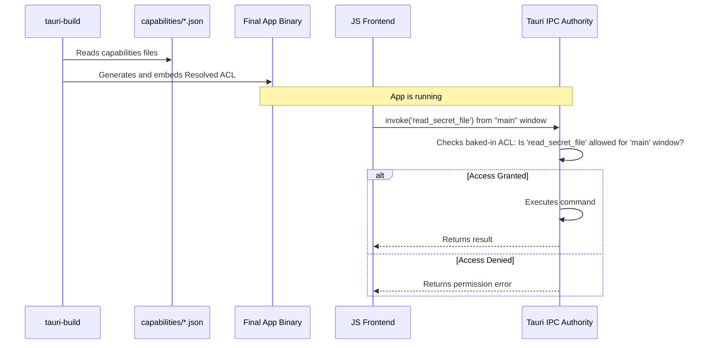

# Chapter 6: Access Control List (ACL) & Capabilities

In the [previous chapter](05_application_builder_.md), we learned how the `tauri::Builder` acts as the assembly line for our app, putting all the pieces together in `main.rs`. We now have a powerful Rust backend and a flexible setup process. But this power comes with a responsibility: security.

If your frontend JavaScript code gets compromised (for example, through a vulnerable library or a malicious ad), an attacker could try to use your app's powerful backend functions for malicious purposes. How do we prevent this?

This chapter introduces Tauri's security system: the **Access Control List (ACL)**. Think of it as your app's diligent security guard, ensuring that the frontend can only do exactly what you permit, and nothing more.

### Your App's Security Guard

Imagine your application is a high-security building. The frontend (your UI) is the public lobby, and the backend (your Rust code) is a series of secure rooms containing valuable tools, like a "file reader" or a "database writer."

By default, without an ACL, it's like you've given the lobby a master key that can open every single door. This is convenient during early construction, but very dangerous in a finished building.

The ACL lets you replace the master key with specific keycards. Each window in your app gets a set of these keycards, which we call **Capabilities**. A capability is just a named list of permissions. For example, you might create a "file-viewer" keycard that only grants permission to open the "read a file" door.

Our goal for this chapter: We'll create two Rust commands, `greet` and `read_secret_file`. We will configure our app so that the `greet` command is always allowed, but the dangerous `read_secret_file` command is blocked until we explicitly grant a capability for it.

### Step 1: Default Deny

Tauri's security model is built on the principle of "default deny." If you don't explicitly allow something, it's forbidden. Let's see this in action.

First, let's add two commands to our `src-tauri/src/main.rs`.

```rust
// src-tauri/src/main.rs

#[tauri::command]
fn greet(name: &str) -> String {
  format!("Hello, {}!", name)
}

#[tauri::command]
fn read_secret_file() -> String {
  // In a real app, this would read a file. Here, we'll just pretend.
  "This is a top-secret message from the backend!".to_string()
}

fn main() {
  tauri::Builder::default()
    .invoke_handler(tauri::generate_handler![greet, read_secret_file])
    .run(tauri::generate_context!())
    .expect("error while running tauri application");
}
```

Now, let's try to call both from our JavaScript.

```javascript
// src/main.js
import { invoke } from '@tauri-apps/api/core';

// This will work fine
invoke('greet', { name: 'World' }).then(console.log);

// Let's try to call the secret command
invoke('read_secret_file')
  .then(console.log)
  .catch(console.error); // This will fail!
```
If you run `npx tauri dev` and open the webview's developer tools, you'll see the "Hello, World!" message, but the call to `read_secret_file` will fail with an error like `command read_secret_file not allowed`.

Why did it fail? Because we haven't enabled any capabilities yet, and Tauri's secure default is to block all commands.

### Step 2: Defining a Capability

To allow our commands, we need to create a "keycard"—a capability file.

First, create a new directory inside `src-tauri`: `capabilities`.

```bash
mkdir src-tauri/capabilities
```

Inside this new directory, create a file named `main.json`. This will be our first capability.

```json
// src-tauri/capabilities/main.json
{
  "identifier": "main-window-permissions",
  "description": "Permissions for the main window",
  "windows": ["main"],
  "permissions": [
    "allow-greet"
  ]
}
```

Let's break this down:
*   `"identifier"`: A unique name for this capability.
*   `"description"`: A human-friendly explanation of what it's for.
*   `"windows"`: A list of window labels that should receive this capability. Our default window is named `"main"`.
*   `"permissions"`: The list of permissions this capability grants. When you create a command like `read_secret_file`, Tauri automatically creates a permission identifier for it: `allow-read-secret-file`. Here, we're only allowing `allow-greet`.

### Step 3: Enabling the Capability

Just creating the file isn't enough. We need to tell our app to use it. We do this in `tauri.conf.json`.

Find the `tauri` object and add a `security` section with a `capabilities` list.

```json
// src-tauri/tauri.conf.json
{
  // ...
  "tauri": {
    "security": {
      "capabilities": [
        "main-window-permissions"
      ]
    },
    // ...
    "windows": [ /* ... */ ]
  }
}
```

This tells Tauri: "The only capability active in this application is the one identified as `main-window-permissions`."

Run `npx tauri dev` again. Now, your `greet` command works, but `read_secret_file` is still blocked. We are in control!

### Step 4: Granting More Permissions

To enable our secret-reading command, we simply add its permission to our capability's list.

Modify `src-tauri/capabilities/main.json`:

```json
// src-tauri/capabilities/main.json
{
  "identifier": "main-window-permissions",
  "description": "Permissions for the main window",
  "windows": ["main"],
  "permissions": [
    "allow-greet",
    "allow-read-secret-file" // Add this line
  ]
}
```

Save the file and re-run `npx tauri dev`. This time, both `invoke('greet', ...)` and `invoke('read_secret_file')` will succeed! You've successfully used the ACL to grant specific permissions to your frontend.

### How Does it Work Under the Hood?

Tauri's ACL system is designed to be both secure and fast. The magic happens at **compile-time**.

When you run `tauri build` or `tauri dev`, a special build script (`tauri-build`) scans your project.

1.  **Permission Discovery**: The build script looks at your `#[tauri::command]` functions and generates a list of potential permissions (like `allow-greet`).
2.  **Capability Parsing**: It then finds the `src-tauri/capabilities` directory and reads all your JSON capability files.
3.  **ACL Resolution**: It checks your `tauri.conf.json` to see which capabilities are active. It then builds a final, "resolved" map of which windows get which permissions.
4.  **Baking it In**: This final, resolved ACL is then embedded directly into your application's binary as Rust code.

When your running application receives an IPC message, it performs a super-fast check against this pre-compiled map before executing the command. There's no slow file reading or parsing at runtime.

Here's a diagram of the process:



#### A Glimpse into the Code

The logic for this is spread across a few key files.

1.  **Build-Time Parsing (`crates/tauri-build/src/acl.rs`):** This code runs during compilation to parse everything.

    ```rust
    // A simplified view of crates/tauri-build/src/acl.rs
    pub fn build(out_dir: &Path, target: Target, attributes: &Attributes) -> super::Result<()> {
      // ... reads plugin manifests ...
      
      // Parses files in ./capabilities/**/*
      let capabilities = tauri_utils::acl::build::parse_capabilities("./capabilities/**/*")?;
      validate_capabilities(&acl_manifests, &capabilities)?;

      // ... generates Rust code for the final ACL ...
      Ok(())
    }
    ```

2.  **Capability Definition (`crates/tauri-utils/src/acl/capability.rs`):** This file defines the Rust `struct` that represents the JSON capability file you created.

    ```rust
    // A simplified view of crates/tauri-utils/src/acl/capability.rs
    #[derive(Debug, Clone, PartialEq, Serialize, Deserialize)]
    pub struct Capability {
      pub identifier: String,
      pub description: String,
      pub windows: Vec<String>,
      pub webviews: Vec<String>,
      pub permissions: Vec<PermissionEntry>,
      // ... and more
    }
    ```

3.  **Runtime Check (`crates/tauri/src/ipc/authority.rs`):** This is the "security guard" at runtime. The `resolve_access` function is called for every IPC message.

    ```rust
    // A simplified view of crates/tauri/src/ipc/authority.rs
    impl RuntimeAuthority {
      pub fn resolve_access(
        &self,
        command: &str,
        window: &str,
        webview: &str,
        origin: &Origin,
      ) -> Option<Vec<ResolvedCommand>> {
        // 1. Check if the command is on the hard-coded `denied_commands` list.
        // 2. If not denied, check if it's on the `allowed_commands` list
        //    for the given window, webview, and origin (local vs remote URL).
        // 3. If a match is found, return it. Otherwise, return None (denied).
      }
    }
    ```

### Conclusion

You have now learned about one of Tauri's most important features: its security model. You know that by using the **Access Control List (ACL)**, you can:

*   Define fine-grained **Permissions** for your app's functionality.
*   Group these permissions into named **Capabilities**.
*   Assign capabilities to specific windows, minimizing your app's attack surface.
*   Rely on Tauri's "default deny" principle for a secure foundation.

This compile-time system ensures your application is both safe and fast. You now have a secure, functional desktop application. The final step is to package it up so you can send it to your users.

In the next chapter, we'll learn how to create installers and executables for different operating systems with the [Application Bundler](07_application_bundler_.md).

---

Generated by [AI Codebase Knowledge Builder](https://github.com/The-Pocket/Tutorial-Codebase-Knowledge)