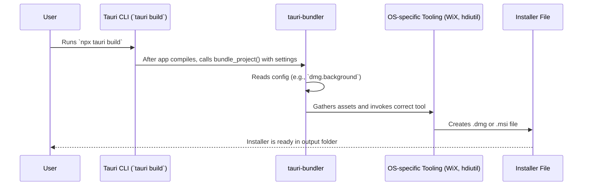

# Chapter 7: Application Bundler

In the [previous chapter](06_access_control_list__acl____capabilities_.md), we locked down our application's security with the Access Control List, creating a robust and safe experience. Our app is now feature-complete, secure, and ready to meet its users. But how do we get it to them? We can't just send them a folder of code!

This is where the **Application Bundler** comes in. It's the final, crucial step in your development process: packaging your application into a professional, distributable, and installable format that anyone can use.

### Your App's Packaging Factory

Imagine you've baked a delicious cake (your app). You've tested it, decorated it, and it's perfect. Now, you need to deliver it. You wouldn't just hand someone the cake; you'd put it in a sturdy, beautiful box to protect it and make it easy to carry.

The Application Bundler is that professional bakery box. It's a packaging factory that takes all the pieces of your app—your compiled Rust binary, your HTML, CSS, and JavaScript assets, your icons, and your resources—and bundles them together into a single, native file for different operating systems.

*   On **macOS**, it creates `.app` bundles and `.dmg` disk images.
*   On **Windows**, it creates `.exe` installers and `.msi` packages.
*   On **Linux**, it creates `.deb`, `.rpm`, or `.AppImage` files.

This process is handled automatically when you run the `tauri build` command, which you first saw in the [Tauri Command-Line Interface (CLI)](01_tauri_command_line_interface__cli__.md) chapter. In this chapter, we'll learn how to *configure* that process.

Our goal: **Customize our installers to add a personal touch.** We'll add a custom license file to our Windows installer and a beautiful background image to our macOS DMG.

### Step 1: Configuring the Bundler

The bundler's settings all live in your app's main blueprint, the `src-tauri/tauri.conf.json` file. Let's open it and find the `tauri.bundle` section.

Initially, it might look very simple:

```json
// src-tauri/tauri.conf.json
{
  "tauri": {
    "bundle": {
      "active": true,
      "identifier": "com.tauri.dev",
      "icon": [
        "icons/32x32.png",
        "icons/128x128.png",
        "icons/128x128@2x.png",
        "icons/icon.icns",
        "icons/icon.ico"
      ]
    }
  }
}
```

This tells Tauri to make the bundler active, defines a unique ID for our app (very important!), and lists the icons to use. Now, let's add our custom settings.

### Step 2: Customizing for Windows and macOS

We can add platform-specific keys like `windows` and `macOS` inside the `bundle` object to control their respective bundlers.

Let's prepare our assets first:
1.  Create a file named `LICENSE.txt` in the root of your project with some license text.
2.  Find a nice background image (e.g., a `.png` file) and save it as `dmg-background.png` inside your `src-tauri/` folder.

Now, let's update the configuration:

```json
// src-tauri/tauri.conf.json
"bundle": {
  "active": true,
  "identifier": "com.my-company.my-app",
  "icon": [ /* ... */ ],
  "macOS": {
    "dmg": {
      "background": "./dmg-background.png"
    }
  },
  "windows": {
    "wix": {
      "licensePath": "../LICENSE.txt"
    }
  }
}
```

Let's break that down:
*   `"macOS"`: An object for macOS-specific settings.
*   `"dmg"`: Inside `macOS`, we configure the `.dmg` installer. We set its `background` to the path of our image, relative to `src-tauri/`.
*   `"windows"`: An object for Windows-specific settings.
*   `"wix"`: Inside `windows`, we configure the WiX Toolset, which creates `.msi` installers. We set the `licensePath` to our `LICENSE.txt` file. The path is relative to `src-tauri/`, so `../` goes up one level to the project root.

### Step 3: Building the Installers

With our configuration saved, all we need to do is run the build command.

```bash
npx tauri build
```

Tauri will now build your app and then run the bundler. The bundler will read your new configuration and apply your customizations.

When it's done, look inside `src-tauri/target/release/bundle/`.
*   If you're on macOS, you'll find a `.dmg` file. Open it, and you'll see your custom background!
*   If you're on Windows, you'll find a `.msi` file. Run it, and you'll see a step where the user must accept the terms from your custom `LICENSE.txt` file.

You've just created professional, customized installers for your users!

### How Does it Work Under the Hood?

The Application Bundler is a separate crate within Tauri called `tauri-bundler`. When the `tauri build` command finishes compiling your application, it calls the bundler's main function, `bundle_project`, and passes it all the settings derived from your `tauri.conf.json`.

1.  **Read Settings**: The bundler receives a large `Settings` object containing everything it needs to know: your app's name, version, the binaries to include, and all the bundle-specific settings you just configured.
2.  **Determine Package Types**: It figures out which installers to create based on your configuration and the operating system you're building on (e.g., `Dmg` on macOS, `WindowsMsi` on Windows).
3.  **Dispatch to Platform Logic**: The bundler then enters a big `match` statement, calling the appropriate function for each package type.
4.  **Gather Assets**: The platform-specific code (e.g., the DMG bundler) gathers all the required files: your compiled app, icons, resources, and your custom assets like the `dmg-background.png`.
5.  **Use Native Tooling**: It then uses OS-native tools or libraries to construct the final package. On macOS, it uses command-line tools like `hdiutil` to create the DMG. On Windows, it generates a WiX XML file (`.wxs`) and uses the WiX Toolset (`candle.exe`, `light.exe`) to build the MSI.
6.  **Final Output**: The finished installer is placed in the output directory, and the path is printed to your console.

This diagram shows the simplified flow:



#### A Glimpse into the Code

You can see the main entry point for this logic in `crates/tauri-bundler/src/bundle.rs`. The `bundle_project` function is the heart of the operation.

```rust
// A simplified view of crates/tauri-bundler/src/bundle.rs
pub fn bundle_project(settings: &Settings) -> crate::Result<Vec<Bundle>> {
  // ... gets a list of package types to build ...
  let mut bundles = Vec::<Bundle>::new();
  for package_type in &package_types {
    // ...
    let bundle_paths = match package_type {
      // On macOS, if the type is Dmg...
      #[cfg(target_os = "macos")]
      PackageType::Dmg => {
        // ...call the DMG-specific bundler function.
        macos::dmg::bundle_project(settings, &bundles)?
      }

      // On Windows, if the type is WindowsMsi...
      #[cfg(target_os = "windows")]
      PackageType::WindowsMsi => {
        // ...call the MSI-specific bundler function.
        windows::msi::bundle_project(settings, false)?
      }

      // ... other platforms and types ...
      _ => { /* ... */ }
    };
    // ...
  }
  // ...
  Ok(bundles)
}
```
This code clearly shows how the bundler acts as a dispatcher, calling the right module for the job.

If we look inside a platform-specific module like `crates/tauri-bundler/src/bundle/windows/nsis/mod.rs` (for `.exe` installers), we can see how it uses your configuration.

```rust
// A simplified view of crates/tauri-bundler/src/bundle/windows/nsis/mod.rs
fn build_nsis_app_installer(settings: &Settings, /* ... */) -> crate::Result<Vec<PathBuf>> {
  // ...
  let mut data = BTreeMap::new(); // Data for the installer template

  // Reads the license file setting if it exists
  if let Some(license_file) = settings.license_file() {
    let license_path = dunce::canonicalize(license_file)?;
    // ... prepares the file ...
    data.insert("license", to_json(license_path));
  }

  // ... generates an installer script (`.nsi`) from a template using this data ...
  // ... runs the `makensis.exe` tool to build the installer ...

  Ok(vec![nsis_installer_path])
}
```
This shows the direct link between the `license_file` property in your `tauri.conf.json` and the code that uses it to build the installer.

### Conclusion

You've now mastered the final step of the application lifecycle: packaging. You learned that the **Application Bundler** is Tauri's built-in factory for creating native installers. You now know how to:

*   Understand the role of the bundler in the `tauri build` process.
*   Configure the bundler for different platforms using the `bundle` section of `tauri.conf.json`.
*   Add custom assets like background images and license files to create a polished, professional user experience.

Throughout this series, we've explored the major concepts that make Tauri work. We've seen how they fit together to let you build powerful desktop apps with web technologies. But there's one final, fundamental concept that underpins everything: the abstraction layer that allows Tauri to work seamlessly across Windows, macOS, and Linux.

In our final chapter, let's explore the core engine that makes this all possible: the [Runtime Abstraction](08_runtime_abstraction_.md).

---

Generated by [AI Codebase Knowledge Builder](https://github.com/The-Pocket/Tutorial-Codebase-Knowledge)