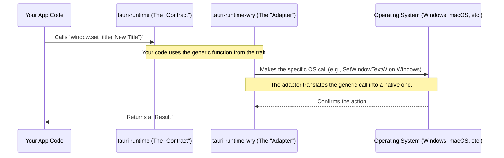

# Chapter 8: Runtime Abstraction

In the [previous chapter on the Application Bundler](07_application_bundler_.md), we learned how to package our finished application into professional installers for macOS, Windows, and Linux. This is one of the most powerful features of Tauri: you write your code once, and it can be built for all major desktop platforms.

But how is this possible? How can the same Rust code that creates a window on macOS also work on Windows? These operating systems are fundamentally different and have completely separate ways of handling windows, menus, and webviews.

This final chapter unveils the core concept that makes Tauri's cross-platform nature possible: the **Runtime Abstraction**.

### The Universal Adapter

Imagine you have a device, like your laptop charger, that you want to plug into a wall socket. The plug on your charger is always the same. However, the wall sockets are different in every country. To solve this, you use a universal power adapter. You plug your charger into the adapter, and the adapter handles connecting to the specific wall socket in the UK, the US, or Japan. Your charger doesn't need to know or care which country it's in.

In Tauri, your application logic is the laptop charger. The operating systems (macOS, Windows, Linux) are the different wall sockets. The **runtime** is the universal adapter.

Tauri provides a "contract" or a common set of commands like `create_a_window`, `set_the_title`, or `minimize_the_window`. Your Rust code uses these simple, universal commands. Under the hood, a specific implementation of the runtime translates these commands into the native language that the current operating system understands.

*   **The Contract:** The `tauri-runtime` crate defines this universal set of commands. In Rust terms, this is a `trait`—a list of functions that an adapter must provide.
*   **The Adapter:** The `tauri-runtime-wry` crate is the default adapter. It uses another library, **WRY** (WebView Rendering librarY), to actually talk to the operating system and manage windows and webviews.

This separation is what makes Tauri so flexible and powerful. Your application code is completely decoupled from the underlying system, allowing it to run anywhere.

### Your Code: Speaking a Universal Language

The beautiful thing about this abstraction is that you've been using it all along without even noticing! When you used the [Application Builder](05_application_builder_.md) or called functions on a window handle, you were talking to the runtime abstraction.

Let's look at a simple piece of code from our `main.rs` file:

```rust
// src-tauri/src/main.rs

tauri::Builder::default()
    .setup(|app| {
        let main_window = app.get_webview_window("main").unwrap();
        main_window.set_title("This title works everywhere!");
        Ok(())
    })
    // ...
```

When you call `main_window.set_title(...)`, you are using a function defined by the runtime "contract". You don't need to write any platform-specific code like this:

```rust
// You DON'T need to do this in Tauri!

#[cfg(target_os = "windows")]
{
  // Some complex Windows-specific API call...
}

#[cfg(target_os = "macos")]
{
  // Some completely different macOS-specific API call...
}
```

The runtime abstraction handles all of that complexity for you. You just state your intent—"set the title"—and the runtime takes care of the rest.

### How Does It Work Under the Hood?

Let's trace what happens when you call a simple function like `set_title`.

1.  **Your App Code**: Your Rust code gets a handle to the window and calls the `.set_title()` method. This method is part of a generic `WindowDispatch` trait.
2.  **The Runtime Trait (`tauri-runtime`)**: Your code isn't calling a specific implementation. It's calling a function defined in the abstract "contract" (the trait). This ensures your code is platform-agnostic.
3.  **The Runtime Implementation (`tauri-runtime-wry`)**: At compile time, Tauri plugs in the `tauri-runtime-wry` "adapter." This adapter has the *real* code for the `set_title` function.
4.  **WRY and TAO**: The `tauri-runtime-wry` implementation uses helper libraries. It uses **TAO** to talk to the operating system's windowing system and **WRY** for the webview. It makes the platform-specific call to change the window's title.
5.  **The Operating System**: The OS receives the native instruction and updates the title bar on the screen.

Here is a diagram showing this flow. Your app only ever needs to talk to the universal adapter.



#### A Glimpse into the Code

You will likely never need to change this code, but seeing how the "contract" and "adapter" are written in Rust can make the concept very clear.

**1. The "Contract" (`crates/tauri-runtime/src/lib.rs`)**

This file defines what any runtime *must* be able to do. It uses Rust's `trait` system. Think of it as a checklist of required features.

```rust
// A simplified view of crates/tauri-runtime/src/lib.rs

// This is the trait (the contract) for a window.
pub trait WindowDispatch<T: UserEvent>: ... {
  // ... other required functions ...

  /// Updates the window title. Any adapter MUST provide this function.
  fn set_title<S: Into<String>>(&self, title: S) -> Result<()>;

  /// Maximizes the window.
  fn maximize(&self) -> Result<()>;

  // ... and many more functions.
}
```

This code doesn't say *how* to set the title, only that a `WindowDispatch` must have a function called `set_title`.

**2. The "Adapter" (`crates/tauri-runtime-wry/...`)**

The `tauri-runtime-wry` crate then provides the *implementation* for that trait. It "fills in the blanks" of the contract.

```rust
// A simplified view of the WRY runtime implementation

use tauri_runtime::WindowDispatch; // Imports the contract

// This struct represents a window managed by WRY.
pub struct WryWindowDispatcher {
  // It holds a reference to the actual window from the TAO library.
  window: tao::window::Window,
}

// Here, we implement the `WindowDispatch` contract for our WRY window.
impl<T: UserEvent> WindowDispatch<T> for WryWindowDispatcher {
  // ...

  // This is the REAL code that runs when you call .set_title()
  fn set_title<S: Into<String>>(&self, title: S) -> Result<()> {
    // It simply calls the function from the underlying TAO library.
    self.window.set_title(&title.into());
    Ok(())
  }

  fn maximize(&self) -> Result<()> {
    self.window.set_maximized(true);
    Ok(())
  }

  // ...
}
```
This implementation connects the generic `set_title` call from the Tauri "contract" to the specific `set_title` function provided by the `tao` windowing library, which in turn knows how to talk to Windows, macOS, and Linux.

### Conclusion: Putting It All Together

Congratulations! You have reached the end of this introductory series. We have journeyed through all the fundamental building blocks of a Tauri application. Let's recap how they all fit together:

1.  You start with the **[Tauri Command-Line Interface (CLI)](01_tauri_command_line_interface__cli__.md)** to create, develop, and build your project.
2.  You use the **[Configuration System (tauri.conf.json)](02_configuration_system__tauri_conf_json__.md)** to provide the blueprint for your app.
3.  Your frontend and backend communicate via **[IPC & Commands](03_inter_process_communication__ipc____commands_.md)**.
4.  The **[JavaScript API (@tauri-apps/api)](04_javascript_api___tauri_apps_api__.md)** provides a clean, safe way for your frontend to use native features.
5.  The **[Application Builder](05_application_builder_.md)** in Rust assembles all the parts of your app's backend at startup.
6.  The **[Access Control List (ACL)](06_access_control_list__acl____capabilities_.md)** ensures this communication is secure by default.
7.  The **[Application Bundler](07_application_bundler_.md)** packages your finished app for distribution.
8.  And finally, the **Runtime Abstraction** is the silent, powerful engine that makes all of this work seamlessly across every major desktop platform.

You now have a solid understanding of Tauri's core architecture. You are well-equipped to explore more advanced topics like plugins, multi-window management, and native menus. The world of fast, secure, and cross-platform desktop development is now at your fingertips. Happy building

---

Generated by [AI Codebase Knowledge Builder](https://github.com/The-Pocket/Tutorial-Codebase-Knowledge)