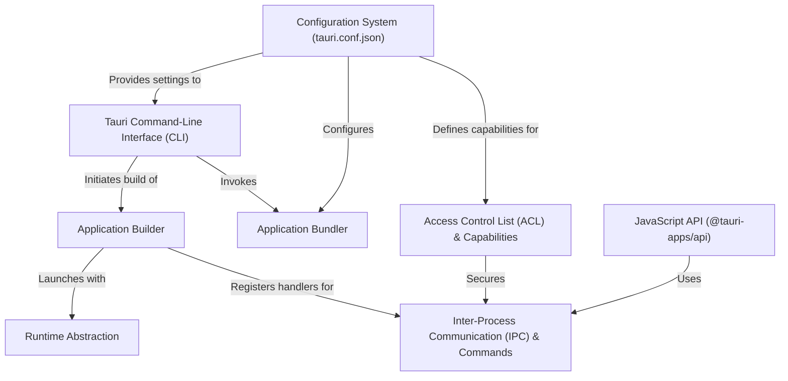

# Tutorial: tauri

Tauri is a framework for building *lightweight, fast, and secure* desktop applications for all major operating systems using web technologies. You write your user interface in any frontend framework that compiles to HTML/CSS/JS (like React or Svelte), and your core logic in **Rust**. Tauri provides a powerful **Command-Line Interface (CLI)** to create, develop, and package your app, and a secure **Inter-Process Communication (IPC)** system that allows your frontend to call your Rust code. It bundles your web app and Rust backend into a single, small, distributable executable.

**Source Repository:** [https://github.com/tauri-apps/tauri](https://github.com/tauri-apps/tauri)

## Chapters

1. [Tauri Command-Line Interface (CLI)
](01_tauri_command_line_interface__cli__.md)
2. [Configuration System (tauri.conf.json)
](02_configuration_system__tauri_conf_json__.md)
3. [Inter-Process Communication (IPC) & Commands
](03_inter_process_communication__ipc____commands_.md)
4. [JavaScript API (@tauri-apps/api)
](04_javascript_api___tauri_apps_api__.md)
5. [Application Builder
](05_application_builder_.md)
6. [Access Control List (ACL) & Capabilities
](06_access_control_list__acl____capabilities_.md)
7. [Application Bundler
](07_application_bundler_.md)
8. [Runtime Abstraction
](08_runtime_abstraction_.md)

---

Generated by [AI Codebase Knowledge Builder](https://github.com/The-Pocket/Tutorial-Codebase-Knowledge)